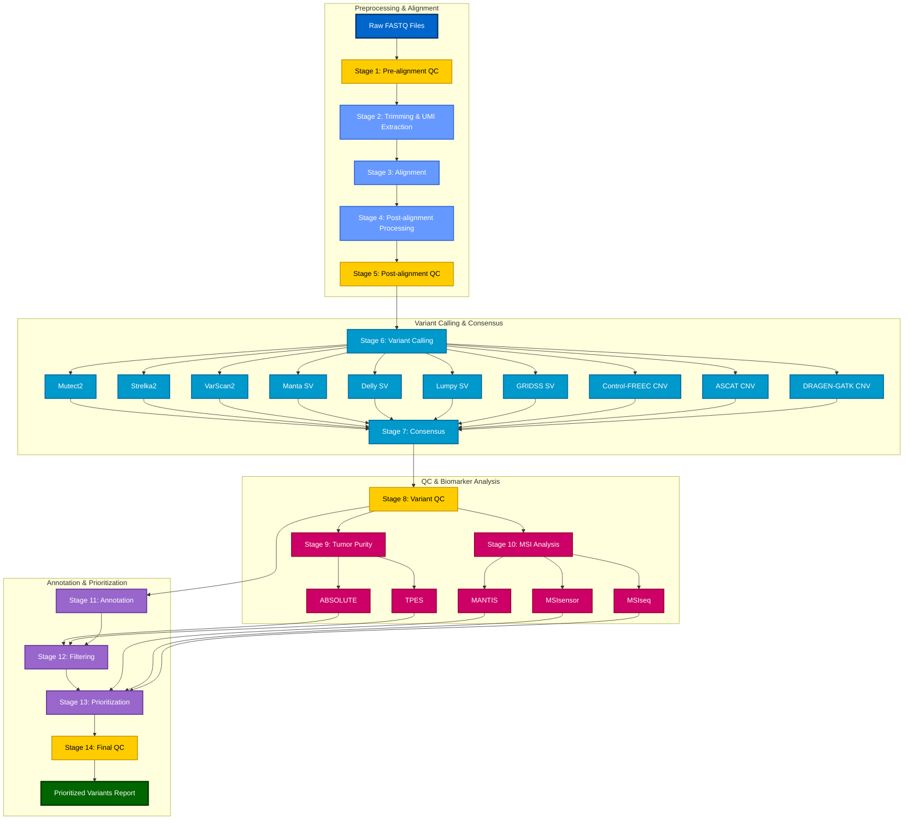

## Overview

This document provides comprehensive, step-by-step guidelines for analyzing sequencing data to detect genetic variants for early cancer detection, from raw FASTQ files to prioritized variants. The pipeline is designed to work with both **Whole Genome Sequencing (WGS)** and **Whole Exome Sequencing (WES)** data, with specific considerations and parameters for each sequencing type. The pipeline emphasizes the use of multiple tools at each stage for consensus building and majority voting to improve accuracy and reduce false positives.

**Sequencing Type Considerations**:

- **WGS (Whole Genome Sequencing)**: 
  - Provides comprehensive coverage of the entire genome, including non-coding regions
  - No target region restrictions; variant calling genome-wide
  - Lower mean coverage requirements (60-100x for tumor)
  - Better for CNV calling, structural variant detection, and MSI analysis
  - Suitable for comprehensive variant discovery including non-coding variants
  
- **WES (Whole Exome Sequencing)**: 
  - Focuses on protein-coding regions (exomes), ~1-2% of genome
  - Requires target region BED file (exome capture regions)
  - Higher mean coverage in target regions (100-150x for tumor)
  - Requires on-target percentage assessment (>80% reads on target)
  - Better for coding variant detection with higher depth
  - CNV calling and MSI analysis may have reduced sensitivity
  - More cost-effective for focused analysis of coding regions

**Key Differences in Pipeline Execution**:

| Aspect | WGS | WES |
|--------|-----|-----|
| **Target BED file** | Not required | Required (exome regions) |
| **Coverage metrics** | CollectWgsMetrics | CollectHsMetrics with BED |
| **Mean coverage** | 60-100x (tumor) | 100-150x in targets (tumor) |
| **On-target %** | N/A | ≥80% required |
| **Variant calling** | Genome-wide | Optionally restrict to targets |
| **CNV calling** | Excellent | Reduced sensitivity |
| **MSI analysis** | Comprehensive | Limited to exonic regions |
| **Tumor purity** | Both ABSOLUTE & TPES work well | TPES preferred (ABSOLUTE limited) |

## Pipeline Architecture

### Workflow Diagram

The following diagram illustrates the complete pipeline workflow from raw FASTQ files to prioritized variants with high-contrast colors for better visibility:

```mermaid
graph TB
    Start[Raw FASTQ Files] --> QC1[Stage 1: Pre-alignment QC<br/>FastQC, QC3, MultiQC]
    QC1 --> Trim[Stage 2: Read Trimming & UMI Extraction<br/>fastp]
    Trim --> Align[Stage 3: Alignment<br/>BWA-MEM / DRAGEN-GATK]
    Align --> Process[Stage 4: Post-alignment Processing<br/>UMI Correction, Deduplication, BQSR]
    Process --> QC2[Stage 5: Post-alignment QC<br/>samtools, GATK, Qualimap, Alfred, QC3]
    QC2 --> Call[Stage 6: Variant Calling<br/>SNV/Indel: Mutect2, Strelka2, VarScan2<br/>SV: Manta, Delly, Lumpy, GRIDSS<br/>CNV: Control-FREEC, ASCAT, DRAGEN-GATK]
    Call --> Consensus[Stage 7: Consensus Variant Calling<br/>bcftools, SURVIVOR]
    Consensus --> QC3[Stage 8: Variant QC<br/>bcftools stats, GATK VariantEval, QC3]
    QC3 --> Purity[Stage 9: Tumor Purity Estimation<br/>ABSOLUTE, TPES]
    Purity --> MSI[Stage 10: MSI Analysis<br/>MANTIS, MSIsensor, MSIseq]
    MSI --> Annotate[Stage 11: Variant Annotation<br/>VEP, AnnotSV]
    Annotate --> Filter[Stage 12: Variant Filtering<br/>Technical, Biological, Clinical filters]
    Filter --> Prioritize[Stage 13: Variant Prioritization<br/>Tier classification, Scoring]
    Prioritize --> QC4[Stage 14: Final QC & Validation<br/>Comprehensive QC metrics, Reporting]
    QC4 --> End[Prioritized Variants Report]
    
    style Start fill:#0066cc,stroke:#003366,stroke-width:3px,color:#ffffff
    style End fill:#006600,stroke:#003300,stroke-width:3px,color:#ffffff
    style QC1 fill:#ffcc00,stroke:#cc9900,stroke-width:2px,color:#000000
    style QC2 fill:#ffcc00,stroke:#cc9900,stroke-width:2px,color:#000000
    style QC3 fill:#ffcc00,stroke:#cc9900,stroke-width:2px,color:#000000
    style QC4 fill:#ffcc00,stroke:#cc9900,stroke-width:2px,color:#000000
    style Purity fill:#cc0066,stroke:#990033,stroke-width:2px,color:#ffffff
    style MSI fill:#cc0066,stroke:#990033,stroke-width:2px,color:#ffffff
    style Call fill:#0099cc,stroke:#006699,stroke-width:2px,color:#ffffff
    style Consensus fill:#0099cc,stroke:#006699,stroke-width:2px,color:#ffffff
    style Process fill:#6699ff,stroke:#3366cc,stroke-width:2px,color:#ffffff
    style Trim fill:#6699ff,stroke:#3366cc,stroke-width:2px,color:#ffffff
    style Align fill:#6699ff,stroke:#3366cc,stroke-width:2px,color:#ffffff
    style Annotate fill:#9966cc,stroke:#663399,stroke-width:2px,color:#ffffff
    style Filter fill:#9966cc,stroke:#663399,stroke-width:2px,color:#ffffff
    style Prioritize fill:#9966cc,stroke:#663399,stroke-width:2px,color:#ffffff
```



### Detailed Workflow with Parallel Processing

The following diagram shows parallel processing opportunities and data dependencies with improved color contrast:



### Data Flow and Dependencies

**Key Data Dependencies**:

- **Stage 4 → Stage 5**: Post-alignment processed BAM files for QC
- **Stage 5 → Stage 6**: QC-validated BAM files for variant calling
- **Stage 6 → Stage 7**: Individual caller VCF files for consensus
- **Stage 7 → Stage 8**: Consensus VCF for variant QC
- **Stage 6 (CNV) → Stage 9**: CNV data for ABSOLUTE purity estimation
- **Stage 7 (SNV) → Stage 9**: Consensus SNV calls for TPES purity estimation
- **Stage 7 → Stage 10**: Consensus variant calls for MSIseq analysis
- **Stage 9 → Stage 12**: Purity estimates for variant filtering
- **Stage 9 → Stage 13**: Purity estimates for variant prioritization
- **Stage 10 → Stage 13**: MSI status for variant prioritization

**Parallel Processing Opportunities**:

- **Stage 6**: Multiple variant callers (SNV/Indel, SV, CNV) can run in parallel
- **Stage 9**: ABSOLUTE and TPES can run in parallel (independent methods)
- **Stage 10**: Multiple MSI tools (MANTIS, MSIsensor, MSIseq) can run in parallel
- **Stage 11**: Multiple annotation tools can run in parallel (if needed)
- **Overall**: Process multiple samples in parallel where computational resources allow

The complete pipeline consists of the following stages:

1. **Pre-alignment Quality Control** - Assess raw read quality
2. **Read Trimming and Adapter Removal** - Clean sequencing artifacts
3. **Alignment to Reference Genome** - Map reads to reference
4. **Post-alignment Processing** - Optimize alignments for variant calling
5. **Post-alignment Quality Control** - Assess alignment quality and coverage metrics
6. **Variant Calling (Multiple Tools)** - Call variants using ensemble of callers
7. **Consensus Variant Calling** - Integrate results from multiple callers
8. **Variant Quality Control** - Assess variant calling quality and metrics
9. **Tumor Purity Estimation** - Estimate tumor purity using ABSOLUTE and TPES (requires CNV and variant data)
10. **Microsatellite Instability (MSI) Analysis** - Assess MSI status using multiple tools
11. **Variant Annotation** - Add functional and clinical information
12. **Variant Filtering** - Remove artifacts and common variants
13. **Variant Prioritization** - Rank variants by clinical significance
14. **Quality Control and Validation** - Final QC and reporting

## Detailed Pipeline Steps

### Stage 1: Pre-alignment Quality Control

**Objective**: Assess raw sequencing data quality before processing

**Tools**:

- **FastQC**: Primary QC tool for sequencing data
- **QC3**: Multi-stage QC tool that performs quality assessment at raw data, alignment, and variant detection stages; detects batch effects and cross-contamination
- **MultiQC**: Aggregate QC metrics across samples

**Best Practices**:

- Run FastQC on all samples before and after trimming
- **Use QC3 for multi-stage QC**: Provides comprehensive quality assessment across raw data, alignment, and variant detection stages
- **QC3 batch effect detection**: Run QC3 on all samples together to detect batch effects and cross-contamination
- Check key metrics: per-base quality, adapter contamination, GC content, sequence duplication
- Set quality thresholds: Phred score > 20 for most bases, < 10% adapter contamination

**Example Commands**:

```bash
# FastQC on raw reads
fastqc sample_R1.fastq.gz sample_R2.fastq.gz -o qc_raw/

# QC3 raw data QC (first stage of multi-stage QC)
qc3 --fastq1 sample_R1.fastq.gz --fastq2 sample_R2.fastq.gz \
  --output qc3_raw/ --stage raw

# MultiQC aggregation
multiqc qc_raw/ -o qc_raw_report/
```

### Stage 2: Read Trimming and Adapter Removal

**Objective**: Remove low-quality bases, adapters, and sequencing artifacts; extract UMIs if present

**Tools**:

- **fastp**: All-in-one FASTQ preprocessor with built-in QC, adapter detection, quality filtering, and UMI extraction

**UMI Detection and Handling**:

UMIs (Unique Molecular Identifiers) are molecular barcodes used to tag individual DNA molecules before PCR amplification. They are critical for:

- Accurate duplicate removal (grouping reads from the same original molecule)
- Error correction (consensus building from UMI families)
- Improved low VAF variant detection (especially important for ctDNA/early cancer detection)

**UMI Location Options**:

- **Index reads**: UMIs in i7 (index1) or i5 (index2) reads
- **Read sequences**: UMIs at the beginning of read1 or read2
- **Combined**: per_index (index1+index2) or per_read (read1+read2)

**Best Practices**:

- **Check for UMIs**: Inspect FASTQ files to determine if UMIs are present and their location
- **UMI extraction**: Use fastp to extract UMIs and append to read names (format: `@readname:UMI:sequence`)
- **UMI validation**: After extraction, validate UMI format and compatibility with downstream tools (see validation steps below)
- **UMI quality assessment**: Check UMI base quality scores after extraction
- **UMI correction**: Perform UMI correction if UMI base quality is low (see Stage 4)
- Use fastp's automatic adapter detection for paired-end reads
- Remove low-quality bases (Phred < 20) from ends
- Remove reads shorter than 36 bp after trimming
- Use sliding window approach (4 bp window, mean quality > 20)
- Keep paired-end reads properly paired
- fastp provides integrated QC metrics (similar to FastQC) in JSON/HTML format

**Example Commands**:

```bash
# fastp trimming and QC (without UMI)
fastp -i sample_R1.fastq.gz -I sample_R2.fastq.gz \
  -o sample_R1_trimmed.fastq.gz -O sample_R2_trimmed.fastq.gz \
  --detect_adapter_for_pe \
  --qualified_quality_phred 20 \
  --length_required 36 \
  --cut_front --cut_tail \
  --cut_window_size 4 --cut_mean_quality 20 \
  --json fastp_report.json \
  --html fastp_report.html

# fastp with UMI extraction (if UMIs are in index reads)
fastp -i sample_R1.fastq.gz -I sample_R2.fastq.gz \
  --index1 index1.fastq.gz --index2 index2.fastq.gz \
  -o sample_R1_trimmed.fastq.gz -O sample_R2_trimmed.fastq.gz \
  --umi_loc per_index \
  --umi_prefix "UMI:" \
  --detect_adapter_for_pe \
  --qualified_quality_phred 20 \
  --length_required 36 \
  --cut_front --cut_tail \
  --cut_window_size 4 --cut_mean_quality 20 \
  --json fastp_report.json \
  --html fastp_report.html

# fastp with UMI extraction (if UMIs are at start of read1)
fastp -i sample_R1.fastq.gz -I sample_R2.fastq.gz \
  -o sample_R1_trimmed.fastq.gz -O sample_R2_trimmed.fastq.gz \
  --umi_loc read1 \
  --umi_len 8 \
  --umi_prefix "UMI:" \
  --detect_adapter_for_pe \
  --qualified_quality_phred 20 \
  --length_required 36 \
  --cut_front --cut_tail \
  --cut_window_size 4 --cut_mean_quality 20 \
  --json fastp_report.json \
  --html fastp_report.html
```

**UMI Validation After Extraction** (if UMIs were extracted):

After UMI extraction by fastp, validate that UMIs are correctly formatted and can be handled by downstream tools:

**Validation Steps**:

1. **Check UMI format in FASTQ read names**:
   - Verify UMIs are appended to read names in expected format
   - fastp default format: `@readname:UMI` (if `--umi_prefix "UMI:"` used)
   - Verify UMI length matches expected length
   - Check for invalid characters in UMIs (should be A, T, G, C, N)

2. **Verify UMI will be transferred to BAM**:
   - fastp extracts UMIs to read names, but downstream tools (UMICollapse, fgbio) need UMIs in BAM tags
   - BWA-MEM and other aligners preserve read names, but UMIs need to be in RX tag for downstream tools
   - Validate that alignment will preserve UMI information

3. **Test UMI extraction compatibility**:
   - Verify UMI format matches what downstream tools expect
   - UMICollapse expects RX tag in BAM (extracted from read names during alignment or post-alignment)
   - fgbio expects RX tag or can extract from read names

**Best Practices**:

- **Validate UMI format immediately after extraction**: Check a sample of reads to ensure UMIs are correctly appended
- **Verify UMI length**: Ensure all UMIs have expected length (e.g., 8-12 bp)
- **Check UMI quality**: If UMI quality scores are available, assess quality distribution
- **Test compatibility**: Extract a small sample and verify UMIs can be processed by downstream tools
- **Document UMI format**: Record UMI location, length, and format for reference

**Example Commands**:

```bash
# Validate UMI extraction (if UMIs were extracted)
# Step 1: Check UMI format in FASTQ read names
zcat sample_R1_trimmed.fastq.gz | head -n 4 | grep "^@"
# Expected output: @readname:UMI_sequence
# Example: @M00123:123:000000000-A1B2C:1:1101:12345:6789:UMI:ATCGATCG

# Step 2: Extract and validate UMI sequences
zcat sample_R1_trimmed.fastq.gz | \
  grep "^@" | \
  sed 's/.*UMI:\([ACGTN]*\).*/\1/' | \
  head -1000 > extracted_umis.txt

# Check UMI length distribution
awk '{print length($0)}' extracted_umis.txt | sort | uniq -c
# Expected: All UMIs should have same length (e.g., 8 bp)

# Check for invalid characters
grep -v "^[ACGTN]*$" extracted_umis.txt
# Expected: No output (all UMIs should contain only A, C, G, T, N)

# Step 3: Verify UMI count matches read count
UMI_COUNT=$(zcat sample_R1_trimmed.fastq.gz | grep -c "^@.*UMI:")
READ_COUNT=$(zcat sample_R1_trimmed.fastq.gz | grep -c "^@")
echo "UMI count: $UMI_COUNT, Read count: $READ_COUNT"
# Expected: UMI_COUNT should equal READ_COUNT (all reads should have UMIs)

# Step 4: Check UMI uniqueness (optional, for quality assessment)
sort extracted_umis.txt | uniq | wc -l
# Compare unique UMIs to total UMIs to assess UMI diversity

# Step 5: Verify UMI will be preserved during alignment
# BWA-MEM preserves read names, so UMIs in read names will be in BAM
# After alignment, extract UMIs from BAM to verify (see Stage 4)
```

**Troubleshooting**:

- **UMIs not in read names**: Check fastp output format; verify `--umi_prefix` was used correctly
- **UMI length mismatch**: Verify `--umi_len` matches actual UMI length in data
- **Invalid characters**: May indicate sequencing errors; consider UMI correction (Stage 4)
- **Missing UMIs**: Some reads may not have UMIs; check fastp logs for extraction statistics

### Stage 3: Alignment to Reference Genome

**Objective**: Map trimmed reads to reference genome

**Tools**:

- **BWA-MEM**: Industry standard for short reads
- **DRAGEN** (if available): Hardware-accelerated alignment on FPGA platform
- **DRAGEN-GATK**: Software implementation for standard hardware (CPU/GPU), recommended when DRAGEN hardware is not available

**Best Practices**:

- Use GRCh38/hg38 reference genome (latest version)
- Include decoy sequences (hs38d1) for better mapping
- Set appropriate read group information (SM, ID, PL, LB, PU)
- **Sequencing type considerations**:
  - **WGS**: No target region restrictions; align all reads genome-wide
  - **WES**: No target region restrictions during alignment (align all reads, filter to targets later if needed)
  - **Target BED file**: For WES, obtain exome target BED file from capture kit manufacturer for downstream QC and variant calling
- **If UMIs were extracted by fastp**: 
  - BWA-MEM preserves read names, so UMIs in read names will be preserved in BAM
  - UMIs need to be in RX tag for downstream tools (UMICollapse, fgbio)
  - Convert UMIs from read names to RX tag after alignment (see Stage 4)
- For ctDNA: Use sensitive alignment parameters

**Example Commands**:

```bash
# BWA-MEM alignment
bwa mem -t 16 \
  -R "@RG\tID:sample\tSM:sample\tPL:ILLUMINA\tLB:lib1\tPU:unit1" \
  reference.fa \
  sample_R1_trimmed.fastq.gz sample_R2_trimmed.fastq.gz \
  | samtools view -bS - > sample.bam

# Sort BAM
samtools sort -@ 8 sample.bam -o sample.sorted.bam
samtools index sample.sorted.bam

# If UMIs were extracted by fastp, verify they are preserved in BAM read names
# (UMIs will be in read names, need to be converted to RX tag in Stage 4)
if [ -n "$HAS_UMI" ]; then
  samtools view sample.sorted.bam | head -1 | awk '{print $1}' | grep -q "UMI" && \
    echo "UMI found in BAM read names" || \
    echo "WARNING: UMI not found in BAM read names"
fi
```

### Stage 4: Post-alignment Processing

**Objective**: Optimize alignments and prepare for variant calling; perform UMI-aware duplicate marking if UMIs are present

**Steps**:

1. **UMI Correction** (if UMIs present and quality is low):

   - Correct sequencing errors in UMI sequences
   - Group similar UMIs that likely represent the same original molecule

2. **Duplicate Marking**: 

   - **Standard**: Identify PCR/optical duplicates (if no UMIs)
   - **UMI-aware**: Group reads by UMI and alignment position (if UMIs present)

3. **Base Quality Score Recalibration (BQSR)**: Correct systematic biases

**Tools**:

- **Standard duplicate marking**:
  - **DRAGEN-GATK MarkDuplicates**: Recommended for best performance
  - **samtools markdup**: Alternative duplicate marking
- **UMI correction** (if UMI quality is low):
  - **fgbio CorrectUmis**: Correct UMI sequencing errors by matching to known UMI sets or using network-based methods
  - **DRAGEN**: UMI error correction using lookup table or sequence similarity (if DRAGEN hardware available)
- **UMI-aware processing**:
  - **UMICollapse**: Primary tool for fast UMI deduplication (recommended, ~50x faster than umi-tools)
  - **fgbio** (optional): Alternative workflow for consensus building and error correction
    - **fgbio GroupReadsByUmi**: Group reads by UMI and alignment position
    - **fgbio CallMolecularConsensusReads**: Generate consensus reads from UMI families
    - **fgbio FilterConsensusReads**: Filter consensus reads by quality
- **DRAGEN-GATK BaseRecalibrator + ApplyBQSR**: Quality score recalibration (recommended for best performance)

**Best Practices**:

- **Check for UMIs**: Verify if UMI information is present in read names (from Stage 2)
- **Validate UMI format in BAM**: After alignment, verify UMIs are accessible
  - **Extract UMIs from BAM read names**: Check that UMIs from fastp are preserved in BAM
  - **Convert to BAM tags if needed**: Some tools require UMIs in RX tag rather than read names
  - **Verify UMI format compatibility**: Ensure UMIs can be extracted by UMICollapse or fgbio
- **Assess UMI quality**: Check UMI base quality scores
  - **Low quality threshold**: Mean UMI quality < 20 (Phred score)
  - **Perform correction if**: >10% of UMIs have low-quality bases
- **UMI correction** (if UMI quality is low):
  - Correct sequencing errors in UMI sequences before deduplication
  - Use fgbio CorrectUmis for error correction
  - If using predefined UMI sets: Match observed UMIs to known set
  - If no predefined set: Use network-based methods to group similar UMIs
  - Improves deduplication accuracy by correcting UMI errors
- **UMI-aware duplicate marking** (if UMIs present):
  - **Primary approach (UMICollapse)**: Fast deduplication based on UMI and alignment position
    - Processes 1M+ UMIs in ~26 seconds (vs 20+ minutes for umi-tools)
    - Recommended for most use cases requiring fast deduplication
  - **Alternative approach (fgbio)**: Consensus building workflow for error correction
    - Group reads by UMI and alignment position
    - Generate consensus reads from UMI families (reduces sequencing errors)
    - Filter consensus reads by quality and family size
    - **Important**: Do NOT run MarkDuplicates after fgbio consensus building
      - Consensus workflow already performs UMI-based deduplication
      - Each consensus read = unique UMI family = unique original molecule
      - Multiple UMI families at same position are NOT duplicates (different molecules)
      - Running coordinate-based MarkDuplicates would incorrectly remove legitimate reads
    - Use when error correction via consensus is critical (e.g., very low VAF detection)
  - More accurate than standard duplicate marking for low VAF variants
- **Standard duplicate marking** (if no UMIs):
  - Mark duplicates to avoid false positives from PCR artifacts
  - For ctDNA: Consider less aggressive duplicate marking (may remove true low-VAF variants)
- Use known variant sites (dbSNP, Mills) for BQSR
- Generate metrics: duplication rate, insert size distribution, UMI family size (if applicable)

**Example Commands**:

```bash
# Standard duplicate marking (no UMIs) - using DRAGEN-GATK
gatk MarkDuplicates \
  -I sample.sorted.bam \
  -O sample.markdup.bam \
  -M sample.markdup.metrics.txt

# UMI-aware processing (if UMIs present)
# Step 0: Validate UMIs in BAM and convert to RX tag if needed
# Extract UMIs from read names (fastp format: @readname:UMI:sequence)
# Check if UMIs are in read names
samtools view sample.sorted.bam | head -1 | awk '{print $1}'
# Expected: Read name should contain UMI (e.g., readname:UMI:ATCGATCG)

# Extract UMIs from read names and verify format
samtools view sample.sorted.bam | \
  head -1000 | \
  awk '{if($1 ~ /:UMI:/) {split($1, parts, ":UMI:"); print parts[2]}}' | \
  head -10
# Expected: UMI sequences (e.g., ATCGATCG)

# If UMIs are in read names but not in RX tag, add RX tag
# Option A: Use fgbio ExtractUmisFromBam (if UMIs are in read sequences, not read names)
# Note: fgbio ExtractUmisFromBam extracts UMIs from read sequences based on read structure
# If fastp put UMIs in read names (not sequences), use Option B instead
# fgbio ExtractUmisFromBam \
#   --input sample.sorted.bam \
#   --output sample.umi_tagged.bam \
#   --read-structure "+T 8M147S +T 8M147S" \
#   --molecular-index-tags RX

# Option B: Extract UMIs from read names and add as RX tag
# fastp appends UMI to read name (format: readname:UMI:sequence when --umi_prefix "UMI:" is used)
# Method 1: Using awk (GNU awk required for match() with array)
samtools view -h sample.sorted.bam | \
  awk 'BEGIN{OFS="\t"} 
       /^@/ {print; next}
       {
         read_name = $1
         # Extract UMI from read name (format: readname:UMI:sequence)
         if (match(read_name, /:UMI:([ACGTN]+)$/, umi_arr)) {
           umi = umi_arr[1]
           # Remove UMI suffix from read name
           gsub(/:UMI:[ACGTN]+$/, "", $1)
           # Reconstruct the line with RX tag
           # BAM format: QNAME FLAG RNAME POS MAPQ CIGAR ... (then optional tags)
           # Add RX tag at the end
           print $0 "\tRX:Z:" umi
         } else {
           print
         }
       }' | \
  samtools view -bS - > sample.umi_tagged.bam

# Method 2: Using Python (more robust, recommended)
python3 << 'PYTHON_SCRIPT'
import pysam
import re
import sys

in_bam_path = "sample.sorted.bam"
out_bam_path = "sample.umi_tagged.bam"

# Pattern to match UMI in read name (format: readname:UMI:sequence)
umi_pattern = re.compile(r':UMI:([ACGTN]+)$')

try:
    in_bam = pysam.AlignmentFile(in_bam_path, "rb")
    out_bam = pysam.AlignmentFile(out_bam_path, "wb", template=in_bam)
    
    for read in in_bam:
        # Extract UMI from read name
        umi_match = umi_pattern.search(read.query_name)
        if umi_match:
            umi = umi_match.group(1)
            # Remove UMI suffix from read name
            read.query_name = umi_pattern.sub('', read.query_name)
            # Add RX tag
            read.set_tag('RX', umi, 'Z')
        out_bam.write(read)
    
    in_bam.close()
    out_bam.close()
    print(f"Successfully extracted UMIs and added RX tags to {out_bam_path}")
except Exception as e:
    print(f"Error: {e}", file=sys.stderr)
    sys.exit(1)
PYTHON_SCRIPT

# Verify RX tag is present
samtools view sample.umi_tagged.bam | head -1 | grep -o "RX:Z:[^\t]*"
# Expected: RX:Z:ATCGATCG (or similar)

# Step 1: Assess UMI quality (check if correction needed)
# Check UMI quality from BAM file (if quality scores available in read names)
samtools view sample.umi_tagged.bam | \
  awk '{for(i=1;i<=NF;i++) if($i~/^RX:/) print $i}' | \
  head -100
# Calculate mean quality (if quality scores available)

# Step 2: UMI correction (if UMI quality is low)
# Option A: fgbio CorrectUmis (with predefined UMI set)
fgbio CorrectUmis \
  --input sample.sorted.bam \
  --output sample.umi_corrected.bam \
  --umi-tag RX \
  --umi-set known_umis.txt \
  --max-edit-distance 1

# Option B: fgbio CorrectUmis (network-based, no predefined set)
fgbio CorrectUmis \
  --input sample.sorted.bam \
  --output sample.umi_corrected.bam \
  --umi-tag RX \
  --max-edit-distance 1 \
  --min-reads-per-umi 2

# Step 3: UMI deduplication
# Primary approach: UMICollapse (fast deduplication)
# Use UMI-tagged BAM (with RX tag) or corrected BAM if correction was performed
INPUT_BAM=${UMI_CORRECTED:-sample.umi_tagged.bam}
# Verify RX tag is present before deduplication
samtools view $INPUT_BAM | head -1 | grep -q "RX:Z:" && echo "RX tag present" || echo "WARNING: RX tag missing"

umicollapse dedup \
  --input $INPUT_BAM \
  --output sample.umicollapse.bam \
  --method directional \
  --min-mapq 20 \
  --edit-distance 1 \
  --umi-tag RX

# Alternative approach: fgbio consensus building (for error correction)
# Use when consensus-based error correction is critical (e.g., very low VAF)
# Step 1: Group reads by UMI
# Use UMI-tagged BAM (with RX tag) for fgbio
INPUT_BAM_FGBIO=${UMI_CORRECTED:-sample.umi_tagged.bam}
fgbio GroupReadsByUmi \
  --input $INPUT_BAM_FGBIO \
  --output sample.grouped.bam \
  --strategy Adjacent \
  --edits 1 \
  --min-map-q 20 \
  --umi-tag RX

# Step 2: Generate consensus reads from UMI families
fgbio CallMolecularConsensusReads \
  --input sample.grouped.bam \
  --output sample.consensus.bam \
  --error-rate-pre-umi 45 \
  --error-rate-post-umi 30 \
  --min-input-base-quality 20 \
  --min-reads 1

# Step 3: Filter consensus reads
fgbio FilterConsensusReads \
  --input sample.consensus.bam \
  --output sample.consensus.filtered.bam \
  --min-reads 2 \
  --max-read-error-rate 0.05 \
  --min-base-quality 20

# Note: Do NOT run MarkDuplicates after fgbio consensus building
# The consensus workflow already performs UMI-based deduplication:
# - Each consensus read represents a unique UMI family (unique original molecule)
# - Multiple UMI families can legitimately map to the same position (different molecules)
# - Running MarkDuplicates (coordinate-based) would incorrectly mark these as duplicates
# - This would remove legitimate non-duplicate reads and reduce sensitivity

# Base quality recalibration (works with both standard and UMI-processed BAMs) - using DRAGEN-GATK
# Use consensus.filtered.bam directly (no MarkDuplicates needed after UMI consensus)
gatk BaseRecalibrator \
  -R reference.fa \
  -I sample.consensus.filtered.bam \
  --known-sites dbsnp.vcf.gz \
  --known-sites mills.vcf.gz \
  -O sample.recal.table

gatk ApplyBQSR \
  -R reference.fa \
  -I sample.consensus.filtered.bam \
  -bqsr sample.recal.table \
  -O sample.recal.bam
```

### Stage 5: Post-alignment Quality Control

**Objective**: Assess alignment quality, coverage metrics, and identify potential issues before variant calling

**Tools**:

- **samtools stats**: Comprehensive alignment statistics
- **GATK CollectAlignmentSummaryMetrics**: Alignment quality metrics
- **GATK CollectInsertSizeMetrics**: Insert size distribution
- **GATK CollectWgsMetrics**: Whole genome coverage metrics (for WGS)
- **GATK CollectHsMetrics**: Hybrid selection (targeted) coverage metrics (for WES and targeted panels)
- **GATK CollectGcBiasMetrics**: GC bias assessment
- **Qualimap**: Comprehensive BAM QC analysis
- **Alfred**: Multi-sample QC metrics in read-group aware manner; computes alignment metrics, GC bias, base composition, insert size, and coverage distributions; supports haplotype-aware analysis; provides interactive web application for visualization
- **QC3**: Multi-stage QC tool (alignment stage); detects batch effects and cross-contamination
- **SeqSQC**: Sex check tool that predicts sample sex based on X chromosome inbreeding coefficient; identifies discrepancies between reported and genetic sex
- **MultiQC**: Aggregate QC metrics across samples

**Key Metrics to Assess**:

1. **Coverage Metrics**:

   - **Mean coverage**: Should meet minimum requirements
     - **WGS**: 60-100x for tumor, 30-60x for normal
     - **WES**: 100-150x for tumor, 50-100x for normal (mean coverage in target regions)
   - **Coverage uniformity**: Coefficient of variation (CV) < 0.5 for uniform coverage
   - **On-target percentage**: 
     - **WGS**: Not applicable (no target regions)
     - **WES**: >80% reads on target (exonic regions)
     - **Targeted panels**: >80% reads on target
   - **Coverage at target regions**: 
     - **WGS**: Assess genome-wide coverage distribution
     - **WES**: Ensure adequate depth in exonic regions (use target BED file)
   - **Coverage distribution**: Check for coverage gaps or extreme outliers

2. **Mapping Quality**:

   - **Percentage of properly paired reads**: >90% for paired-end data
   - **Mapping quality (MQ)**: Mean MQ > 40
   - **Unmapped reads**: <5% unmapped reads
   - **Secondary/supplementary alignments**: Check for excessive secondary alignments

3. **Duplicate Metrics**:

   - **Duplication rate**: 
     - **Ideal thresholds** (may vary based on library preparation):
       - WGS: <20% duplication rate (typical for PCR-free libraries)
       - WES: <30% duplication rate (slightly higher due to target enrichment)
       - Targeted panels: <50% duplication rate
     - **Note**: Duplication rates can be significantly higher depending on PCR amplification cycles used during library preparation
       - High PCR cycles → higher duplication rates (may exceed ideal thresholds)
       - UMI-based deduplication can help manage high duplication rates
       - Evaluate duplication in context of library preparation method
     - ctDNA: May have higher duplication due to low input
   - **UMI family size** (if UMIs used): Check distribution of UMI family sizes

4. **Insert Size Metrics**:

   - **Mean insert size**: Should match library preparation expectations
   - **Insert size distribution**: Check for normal distribution, identify library issues
   - **Standard deviation**: Should be reasonable for library type

5. **Base Quality**:

   - **Mean base quality**: Should be >30 (Phred score)
   - **Base quality distribution**: Check for quality degradation

6. **GC Bias**:

   - **GC bias**: Should be minimal (GC bias coefficient close to 1.0)
   - **GC coverage correlation**: Check for GC-related coverage bias

7. **Contamination Checks**:

   - **Cross-sample contamination**: Use specialized tools for accurate detection and quantification:
     - **DRAGEN Cross-Sample Contamination Module**: Probabilistic mixture model to estimate fraction of reads from another human source; supports separate modes for germline and somatic samples (recommended when DRAGEN is available)
     - **ContEst (GATK)**: Estimates level of cross-individual contamination; accurate across various contamination levels and read depths
     - **VerifyBamID**: Verifies sample identity and detects contamination using population variant data
     - **QC3**: Multi-stage QC tool that can detect cross-contamination
   - **Batch effects**: Use QC3 to detect batch effects across samples
   - **Species contamination**: Check for non-human reads
   - **Sample identity**: Verify sample matches expected identity

8. **Sex Check**:

   - **Sex validation**: Verify biological sex matches expected sex based on genetic data
   - **X/Y chromosome coverage ratio**: Calculate coverage ratio between X and Y chromosomes
     - Males: X/Y ratio ~1.0 (one X, one Y chromosome)
     - Females: X/Y ratio >> 1.0 (very high, typically 10-100+; two X chromosomes, minimal Y coverage from background mapping/pseudoautosomal regions)
   - **X/autosome coverage ratio**: Alternative method using X chromosome coverage relative to autosomes
     - Males: X/autosome ratio ~0.5 (haploid X chromosome)
     - Females: X/autosome ratio ~1.0 (diploid X chromosomes)
   - **X chromosome inbreeding coefficient**: Use SeqSQC to calculate inbreeding coefficient from X chromosome variants
   - **Discrepancy detection**: Flag samples where reported sex doesn't match genetic sex (indicates sample mix-up or contamination)

**Best Practices**:

- Run QC on both tumor and normal samples (if available)
- **Use Alfred for read-group aware QC**: Computes metrics by read group, useful for multi-sample comparisons
- **Alfred interactive visualization**: Use Alfred's web application for interactive exploration of QC metrics across samples
- **Perform cross-sample contamination detection**: Essential for ensuring sample purity
  - **DRAGEN Cross-Sample Contamination**: Use when DRAGEN is available; provides accurate contamination estimates for both germline and somatic samples
  - **ContEst**: Use for detailed contamination level estimation; requires population allele frequency data
  - **VerifyBamID**: Use for sample identity verification and contamination detection
  - **QC3**: Use for multi-stage contamination detection across raw data, alignment, and variant stages
  - **Thresholds**: 
    - Germline samples: < 2% contamination acceptable
    - Somatic samples: < 5% contamination acceptable (higher threshold due to tumor heterogeneity)
    - **Fail samples with high contamination** (> 5% for germline, > 10% for somatic) before proceeding
- **Use QC3 for batch effect detection**: Run QC3 on all samples to identify batch effects and cross-contamination
- **Alfred haplotype-aware analysis**: If working with phased data, use Alfred for haplotype-resolved QC metrics
- **Perform sex check**: Verify biological sex matches expected sex using X/Y chromosome coverage ratio, X/autosome ratio, or SeqSQC
  - **X/Y coverage ratio method**: Calculate from BAM files (males: ~1.0, females: >> 1.0, typically 10-100+)
  - **X/autosome ratio method**: Calculate X chromosome coverage relative to autosomes (males: ~0.5, females: ~1.0)
  - **SeqSQC method**: Use after variant calling for more accurate sex prediction based on X chromosome inbreeding coefficient
  - **Flag discrepancies**: Investigate samples where reported sex doesn't match genetic sex
- Compare tumor vs normal metrics to identify issues
- Set QC thresholds based on sequencing type (WGS, WES, targeted)
- For ctDNA: Adjust thresholds (may have lower coverage, higher duplication)
- Generate comprehensive QC reports for documentation
- **Fail samples that don't meet QC thresholds** before proceeding to variant calling

**Example Commands**:

```bash
# Collect alignment summary metrics
gatk CollectAlignmentSummaryMetrics \
  -R reference.fa \
  -I sample.recal.bam \
  -O sample.alignment_metrics.txt

# Collect insert size metrics
gatk CollectInsertSizeMetrics \
  -R reference.fa \
  -I sample.recal.bam \
  -O sample.insert_size_metrics.txt \
  -H sample.insert_size_histogram.pdf

# Collect coverage metrics
# For WGS: Use CollectWgsMetrics (no target regions needed)
gatk CollectWgsMetrics \
  -R reference.fa \
  -I sample.recal.bam \
  -O sample.wgs_metrics.txt

# For WES: Use CollectHsMetrics with target BED file (exome regions)
# Download exome target BED file if not available (e.g., from capture kit manufacturer)
gatk CollectHsMetrics \
  -R reference.fa \
  -I sample.recal.bam \
  -O sample.wes_metrics.txt \
  -TI exome_target_regions.bed \
  -BI exome_target_regions.bed

# Collect GC bias metrics
gatk CollectGcBiasMetrics \
  -R reference.fa \
  -I sample.recal.bam \
  -O sample.gc_bias_metrics.txt \
  -CHART sample.gc_bias_chart.pdf \
  -SAMPLE_SIZE 100000

# Comprehensive QC with Qualimap
qualimap bamqc \
  -bam sample.recal.bam \
  -outdir qualimap_output/ \
  --java-mem-size=8G

# Cross-sample contamination detection
# Option 1: DRAGEN Cross-Sample Contamination (recommended if DRAGEN available)
# For germline samples
dragen --bam-input sample.recal.bam \
  --enable-cross-sample-contamination-detection true \
  --cross-sample-contamination-mode germline \
  --output-dir contamination_output/

# For somatic samples
dragen --bam-input tumor.recal.bam \
  --enable-cross-sample-contamination-detection true \
  --cross-sample-contamination-mode somatic \
  --output-dir contamination_output/

# Option 2: ContEst (GATK) - estimates contamination level
gatk ContEst \
  -R reference.fa \
  -I sample.recal.bam \
  -O contamination_output/contamination.txt \
  --population-af /path/to/population_af.vcf.gz \
  --genotype-concordance /path/to/genotype_concordance.vcf.gz

# Option 3: VerifyBamID - verifies sample identity and detects contamination
verifyBamID \
  --vcf reference_variants.vcf.gz \
  --bam sample.recal.bam \
  --out verifybamid_output \
  --precise

# Alfred alignment QC (read-group aware, multi-sample)
alfred qc -r reference.fa \
  -o alfred_qc/ \
  sample.recal.bam

# QC3 alignment QC (second stage of multi-stage QC)
qc3 --bam sample.recal.bam \
  --reference reference.fa \
  --output qc3_alignment/ \
  --stage alignment

# Sex check using X/Y chromosome coverage ratio
# Calculate coverage on X and Y chromosomes
samtools view -b sample.recal.bam chrX | \
  samtools depth - | awk '{sum+=$3; count++} END {print "X_coverage:", sum/count}' > sex_check.txt
samtools view -b sample.recal.bam chrY | \
  samtools depth - | awk '{sum+=$3; count++} END {print "Y_coverage:", sum/count}' >> sex_check.txt

# Calculate X/Y ratio (males: ~1.0, females: >> 1.0, typically 10-100+)
# Calculate X/autosome ratio (males: ~0.5, females: ~1.0)
# Alternative: Use mosdepth for faster coverage calculation
mosdepth --by 1000 --chrom chrX sample.chrX sample.recal.bam
mosdepth --by 1000 --chrom chrY sample.chrY sample.recal.bam
mosdepth --by 1000 --exclude chrX,chrY sample.autosomes sample.recal.bam
# Calculate ratios
# X/Y ratio = X_coverage / Y_coverage
# X/autosome ratio = X_coverage / autosome_coverage

# Sex check using SeqSQC (requires VCF file, typically done after variant calling)
# R script:
# library(SeqSQC)
# seqfile <- LoadVfile("path_to_vcf")
# sex_check_results <- SexCheck(seqfile)
# print(sex_check_results)

# Aggregate QC metrics with MultiQC
multiqc . \
  -o multiqc_post_alignment/ \
  --title "Post-Alignment QC"
```

**QC Thresholds** (recommended minimums):

- **Mean coverage**: 
  - **WGS tumor**: ≥60x (genome-wide mean)
  - **WGS normal**: ≥30x (genome-wide mean)
  - **WES tumor**: ≥100x (mean coverage in target/exonic regions)
  - **WES normal**: ≥50x (mean coverage in target/exonic regions)
  - **Targeted panels**: ≥500x (mean coverage in target regions)
  - **ctDNA**: ≥100x (WGS) or ≥200x (WES in target regions)
- **Properly paired reads**: ≥90%
- **Mean mapping quality**: ≥40
- **Duplication rate**: 
  - **Ideal thresholds** (may vary based on library preparation):
    - **WGS**: <20% (typical for PCR-free libraries)
    - **WES**: <30% (slightly higher due to target enrichment)
    - **Targeted panels**: <50%
  - **Note**: Duplication rates can be significantly higher depending on PCR amplification cycles
    - High PCR cycles during library preparation can result in duplication rates exceeding ideal thresholds
    - UMI-based deduplication is recommended for samples with high duplication rates
    - Evaluate duplication rates in context of library preparation method and sequencing depth
- **On-target percentage**: 
  - **WGS**: Not applicable (no target regions)
  - **WES**: ≥80% (reads mapping to exonic target regions)
  - **Targeted panels**: ≥80%
- **GC bias coefficient**: 0.8-1.2
- **Sex check**: Coverage ratios should match expected sex
  - **X/Y ratio method**:
    - Males: X/Y ratio ~1.0 (range: 0.8-1.2)
    - Females: X/Y ratio >> 1.0 (typically 10-100+, very high due to minimal Y chromosome coverage)
  - **X/autosome ratio method** (alternative, often more reliable):
    - Males: X/autosome ratio ~0.5 (range: 0.4-0.6)
    - Females: X/autosome ratio ~1.0 (range: 0.9-1.1)
  - **SeqSQC**: Inbreeding coefficient <0.2 (female), >0.8 (male)

**Action Items Based on QC Results**:

- **Low coverage**: Increase sequencing depth or exclude low-coverage regions
- **High duplication**: May indicate low input or PCR issues
- **Poor mapping quality**: Check reference genome, alignment parameters
- **GC bias**: May require GC correction or indicate library issues
- **Contamination detected**: Exclude contaminated samples or correct if possible
- **Abnormal insert size**: May indicate library preparation issues
- **Sex mismatch**: If reported sex doesn't match genetic sex, investigate sample mix-up or contamination

### Stage 6: Variant Calling (Multiple Tools)

**Objective**: Identify somatic variants using ensemble of callers

**SNV/Indel Callers** (use 3-5 for consensus):

1. **DRAGEN-GATK** (if available): Hardware-accelerated, high sensitivity
2. **GATK Mutect2**: Industry standard for tumor-normal pairs
3. **Strelka2**: High sensitivity, good for indels
4. **VarScan2**: Good for low-coverage data
5. **SomaticSniper**: Fast processing for high-coverage data

**Structural Variant Callers** (use 3-4 for consensus, as SVs are harder to detect):

1. **Manta**: Excellent for paired-end data, good sensitivity for deletions/duplications
2. **Delly**: Comprehensive SV detection, good for translocations
3. **Lumpy**: High sensitivity, good for complex rearrangements
4. **GRIDSS**: High precision, good for breakpoint resolution
5. **DRAGEN-GATK** (if available): Integrated SV calling with SNV/indel calling

**CNV Callers** (use 2-3 for consensus):

1. **DRAGEN CNV** (if available): Hardware-accelerated on FPGA platform
2. **DRAGEN-GATK CNV**: Software implementation for standard hardware, recommended when DRAGEN hardware is not available
3. **Control-FREEC**: Works with/without matched normal
4. **ASCAT**: Handles tumor purity and ploidy

**Note on CNV Calling for WES**:
- CNV calling from WES data is more challenging than WGS due to sparse coverage
- Some CNV callers work better with WES (e.g., Control-FREEC, ExomeDepth)
- For WES: Consider using specialized exome CNV callers or accept lower sensitivity
- For WGS: All CNV callers work well with genome-wide coverage

**Best Practices**:

- Run all callers on same BAM files for fair comparison
- Use tumor-normal pairs when available (improves specificity)
- For tumor-only: Use population frequency filtering
- **Sequencing type considerations**:
  - **WGS**: No target region restrictions; call variants genome-wide; provides comprehensive variant detection including non-coding regions
  - **WES**: Provide target BED file (exome regions) to variant callers for better performance; focus on exonic variants; may miss non-coding variants
  - **Target regions**: For WES, use exome target BED file to restrict variant calling to target regions (optional but recommended for efficiency)
- **UMI-aware variant calling** (if UMIs were processed in Stage 4):
  - Use deduplicated BAM files from UMICollapse (fast, recommended)
  - Or use consensus BAM files from fgbio workflow (for error correction)
  - Some callers (e.g., LoFreq, VarDict) can directly use UMI information
  - UMI-processed data enables lower VAF thresholds
- **Note**: Tumor purity estimation (Stage 9) will be performed after variant calling and consensus
  - Purity estimates can be used in downstream filtering and prioritization
  - Some callers (e.g., VarScan2) can accept purity estimates if available
- Set appropriate VAF thresholds:
  - **WGS tissue**: 5-10% minimum (adjust for purity)
  - **WES tissue**: 5-10% minimum (adjust for purity; may have higher depth in target regions)
  - **ctDNA**: 0.1-0.5% minimum (with high depth)
  - **With UMI processing**: Can lower thresholds (e.g., 0.05-0.1% for ctDNA)
- Apply caller-specific quality filters

**Example Commands**:

```bash
# DRAGEN-GATK somatic variant calling (tumor-normal pair) - recommended
# For WGS: No target regions needed
gatk Mutect2 \
  -R reference.fa \
  -I tumor.recal.bam \
  -I normal.recal.bam \
  -normal normal_sample \
  -O dragen_gatk.vcf.gz \
  --tumor-sample tumor_sample

# For WES: Optionally restrict to target regions (improves performance)
# Download exome target BED file if not available
gatk Mutect2 \
  -R reference.fa \
  -I tumor.recal.bam \
  -I normal.recal.bam \
  -normal normal_sample \
  -O dragen_gatk.vcf.gz \
  --tumor-sample tumor_sample \
  -L exome_target_regions.bed

# Alternative: Standard Mutect2 (if DRAGEN-GATK not available)
# For WGS
gatk Mutect2 \
  -R reference.fa \
  -I tumor.recal.bam \
  -I normal.recal.bam \
  -normal normal_sample \
  -O mutect2.vcf.gz

# For WES (with target regions)
gatk Mutect2 \
  -R reference.fa \
  -I tumor.recal.bam \
  -I normal.recal.bam \
  -normal normal_sample \
  -O mutect2.vcf.gz \
  -L exome_target_regions.bed

# Strelka2
# For WGS: No target regions
configureStrelkaSomaticWorkflow.py \
  --tumorBam tumor.recal.bam \
  --normalBam normal.recal.bam \
  --referenceFasta reference.fa \
  --runDir strelka_workflow

# For WES: Optionally restrict to target regions
configureStrelkaSomaticWorkflow.py \
  --tumorBam tumor.recal.bam \
  --normalBam normal.recal.bam \
  --referenceFasta reference.fa \
  --exome \
  --callRegions exome_target_regions.bed \
  --runDir strelka_workflow

strelka_workflow/runWorkflow.py -m local -j 16

# VarScan2
samtools mpileup -f reference.fa \
  tumor.recal.bam normal.recal.bam \
  | varscan somatic - varscan_output \
  --tumor-purity 0.8 --normal-purity 1.0

# Structural variant calling
# Manta
configManta.py \
  --tumorBam tumor.recal.bam \
  --normalBam normal.recal.bam \
  --referenceFasta reference.fa \
  --runDir manta_workflow
manta_workflow/runWorkflow.py -m local -j 16

# Delly
delly call -g reference.fa \
  -o delly.bcf \
  tumor.recal.bam normal.recal.bam

# Lumpy
lumpyexpress \
  -B tumor.recal.bam,normal.recal.bam \
  -S tumor.splitters.bam,normal.splitters.bam \
  -D tumor.discordants.bam,normal.discordants.bam \
  -o lumpy.vcf

# GRIDSS
gridss \
  --reference reference.fa \
  --output gridss.vcf \
  --assembly gridss.assembly.bam \
  tumor.recal.bam normal.recal.bam
```

### Stage 7: Consensus Variant Calling

**Objective**: Integrate results from multiple callers using majority voting for SNV/indels and structural variants

**Tools**:

- **bcftools isec**: Intersect VCF files from multiple callers
- **SomaticCombiner**: Specialized tool for somatic variant consensus
- **SURVIVOR**: Structural variant consensus caller
- **Custom scripts**: For flexible voting strategies

**SNV/Indel Consensus**:

**Voting Strategies**:

1. **Strict consensus**: Variant called by ALL callers (high specificity)
2. **Majority voting**: Variant called by ≥50% of callers (balanced)
3. **Relaxed consensus**: Variant called by ≥2 callers (high sensitivity)
4. **VAF-adaptive voting**: Adjust based on variant allele frequency

**Best Practices**:

- Normalize VCF files before comparison (vt normalize, bcftools norm)
- Require consensus for high-confidence variants
- For low-VAF variants (ctDNA): Use relaxed consensus (≥2 callers)
- Track which callers identified each variant
- Consider caller-specific strengths (e.g., Strelka2 for indels)

**Structural Variant Consensus**:

**Voting Strategies** (SVs are harder to detect, consensus is critical):

1. **Relaxed consensus**: SV called by ≥2 callers (recommended for SVs)
2. **Majority voting**: SV called by ≥50% of callers (balanced)
3. **Strict consensus**: SV called by ALL callers (very high specificity, may miss true SVs)

**Best Practices for SV Consensus**:

- **SVs are harder to detect**: Use relaxed consensus (≥2 callers) to avoid missing true SVs
- **Breakpoint matching**: Allow for small differences in breakpoint positions (±100-500 bp)
- **SV type matching**: Group similar SV types (e.g., DEL, DUP, INV, TRA)
- **Use SURVIVOR**: Specialized tool for SV consensus calling with breakpoint tolerance
- **Track caller agreement**: Document which callers identified each SV
- **Consider caller strengths**:
  - Manta: Good for deletions/duplications
  - Delly: Good for translocations
  - Lumpy: Good for complex rearrangements
  - GRIDSS: Good for precise breakpoints

**Example Commands**:

```bash
# SNV/Indel consensus
# Normalize VCFs
bcftools norm -f reference.fa -m-both mutect2.vcf.gz -O z -o mutect2.norm.vcf.gz
bcftools norm -f reference.fa -m-both strelka2.vcf.gz -O z -o strelka2.norm.vcf.gz

# Intersect (variants in at least 2 callers)
bcftools isec -n +2 \
  mutect2.norm.vcf.gz \
  strelka2.norm.vcf.gz \
  varscan2.norm.vcf.gz \
  -p consensus_snv_output/

# Merge consensus SNV/indel variants
bcftools merge consensus_snv_output/0000.vcf consensus_snv_output/0001.vcf \
  -O z -o consensus_snv_indel.vcf.gz

# Structural variant consensus
# Prepare SV VCF files (convert to standard format if needed)
# SURVIVOR requires list of VCF files
echo -e "manta.vcf\ndelly.vcf\nlumpy.vcf\ngridss.vcf" > sv_vcf_list.txt

# Run SURVIVOR consensus (allow 1000bp breakpoint distance, require 2 callers)
SURVIVOR merge sv_vcf_list.txt \
  1000 \
  2 \
  1 \
  1 \
  0 \
  30 \
  consensus_sv.vcf

# Alternative: Manual consensus using bcftools (for simpler cases)
# Note: SVs require breakpoint matching, SURVIVOR is recommended
```

### Stage 8: Variant Quality Control

**Objective**: Assess variant calling quality, validate variant metrics, and identify potential issues

**Tools**:

- **bcftools stats**: Variant statistics and quality metrics
- **GATK VariantEval**: Comprehensive variant evaluation
- **vcf-stats**: VCF file statistics
- **QC3**: Multi-stage QC tool (variant detection stage); provides independent evaluation of variant quality; detects batch effects in variant calling
- **Custom scripts**: For VAF distribution, Ti/Tv ratio, and other metrics
- **MultiQC**: Aggregate variant QC metrics

**Key Metrics to Assess**:

1. **Variant Count Metrics**:

   - **Total variants**: SNVs, indels, SVs by type
   - **Variants per caller**: Track caller-specific variant counts
   - **Consensus variants**: Number of variants in consensus set
   - **Variants by impact**: High, moderate, low impact variants

2. **Variant Quality Metrics**:

   - **Mean variant quality**: Should be >20-30
   - **Quality score distribution**: Check for low-quality variants
   - **Caller agreement**: Percentage of variants called by multiple callers
   - **Filter status**: Percentage of variants passing filters

3. **Variant Allele Frequency (VAF) Distribution**:

   - **VAF distribution**: Should show expected patterns
     - Clonal variants: VAF peak near tumor purity
     - Subclonal variants: Lower VAF values
   - **VAF vs purity**: Check consistency with tumor purity (will be estimated in Stage 9)
   - **VAF outliers**: Identify suspicious VAF values

4. **Transition/Transversion (Ti/Tv) Ratio**:

   - **Somatic variants**: Ti/Tv ratio ~2.0 (expected for somatic mutations)
   - **Deviations**: Ti/Tv <1.5 may indicate false positives, >2.5 may indicate filtering issues
   - **By variant type**: Check Ti/Tv for SNVs vs indels separately

5. **Variant Type Distribution**:

   - **SNV vs Indel ratio**: Typically 10:1 to 20:1 for somatic variants
   - **Indel size distribution**: Most indels are small (1-10 bp)
   - **SV types**: Distribution of deletions, duplications, inversions, translocations

6. **Caller Agreement**:

   - **Consensus rate**: Percentage of variants called by ≥2 callers
   - **Caller-specific contributions**: Variants unique to each caller
   - **Disagreement analysis**: Investigate variants with conflicting calls

7. **Coverage at Variant Sites**:

   - **Mean depth at variants**: Should be adequate (≥10-20x)
   - **Coverage distribution**: Check for variants in low-coverage regions
   - **Allelic depth**: Check AD (allelic depth) for proper VAF calculation

8. **Cross-Sample Contamination**:

   - **Contamination detection at variant level**: Use specialized tools
     - **DRAGEN Cross-Sample Contamination**: Can be run on variant calls to detect contamination
     - **ContEst**: Can estimate contamination from variant data
     - **QC3**: Detects cross-contamination at variant detection stage
   - **Unexpected variants**: Check for variants inconsistent with sample
   - **Variant sharing**: Compare with other samples to detect contamination
   - **Heterozygosity**: Check for excessive heterozygosity (may indicate contamination)
   - **VAF patterns**: Contaminated samples may show unexpected VAF distributions

9. **Structural Variant Metrics**:

   - **SV count by type**: DEL, DUP, INV, TRA counts
   - **SV size distribution**: Most SVs are <1Mb
   - **SV quality scores**: Check quality distribution
   - **Breakpoint confidence**: Assess breakpoint resolution

**Best Practices**:

- Run QC on consensus variants (after Stage 7, before Stage 9)
- **Use QC3 for variant detection QC**: Provides independent evaluation of variant quality and detects batch effects in variant calling
- **Cross-sample contamination detection at variant level**: 
  - **DRAGEN Cross-Sample Contamination**: Run on variant calls for contamination estimation
  - **ContEst**: Can estimate contamination from variant allele frequencies
  - **QC3**: Detects cross-contamination at variant detection stage
  - **Variant sharing analysis**: Compare variant calls across samples to identify unexpected sharing
- Compare metrics across callers to identify issues
- Check VAF distribution for consistency with tumor purity
- Validate Ti/Tv ratio (should be ~2.0 for somatic variants)
- Investigate outliers and unexpected patterns
- Document QC metrics for reporting

**Example Commands**:

```bash
# Variant statistics with bcftools
bcftools stats consensus.vcf.gz > consensus.stats.txt

# Detailed variant evaluation with GATK
gatk VariantEval \
  -R reference.fa \
  -eval consensus.vcf.gz \
  -O variant_eval.txt \
  --dbsnp dbsnp.vcf.gz

# VAF distribution analysis
bcftools query -f '%INFO/AF\n' consensus.vcf.gz | \
  awk '{if($1>0 && $1<1) print $1}' > vaf_distribution.txt

# Calculate Ti/Tv ratio
bcftools view -v snps consensus.vcf.gz | \
  bcftools query -f '%REF%ALT\n' | \
  awk '{if($1=="AC" || $1=="CA" || $1=="GT" || $1=="TG") ti++; else if($1=="AG" || $1=="GA" || $1=="CT" || $1=="TC") tv++} END {print "Ti/Tv:", ti/tv}'

# Caller agreement analysis
# Count variants per caller (if caller info in VCF)
bcftools query -f '%CHROM\t%POS\t%INFO/CALLER\n' consensus.vcf.gz | \
  awk '{callers[$3]++} END {for(c in callers) print c, callers[c]}'

# Coverage at variant sites
bcftools query -f '%CHROM\t%POS\t%DP\n' consensus.vcf.gz > variant_coverage.txt

# QC3 variant detection QC (third stage of multi-stage QC)
qc3 --vcf consensus.vcf.gz \
  --bam tumor.recal.bam \
  --reference reference.fa \
  --output qc3_variant/ \
  --stage variant

# Aggregate variant QC with MultiQC
multiqc . \
  -o multiqc_variant_qc/ \
  --title "Variant QC"
```

**QC Thresholds** (recommended):

- **Ti/Tv ratio**: 1.5-2.5 for somatic variants (target: ~2.0)
- **Mean variant quality**: ≥20
- **Consensus rate**: ≥60% of variants called by ≥2 callers
- **VAF distribution**: Should show peak near tumor purity
- **Coverage at variants**: Mean depth ≥10-20x
- **Caller agreement**: High agreement for high-confidence variants

**Action Items Based on QC Results**:

- **Low Ti/Tv ratio**: May indicate false positives, review filtering
- **High Ti/Tv ratio**: May be over-filtering, review filters
- **Abnormal VAF distribution**: Check tumor purity, review variant calling
- **Low caller agreement**: Review caller parameters, check for systematic issues
- **Low coverage at variants**: May need higher sequencing depth
- **Contamination detected**: Exclude contaminated variants or samples

### Stage 9: Tumor Purity Estimation

**Objective**: Digitally estimate tumor purity using multiple complementary methods based on copy number and variant data from previous stages

**Tools** (use both for consensus):

1. **ABSOLUTE** (Analysis of Copy Number Alterations):

   - Estimates tumor purity and ploidy from somatic copy-number alterations (SCNAs)
   - Provides absolute copy-number and mutation multiplicities
   - Detects subclonal heterogeneity and somatic homozygosity
   - Particularly effective for samples with detectable SCNAs

2. **TPES** (Tumor Purity Estimation from SNVs):

   - Estimates tumor purity from allelic fraction distribution of somatic SNVs
   - Useful for tumors with nearly euploid genomes (where SCNA-based methods may be less effective)
   - High concordance with other purity estimation tools across cancer types
   - Works well when copy-number alterations are minimal

**Prerequisites**:

- Post-alignment processed BAM files (tumor and normal if available)
- **For ABSOLUTE**: Segmented copy-number data from CNV callers (Control-FREEC, ASCAT, or DRAGEN-GATK CNV) from Stage 6
  - **WGS**: CNV calling works well; provides comprehensive copy-number data
  - **WES**: CNV calling is more limited; may have lower sensitivity and resolution
- **For TPES**: Somatic SNV calls from consensus variant calling (Stage 7)
  - **WGS**: Works well with genome-wide SNV data
  - **WES**: Works well with exonic SNV data (may have more SNVs in coding regions)

**Best Practices**:

- Run both ABSOLUTE and TPES for comprehensive assessment
- Compare results from both methods - discrepancies may indicate:
  - Low copy-number alterations (ABSOLUTE may be less reliable)
  - High copy-number alterations (TPES may be less reliable)
  - Subclonal heterogeneity
- Use consensus purity estimate (average or median of both methods)
- For early cancer detection: Purity estimates help adjust VAF thresholds in downstream filtering
- Minimum purity requirements: 20-30% for reliable variant detection

**ABSOLUTE Workflow**:

1. **Prepare Copy-Number Data**:

   - Run CNV caller (Control-FREEC, ASCAT, or DRAGEN-GATK CNV) to generate segmented copy-number data
   - Format output as required by ABSOLUTE (segmented copy-number file)

2. **Run ABSOLUTE**:

   - Input: Segmented copy-number file, optional mutation data
   - Output: Tumor purity estimate, ploidy estimate, absolute copy-number calls

**TPES Workflow**:

1. **Prepare SNV Data**:

   - Use consensus somatic SNV calls from Stage 7
   - Extract VAF (variant allele frequency) information for each SNV
   - Filter for high-confidence somatic variants

2. **Run TPES**:

   - Input: VCF file with somatic SNVs and VAF information
   - Output: Tumor purity estimate based on allelic fraction distribution

**Integration and Consensus**:

- Compare purity estimates from both methods
- Calculate consensus estimate (mean or median)
- Use consensus purity to:
  - Filter variants based on expected VAF given purity
  - Interpret variant allele frequencies in context of purity
  - Adjust downstream analysis thresholds

**Example Commands**:

```bash
# Step 1: Generate copy-number data for ABSOLUTE (using Control-FREEC from Stage 6)
# For WGS: No target regions needed
control-freec -f reference.fa \
  -tumor tumor.recal.bam \
  -normal normal.recal.bam \
  -sample tumor_sample \
  -o cnv_output/

# For WES: Provide target BED file (exome regions)
control-freec -f reference.fa \
  -tumor tumor.recal.bam \
  -normal normal.recal.bam \
  -sample tumor_sample \
  -bed exome_target_regions.bed \
  -o cnv_output/

# Step 2: Prepare ABSOLUTE input (segmented copy-number file)
# Format: chromosome, start, end, log2_ratio, copy_number
# (Convert Control-FREEC output to ABSOLUTE format)

# Step 3: Run ABSOLUTE (R package)
Rscript run_absolute.R \
  --seg_file tumor.seg \
  --maf_file tumor.maf \
  --output_dir absolute_output/

# Step 4: Run TPES (requires somatic SNV VCF from Stage 7)
# Use consensus variant calls from Stage 7
tpes --vcf consensus.vcf.gz \
  --output tpes_output.txt \
  --min-vaf 0.05 \
  --min-depth 10

# Step 5: Compare and integrate results
python integrate_purity_estimates.py \
  --absolute absolute_output/purity.txt \
  --tpes tpes_output.txt \
  --output consensus_purity.txt
```

**Output Interpretation**:

- **Purity estimate**: Proportion of tumor cells (0.0-1.0)
- **Ploidy estimate** (from ABSOLUTE): Average number of chromosome copies
- **Confidence metrics**: Check agreement between methods
- **Use in downstream analysis**: 
  - Adjust VAF threshold: expected_VAF = observed_VAF / purity
  - Filter variants: Keep if observed_VAF >= (min_expected_VAF * purity)

**Special Considerations**:

- **Low purity samples** (< 20%): May require higher sequencing depth
- **High purity samples** (> 80%): Standard thresholds apply
- **Subclonal variants**: Purity represents dominant clone; subclones may have lower effective purity
- **ctDNA samples**: Purity estimation more challenging; may need specialized methods

### Stage 10: Microsatellite Instability (MSI) Analysis

**Objective**: Assess microsatellite instability status using multiple computational tools for biomarker classification and immunotherapy response prediction

**Clinical Significance**:

- MSI-H (high microsatellite instability) tumors are associated with:
  - Defective DNA mismatch repair (dMMR)
  - High tumor mutational burden (TMB)
  - Response to immune checkpoint inhibitors (PD-1/PD-L1 inhibitors)
  - Better prognosis in certain cancer types
  - Lynch syndrome (hereditary non-polyposis colorectal cancer)
- MSI status is a critical biomarker for treatment selection

**Tools** (use multiple for consensus):

1. **MANTIS** (Microsatellite Analysis for Normal-Tumor InStability):

   - Compares tumor and matched normal BAM files
   - Provides MSI score based on differences in microsatellite loci
   - High accuracy across various cancer types
   - Output: MSI score (0-1), with higher scores indicating MSI-H

2. **MSIsensor**:

   - C++ implementation for paired tumor-normal analysis
   - Evaluates MSI status by analyzing microsatellite loci
   - Validated on large datasets (TCGA)
   - Correlates well with experimental MSI measurements
   - Output: MSI score and percentage of unstable loci

3. **MSIseq**:

   - Uses somatic mutation catalogs with machine learning classifiers
   - Can work with variant calls (VCF files)
   - High concordance with clinical MSI tests
   - Can classify tumors from whole-exome data subsets
   - Output: MSI classification (MSI-H, MSS)

4. **MSMuTect and MSMutSig** (Broad Institute):

   - Identifies microsatellite indels
   - Highlights genes with more microsatellite indels than expected
   - Useful for detecting MSI-related mutational patterns
   - Can be integrated with variant calling results

**Prerequisites**:

- Post-alignment processed BAM files (tumor and normal if available)
- For MSIseq: Variant calls (VCF files) from Stage 7
  - **WGS**: Works well with genome-wide variant data
  - **WES**: Works well with exonic variant data; may have sufficient microsatellite coverage in exons
- For MANTIS and MSIsensor: BAM files with sufficient coverage
  - **WGS**: Excellent coverage of microsatellite regions throughout genome
  - **WES**: Limited to microsatellites in exonic regions; may have reduced sensitivity
- Reference genome with microsatellite annotations (some tools provide this)

**Best Practices**:

- **Use multiple tools** for consensus MSI classification
- **Tumor-normal pairs**: Required for MANTIS and MSIsensor (most accurate)
- **Coverage requirements**: 
  - Minimum 30-50x coverage for reliable MSI detection
  - Higher coverage improves accuracy
  - Longer reads (100+ bp) recommended for better microsatellite analysis
- **Consensus classification**:
  - MSI-H: ≥2 tools classify as MSI-H, or high MSI score (>0.4 for MANTIS)
  - MSS (microsatellite stable): All tools classify as MSS, or low MSI score
  - Discordant: Requires manual review or additional validation
- **Quality control**:
  - Check coverage at microsatellite loci
  - Verify tumor-normal pair matching
  - Review MSI scores across tools for consistency

**MANTIS Workflow**:

1. **Prepare BAM files**:

   - Ensure BAM files are sorted and indexed
   - Verify read groups are properly set

2. **Run MANTIS**:

   - Input: Tumor and normal BAM files
   - Output: MSI score (0-1 range)
   - Threshold: Typically >0.4 indicates MSI-H

**MSIsensor Workflow**:

1. **Scan microsatellite sites** (one-time setup):

   - Generate microsatellite site list from reference genome
   - Or use pre-computed site lists provided by tool

2. **Run MSIsensor**:

   - Input: Tumor and normal BAM files, microsatellite sites
   - Output: MSI score and unstable loci percentage
   - Threshold: Typically >20% unstable loci indicates MSI-H

**MSIseq Workflow**:

1. **Prepare variant data**:

   - Use consensus variant calls from Stage 7
   - Filter for high-confidence variants

2. **Run MSIseq**:

   - Input: VCF file with somatic variants
   - Output: MSI classification (MSI-H or MSS)
   - Uses machine learning classifier trained on TCGA data

**Integration and Consensus**:

- Compare MSI classifications from all tools
- Calculate consensus:
  - **MSI-H**: ≥2 tools classify as MSI-H, or average MSI score >0.4
  - **MSS**: All tools classify as MSS, or average MSI score <0.2
  - **Indeterminate**: Discordant results require review
- Use consensus MSI status for:
  - Treatment decision support (immunotherapy eligibility)
  - Variant interpretation context
  - Reporting and clinical annotation

**Example Commands**:

```bash
# MANTIS analysis
mantis run \
  -n normal.recal.bam \
  -t tumor.recal.bam \
  -o mantis_output/

# MSIsensor analysis
# Step 1: Scan microsatellite sites (one-time, if not pre-computed)
msisensor scan -d reference.fa -o microsatellites.list

# Step 2: Run MSIsensor
msisensor msi \
  -d microsatellites.list \
  -n normal.recal.bam \
  -t tumor.recal.bam \
  -o msisensor_output/ \
  -l 1 -q 1 -b 2

# MSIseq analysis (using variant calls)
# Requires R package
Rscript run_msiseq.R \
  --vcf consensus.vcf.gz \
  --output msiseq_output.txt

# Consensus MSI classification
python integrate_msi_results.py \
  --mantis mantis_output/msi_score.txt \
  --msisensor msisensor_output/msi_score.txt \
  --msiseq msiseq_output.txt \
  --output consensus_msi.txt
```

**Output Interpretation**:

- **MSI-H (High)**: 
  - MANTIS score >0.4
  - MSIsensor unstable loci >20%
  - MSIseq classification: MSI-H
  - Clinical implication: Eligible for immunotherapy, high TMB likely
- **MSS (Stable)**:
  - MANTIS score <0.2
  - MSIsensor unstable loci <10%
  - MSIseq classification: MSS
  - Clinical implication: Standard treatment protocols
- **Indeterminate**:
  - Discordant results between tools
  - Borderline scores
  - Action: Manual review, consider experimental validation (PCR-based MSI testing)

**Integration with Variant Analysis**:

- **TMB correlation**: MSI-H tumors typically have high TMB
- **Variant filtering**: MSI-H tumors may have more indels in microsatellite regions
- **Clinical reporting**: Include MSI status in variant interpretation
- **Treatment matching**: MSI status informs immunotherapy eligibility

**Special Considerations**:

- **Tumor-only samples**: Some tools can work with tumor-only, but accuracy is reduced
- **Low coverage**: May affect MSI detection accuracy
- **Tumor purity**: Low purity may affect MSI scores (account for in interpretation)
- **Cancer type**: MSI is more common in colorectal, endometrial, and gastric cancers
- **Early detection**: MSI can be detected in early-stage tumors

### Stage 11: Variant Annotation

**Objective**: Add functional, population, and clinical annotations for SNV/indels and structural variants

**Tools**:

- **Ensembl VEP**: Comprehensive annotation (primary, supports SVs)
- **SnpEff**: Fast alternative annotation
- **Annovar**: Commercial annotation suite
- **AnnotSV**: Specialized structural variant annotation

**SNV/Indel Annotation Sources**:

- **Functional**: VEP consequences, protein changes
- **Population frequency**: gnomAD, 1000 Genomes, ExAC
- **Clinical**: COSMIC, ClinVar, OncoKB
- **Pathogenicity**: CADD, SIFT, PolyPhen-2, AlphaMissense
- **Drug databases**: OncoKB, CIViC, DrugBank

**Structural Variant Annotation Sources**:

- **Functional**: VEP consequences for breakpoints, gene disruptions
- **Population frequency**: gnomAD SV, DGV (Database of Genomic Variants)
- **Clinical**: COSMIC, ClinVar (for known pathogenic SVs)
- **Gene annotations**: Affected genes, gene fusions, regulatory regions
- **Cancer databases**: COSMIC (for known cancer-associated SVs)

**Best Practices**:

- Use VEP with plugins for comprehensive annotation (supports both SNV/indel and SV)
- Include COSMIC for cancer-specific variants (both SNV and SV)
- Add pathogenicity scores (CADD, AlphaMissense) for SNV/indels
- Annotate with OncoKB for actionability
- **For SVs**: Use specialized SV annotation tools (AnnotSV) for comprehensive SV annotation
- Use GRCh38/hg38 coordinates consistently
- **SV-specific**: Annotate gene fusions, disrupted genes, regulatory regions

**Example Commands**:

```bash
# SNV/Indel annotation with VEP
vep -i consensus_snv_indel.vcf.gz \
  -o consensus_snv_indel.annotated.vcf \
  --cache --dir_cache /path/to/vep_cache \
  --assembly GRCh38 --format vcf --vcf \
  --plugin CADD,/path/to/CADD.tsv.gz \
  --plugin dbNSFP,/path/to/dbNSFP.gz \
  --custom /path/to/cosmic.vcf.gz,COSMIC,vcf,exact,0 \
  --custom /path/to/oncokb.txt.gz,OncoKB,tsv,exact,0

# Structural variant annotation with VEP
vep -i consensus_sv.somatic.vcf.gz \
  -o consensus_sv.annotated.vcf \
  --cache --dir_cache /path/to/vep_cache \
  --assembly GRCh38 --format vcf --vcf \
  --custom /path/to/cosmic.vcf.gz,COSMIC,vcf,exact,0 \
  --custom /path/to/dgv.vcf.gz,DGV,vcf,exact,0

# Alternative: AnnotSV for comprehensive SV annotation
AnnotSV -SVfile consensus_sv.somatic.vcf.gz \
  -genomeBuild GRCh38 \
  -outputDir sv_annotation/ \
  -txFile /path/to/transcripts.txt
```

### Stage 12: Variant Filtering

**Objective**: Remove artifacts, common variants, and low-quality calls for SNV/indels and structural variants

**SNV/Indel Filtering Categories**:

1. **Technical Filters**:

   - Mapping quality (MQ) > 40
   - Base quality (BQ) > 20
   - Read depth: Minimum 10-20x per sample
   - Strand bias: Remove extreme strand bias
   - Low complexity regions: Filter or flag
   - Homopolymer runs: Filter variants in homopolymers

2. **Biological Filters**:

   - Population frequency: gnomAD AF < 0.01% (rare variants)
   - Germline filtering: Remove variants in matched normal (VAF > 2%)
   - Common variants: Filter dbSNP common variants (unless in COSMIC)

3. **Caller-Specific Filters**:

   - DRAGEN-GATK/Mutect2: PASS filter, SQ score > 10-20 (for DRAGEN-GATK)
   - Strelka2: QSS_NT > 0 (tumor) and QSS_NT < 0 (normal)
   - DRAGEN: SQ score > 10-20

**Structural Variant Filtering**:

1. **Technical Filters**:

   - Quality score thresholds: Filter low-quality SVs (quality score > 20-30)
   - Read pair support: Minimum supporting read pairs (e.g., ≥5 for deletions, ≥3 for translocations)
   - Split read support: For breakpoint resolution
   - Breakpoint confidence: High confidence breakpoint calls

2. **Biological Filters**:

   - **Remove common germline SVs**: 
     - gnomAD SV database: Filter common structural variants
     - DGV (Database of Genomic Variants): Remove known germline SVs
   - Germline filtering: Remove SVs present in matched normal
   - Size filters: Filter very small SVs (< 50 bp) that may be artifacts

3. **Caller-Specific Filters**:

   - Manta: Filter by QUAL score and read support
   - Delly: Filter by genotype quality and read support
   - Lumpy: Filter by quality score and read support
   - GRIDSS: Filter by quality score and breakpoint confidence

4. **SV-Specific Considerations**:

   - **Repeat regions**: Flag or filter SVs in repetitive regions (may be false positives)
   - **Centromeric/telomeric regions**: Lower confidence in these regions
   - **Complex rearrangements**: Require higher support for complex SVs
   - **Translocations**: Require split-read and read-pair evidence

**Best Practices**:

- Apply filters progressively (technical → biological → clinical)
- **Account for tumor purity** (from Stage 9):
  - Adjust VAF filters: expected_VAF = observed_VAF / purity
  - Filter variants with VAF inconsistent with purity estimate
  - Example: If purity is 0.3 and observed VAF is 1%, expected VAF = 3.3% (may be subclonal)
- Keep track of filter reasons for each variant
- For ctDNA: Relax some filters but increase depth requirements
- Don't over-filter: May remove true low-VAF variants

**Example Commands**:

```bash
# Basic filtering with bcftools
bcftools filter -i 'QUAL>20 && DP>10 && MQ>40' \
  consensus.annotated.vcf.gz \
  -O z -o consensus.filtered.vcf.gz

# Filter common variants (keep if in COSMIC)
bcftools filter -i 'gnomAD_AF<0.0001 || COSMIC!="."' \
  consensus.filtered.vcf.gz \
  -O z -o consensus.rare.vcf.gz

# Structural variant filtering
# Filter by quality and read support
bcftools filter -i 'QUAL>20 && INFO/SUPPORT>=5' \
  consensus_sv.vcf \
  -O z -o consensus_sv.filtered.vcf.gz

# Remove common germline SVs (using DGV or gnomAD SV)
# Annotate with population frequency databases first, then filter
bcftools filter -i 'DGV_AF<0.01 || gnomAD_SV_AF<0.01' \
  consensus_sv.filtered.vcf.gz \
  -O z -o consensus_sv.rare.vcf.gz

# Remove SVs present in matched normal
bcftools isec -C consensus_sv.rare.vcf.gz normal_sv.vcf.gz \
  -O z -o consensus_sv.somatic.vcf.gz
```

### Stage 13: Variant Prioritization

**Objective**: Rank variants by clinical significance and actionability

**Prioritization Criteria** (in order of importance):

1. **Impact Level** (VEP):

   - HIGH: Stop gained, frameshift, splice site
   - MODERATE: Missense with high pathogenicity scores
   - LOW: Synonymous (usually exclude)
   - **For SVs**: Gene disruptions, gene fusions, regulatory region disruptions

2. **Cancer Gene Lists**:

   - COSMIC Tier 1 genes (known cancer drivers)
   - OncoKB Level 1-3 (actionable variants)
   - TCGA frequently mutated genes
   - **For SVs**: Known fusion genes (e.g., BCR-ABL, EML4-ALK), cancer-associated gene disruptions

3. **Pathogenicity Scores**:

   - CADD > 20 (deleterious)
   - AlphaMissense > 0.5 (pathogenic)
   - PolyPhen-2 "probably damaging"
   - SIFT "deleterious"
   - **For SVs**: Gene disruption scores, functional impact predictions

4. **Clinical Significance**:

   - ClinVar: Pathogenic/Likely Pathogenic
   - OncoKB: Therapeutic implications
   - CIViC: Clinical evidence
   - **MSI status** (from Stage 10): MSI-H status indicates immunotherapy eligibility
   - **For SVs**: Known pathogenic SVs, therapeutic gene fusions

5. **Variant Allele Frequency**:

   - Higher VAF in tumor (if available)
   - **Consistent with tumor purity** (from Stage 9):
     - Calculate expected VAF: expected_VAF = observed_VAF / purity
     - Prioritize variants with VAF consistent with clonal status
     - Subclonal variants (VAF < purity) may still be important
   - **For SVs**: Consider SV allele frequency and read support

**Prioritization Tiers**:

- **Tier 1**: High-impact variants in cancer genes with clinical significance
  - SNV/indels: Stop gained, frameshift in cancer genes
  - SVs: Known gene fusions (e.g., BCR-ABL), disruptions of Tier 1 cancer genes
- **Tier 2**: Moderate-impact variants with high pathogenicity scores
  - SNV/indels: Missense with high pathogenicity scores in cancer genes
  - SVs: Disruptions of cancer-associated genes, novel gene fusions
- **Tier 3**: Variants of unknown significance (VUS)
  - SNV/indels: Variants with uncertain functional impact
  - SVs: SVs in non-coding regions or genes of uncertain significance
- **Tier 4**: Likely benign (exclude from reporting)
  - Common variants, synonymous variants, benign SVs

**Best Practices**:

- Use scoring system combining multiple criteria
- Prioritize variants with therapeutic implications
- Consider tumor type-specific gene lists
- Document prioritization rationale

**Example Prioritization Script Logic**:

```python
# Pseudo-code for prioritization
def prioritize_variant(variant):
    score = 0
    
    # Variant Impact (0-40 points)
    if variant.impact == "HIGH": score += 40
    elif variant.impact == "MODERATE": score += 20
    
    # Cancer gene (0-30 points)
    if variant.gene in COSMIC_TIER1: score += 30
    elif variant.gene in CANCER_GENES: score += 15
    
    # Pathogenicity (0-20 points)
    if variant.cadd > 20: score += 10
    if variant.alphamissense > 0.5: score += 10
    
    # Clinical (0-10 points)
    if variant.oncokb_level in [1,2,3]: score += 10
    
    return score
```

### Stage 14: Quality Control and Validation

**Objective**: Final QC metrics and validation of prioritized variants

**QC Metrics**:

- **Coverage**: 
  - **WGS**: Mean genome-wide coverage, coverage uniformity
  - **WES**: Mean coverage in target regions, coverage uniformity, on-target percentage
- **Sex check**: Verify biological sex matches expected sex (X/Y coverage ratio or SeqSQC)
- **Cross-sample contamination**: Contamination estimates from DRAGEN, ContEst, VerifyBamID, and QC3
  - Germline samples: < 2% contamination acceptable
  - Somatic samples: < 5% contamination acceptable
  - Flag samples with high contamination for review
- **Tumor purity**: Purity estimates from ABSOLUTE and TPES, agreement between methods
  - **WGS**: Both ABSOLUTE and TPES work well
  - **WES**: TPES works well; ABSOLUTE may have reduced accuracy due to sparse CNV data
- **MSI status**: MSI classification from multiple tools, consensus agreement
  - **WGS**: Excellent MSI detection with comprehensive microsatellite coverage
  - **WES**: MSI detection limited to exonic microsatellites; may have reduced sensitivity
- **Variant metrics**: 
  - Ti/Tv ratio (~2.0 for somatic), VAF distribution
  - SV metrics: Number of SVs by type (DEL, DUP, INV, TRA), size distribution
- **VAF vs Purity**: Check that VAF distribution is consistent with purity estimate
- **TMB correlation**: If MSI-H, verify high TMB (tumor mutational burden)
- **Caller agreement**: Percentage of variants called by multiple callers
- **Annotation completeness**: Percentage of variants with full annotation

**Validation**:

- **In silico**: Database matches, multiple caller agreement
- **Experimental**: dPCR, Sanger sequencing for high-priority variants
- **Visual inspection**: IGV for suspicious variants

**Reporting**:

- Generate comprehensive report with:
  - Pipeline summary and QC metrics
  - **Cross-sample contamination**: Contamination estimates and interpretation
    - Report contamination levels from all tools (DRAGEN, ContEst, VerifyBamID, QC3)
    - Flag samples with high contamination (> 2% for germline, > 5% for somatic)
    - Include recommendations for contaminated samples
  - **MSI status**: Consensus MSI classification and supporting evidence
  - Prioritized variant list with annotations (SNV/indels and SVs)
  - Filtering statistics (separate for SNV/indels and SVs)
  - **Clinical biomarkers**: MSI status, TMB (if calculated), actionable variants
  - **Structural variants**: Summary of gene fusions, disrupted genes, known pathogenic SVs
  - Recommendations for validation (including PCR or long-read sequencing for SVs)

## Pipeline Integration and Automation

### Workflow Management

- Use workflow managers (Nextflow, Snakemake, WDL) for reproducibility
- Version control all scripts and configurations
- Document all tool versions and parameters

### Parallelization

- Process samples in parallel where possible
- Use cluster computing for large datasets
- Optimize I/O operations (use compressed formats)

### Quality Assurance

- Implement checkpoints at each stage
- Fail fast on QC failures
- Generate intermediate QC reports

## Special Considerations for Early Cancer Detection

### Low VAF Detection (ctDNA)

- Increase sequencing depth (100-200x minimum)
- **UMI processing is highly recommended**:
  - Extract UMIs during read trimming (Stage 2)
  - Use UMICollapse for fast deduplication (Stage 4, recommended)
  - Or use fgbio consensus workflow for error correction when needed
  - Enables detection of variants at 0.05-0.1% VAF (vs 0.1-0.5% without UMIs)
  - Reduces false positives from sequencing errors
- Relax consensus requirements (≥2 callers sufficient)
- Consider specialized tools (e.g., LoFreq, VarDict) that support UMI data

### Tumor Purity

- **Estimate tumor purity using multiple methods** (Stage 9):
  - ABSOLUTE: Copy-number alteration-based estimation
  - TPES: SNV-based estimation
  - Use consensus estimate from both methods
- **Integrate purity estimates throughout pipeline**:
  - Purity estimation performed after variant calling (Stage 9)
  - Account for purity in variant filtering (Stage 12)
  - Consider purity in variant prioritization (Stage 13)
- Minimum purity: 20-30% for reliable variant detection
- For low purity samples: Increase sequencing depth or use specialized methods

### Serial Monitoring

- Use consistent pipeline versions across timepoints
- Track variants longitudinally
- Monitor VAF changes over time

## References and Resources

### Key Tools

- Read Processing: fastp (trimming, adapter removal, UMI extraction)
- Alignment: BWA-MEM, DRAGEN (hardware), DRAGEN-GATK (software)
- **UMI Processing**: fgbio CorrectUmis (UMI correction for low quality), UMICollapse (primary, fast deduplication), fgbio (optional, consensus building)
- Post-alignment: DRAGEN-GATK (MarkDuplicates, BaseRecalibrator, ApplyBQSR)
- **Post-alignment QC**: samtools stats, GATK CollectMetrics, Qualimap, **DRAGEN Cross-Sample Contamination** (probabilistic mixture model for contamination detection), **ContEst/GATK** (cross-individual contamination estimation), VerifyBamID (sample identity and contamination), Alfred (read-group aware, haplotype-aware, interactive visualization), QC3 (multi-stage, batch effect detection), SeqSQC (sex check), MultiQC
- **Tumor Purity Estimation**: ABSOLUTE, TPES
- CNV Calling (for ABSOLUTE): Control-FREEC, ASCAT, DRAGEN-GATK CNV
- Variant Calling: DRAGEN (hardware), DRAGEN-GATK (software, recommended), Strelka2, VarScan2, LoFreq, VarDict, Manta, Delly, Lumpy, GRIDSS (for SVs)
- Consensus: bcftools, SomaticCombiner, SURVIVOR (for structural variants)
- **Variant QC**: bcftools stats, GATK VariantEval, vcf-stats, **DRAGEN Cross-Sample Contamination** (variant-level contamination), **ContEst/GATK** (contamination from variants), QC3 (variant detection stage, batch effect detection, cross-contamination), MultiQC
- **MSI Analysis**: MANTIS, MSIsensor, MSIseq, MSMuTect
- Annotation: VEP, SnpEff, Annovar, AnnotSV (for structural variants)
- Filtering: bcftools, DRAGEN-GATK, custom scripts

### Databases

- Reference: GRCh38/hg38 with decoys
- **Target regions** (for WES): Exome target BED files
  - Download from capture kit manufacturer (e.g., Illumina, Agilent, Roche)
  - Or use standard exome target files (e.g., Gencode, RefSeq)
  - Ensure BED file matches the capture kit used for sequencing
- Variants: dbSNP, gnomAD, COSMIC, ClinVar, DGV (Database of Genomic Variants for SVs), gnomAD SV
- Clinical: OncoKB, CIViC, DrugBank
- Pathogenicity: CADD, AlphaMissense, dbNSFP

### Best Practice Guidelines

- ACMG/AMP variant interpretation guidelines
- FDA companion diagnostic guidelines
- NCCN clinical practice guidelines

## Appendix: Example Complete Pipeline Script

[coming soon]


