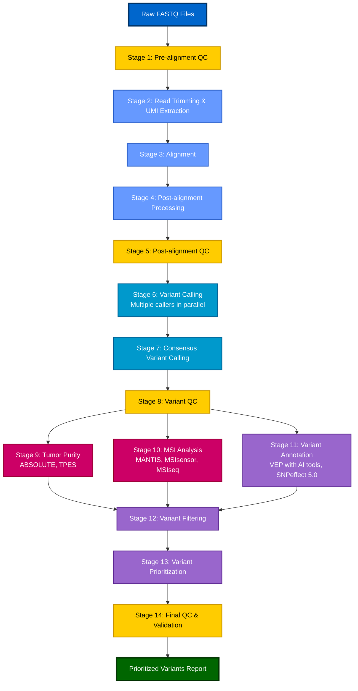

## Overview

This document provides comprehensive, step-by-step guidelines for analyzing sequencing data to detect somatic variants, from raw FASTQ files to prioritized variants. The pipeline is designed to work with both **Whole Genome Sequencing (WGS)** and **Whole Exome Sequencing (WES)** data, with specific considerations and parameters for each sequencing type (see table below). The pipeline emphasizes the use of multiple tools at each stage for consensus building and majority voting to improve accuracy and reduce false positives.

**Key Differences in Pipeline Execution**:

| Aspect | WGS | WES |
|--------|-----|-----|
| **Target BED file** | Not required | Required (exome regions) |
| **Coverage metrics** | CollectWgsMetrics | CollectHsMetrics with BED |
| **Mean coverage** | 60-100x (tumor) | 100-150x in targets (tumor) |
| **On-target %** | N/A | ≥80% required |
| **Variant calling** | Genome-wide | Optionally restrict to targets |
| **CNV calling** | Excellent | Reduced sensitivity |
| **MSI analysis** | Comprehensive | Limited to exonic regions |
| **Tumor purity** | Both ABSOLUTE & TPES work well | TPES preferred (ABSOLUTE limited) |

## Pipeline Architecture

### Workflow Overview

The pipeline consists of 14 stages from raw FASTQ files to prioritized variants. The workflow diagram below shows the complete pipeline with parallel processing opportunities:



## Detailed Pipeline Steps

### Stage 1: Pre-alignment Quality Control

**Objective**: Assess raw sequencing data quality before processing

**Tools**:

- **FastQC**: Primary QC tool for sequencing data quality assessment
- **MultiQC**: Aggregate QC metrics across samples for comparison

**Best Practices**:

- Run FastQC on all samples before trimming to assess raw data quality
- Aggregate results with MultiQC to compare quality metrics across samples and identify potential sequencing batch effects (quality score differences, GC content patterns, adapter contamination levels)
- Check key metrics: per-base quality, adapter contamination, GC content, sequence duplication
- Set quality thresholds: Phred score > 20 for most bases, < 10% adapter contamination

**Example Commands**:

```bash
# FastQC on raw reads
fastqc sample_R1.fastq.gz sample_R2.fastq.gz -o qc_raw/

# MultiQC aggregation
multiqc qc_raw/ -o qc_raw_report/
```

### Stage 2: Read Trimming and Adapter Removal

**Objective**: Remove low-quality bases, adapters, and sequencing artifacts; extract UMIs if present

**Tools**:

- **fastp**: All-in-one FASTQ preprocessor with built-in QC, adapter detection, quality filtering, and UMI extraction

**UMI Detection and Handling**:

UMIs (Unique Molecular Identifiers) are molecular barcodes used to tag individual DNA molecules before PCR amplification. They are critical for:

- Accurate duplicate removal (grouping reads from the same original molecule)
- Error correction (consensus building from UMI families)
- Improved low VAF (variant allele fraction, the proportion of DNA molecules in a specific sample that carry a particular genetic mutation at a given genomic location) variant detection (especially important for ctDNA and low-purity tumor samples)

**UMI Location Options**:

- **Index reads**: UMIs in i7 (index1) or i5 (index2) reads
- **Read sequences**: UMIs at the beginning of read1 or read2
- **Combined**: per_index (index1+index2) or per_read (read1+read2)

**Best Practices**:

- **Check for UMIs**: Inspect FASTQ files to determine if UMIs are present and their location
- **UMI extraction**: Use fastp to extract UMIs and append to read names (format: `@readname:UMI:sequence`)
- **UMI validation**: After extraction, validate UMI format and compatibility with downstream tools (see validation steps below)
- **UMI quality assessment**: Check UMI base quality scores after extraction
- **UMI correction**: Perform UMI correction if UMI base quality is low (see Stage 4)
- Use fastp's automatic adapter detection for paired-end reads
- Remove low-quality bases (Phred < 15) from ends
- Remove reads shorter than 25 bp after trimming
- Use sliding window approach (4 bp window, mean quality > 15)
- Keep paired-end reads properly paired
- fastp provides integrated QC metrics (similar to FastQC) in JSON/HTML format

**Example Commands**:

```bash
# fastp trimming and QC (without UMI)
fastp -i sample_R1.fastq.gz -I sample_R2.fastq.gz \
  -o sample_R1_trimmed.fastq.gz -O sample_R2_trimmed.fastq.gz \
  --detect_adapter_for_pe \
  --qualified_quality_phred 20 \
  --length_required 36 \
  --cut_front --cut_tail \
  --cut_window_size 4 --cut_mean_quality 20 \
  --json fastp_report.json \
  --html fastp_report.html

# fastp with UMI extraction (if UMIs are in index reads)
fastp -i sample_R1.fastq.gz -I sample_R2.fastq.gz \
  --index1 index1.fastq.gz --index2 index2.fastq.gz \
  -o sample_R1_trimmed.fastq.gz -O sample_R2_trimmed.fastq.gz \
  --umi_loc per_index \
  --umi_prefix "UMI:" \
  --detect_adapter_for_pe \
  --qualified_quality_phred 20 \
  --length_required 36 \
  --cut_front --cut_tail \
  --cut_window_size 4 --cut_mean_quality 20 \
  --json fastp_report.json \
  --html fastp_report.html

# fastp with UMI extraction (if UMIs are at start of read1)
fastp -i sample_R1.fastq.gz -I sample_R2.fastq.gz \
  -o sample_R1_trimmed.fastq.gz -O sample_R2_trimmed.fastq.gz \
  --umi_loc read1 \
  --umi_len 8 \
  --umi_prefix "UMI:" \
  --detect_adapter_for_pe \
  --qualified_quality_phred 20 \
  --length_required 36 \
  --cut_front --cut_tail \
  --cut_window_size 4 --cut_mean_quality 20 \
  --json fastp_report.json \
  --html fastp_report.html
```

**UMI Validation After Extraction** (if UMIs were extracted):

After UMI extraction by fastp, validate that UMIs are correctly formatted and can be handled by downstream tools:

**Validation Steps**:

1. **Check UMI format in FASTQ read names**:
   - Verify UMIs are appended to read names in expected format
   - fastp default format: `@readname:UMI` (if `--umi_prefix "UMI:"` used)
   - Verify UMI length matches expected length
   - Check for invalid characters in UMIs (should be A, T, G, C, N)

**Best Practices**:

- **Validate UMI format immediately after extraction**: Check a sample of reads to ensure UMIs are correctly appended to read names
- **Verify UMI length**: Ensure all UMIs have expected length (e.g., 8-12 bp)
- **Document UMI format**: Record UMI location, length, and format for reference
- **After alignment (Stage 4)**: Verify UMIs are properly transferred to BAM and can be extracted for downstream tools

**Example Commands**:

```bash
# Validate UMI extraction (if UMIs were extracted)
# Step 1: Check UMI format in FASTQ read names
zcat sample_R1_trimmed.fastq.gz | head -n 4 | grep "^@"
# Expected output: @readname:UMI_sequence
# Example: @M00123:123:000000000-A1B2C:1:1101:12345:6789:UMI:ATCGATCG

# Step 2: Extract and validate UMI sequences
zcat sample_R1_trimmed.fastq.gz | \
  grep "^@" | \
  sed 's/.*UMI:\([ACGTN]*\).*/\1/' | \
  head -1000 > extracted_umis.txt

# Check UMI length distribution
awk '{print length($0)}' extracted_umis.txt | sort | uniq -c
# Expected: All UMIs should have same length (e.g., 8 bp)

# Check for invalid characters
grep -v "^[ACGTN]*$" extracted_umis.txt
# Expected: No output (all UMIs should contain only A, C, G, T, N)

# Step 3: Verify UMI count matches read count
UMI_COUNT=$(zcat sample_R1_trimmed.fastq.gz | grep -c "^@.*UMI:")
READ_COUNT=$(zcat sample_R1_trimmed.fastq.gz | grep -c "^@")
echo "UMI count: $UMI_COUNT, Read count: $READ_COUNT"
# Expected: UMI_COUNT should equal READ_COUNT (all reads should have UMIs)

# Step 4: Check UMI uniqueness (optional, for quality assessment)
sort extracted_umis.txt | uniq | wc -l
# Compare unique UMIs to total UMIs to assess UMI diversity
```

### Stage 3: Alignment to Reference Genome

**Objective**: Map trimmed reads to reference genome

**Tools**:

- **DRAGEN** (if available): Hardware-accelerated alignment on FPGA platform
- **DRAGMAP**: Software implementation for standard hardware (CPU/GPU), recommended when FPGA
- **BWA-MEM**: Industry standard for short reads hardware is not available

#### Comparison: BWA-MEM vs. DRAGEN vs. DRAGMAP

| Feature | **BWA-MEM** | **DRAGEN** | **DRAGMAP** |
|---------|-------------|------------|-------------|
| **Hardware Requirements** | Standard CPU | FPGA hardware (Illumina DRAGEN platform) | Standard CPU/GPU |
| **Speed** | Moderate (industry standard) | Very fast (hardware-accelerated) | Fast (optimized software implementation) |
| **Accuracy** | High (well-validated) | High (equivalent to DRAGMAP) | High (equivalent to DRAGEN) |
| **Decoy Support** | Manual setup required | Built-in support | Built-in support with automatic detection |
| **ALT Masking** | Manual BED file required | Built-in support | Built-in support with ALT mask BED |
| **Pangenome Support** | Not supported | Supported (DRAGEN v4.3+) | Supported (with pangenome hash tables) |
| **Cost** | Free, open-source | Requires DRAGEN hardware purchase | Free, open-source |
| **Ease of Use** | Well-documented, widely adopted | Requires DRAGEN hardware setup | Easy installation via conda or build from source |
| **Best Use Cases** | • Standard research workflows<br>• When DRAGEN hardware unavailable<br>• Widely compatible with existing pipelines | • Large-scale production environments<br>• When speed is critical<br>• When DRAGEN hardware is available | • When DRAGEN-like accuracy needed without hardware<br>• Large-scale projects requiring fast alignment<br>• Somatic variant calling (improved mapping specificity) |

**Recommendation for Somatic Variant Analysis**: Prioritize **DRAGMAP** or **DRAGEN** over BWA-MEM for somatic variant calling due to:
- **Improved mapping specificity**: Built-in decoy and ALT masking reduce false positives from misaligned reads (critical for low-VAF variant detection)
- **Better accuracy for low-VAF variants**: Reduced ambiguous mapping improves detection of rare somatic variants
- **DRAGEN-GATK compatibility**: DRAGMAP/DRAGEN alignments are optimized for GATK variant calling workflows

**When to Use DRAGEN**:
- Large-scale production environments with high throughput needs
- When DRAGEN hardware platform is available
- When maximum speed is critical
- Clinical or commercial sequencing services
- **Somatic variant analysis** (recommended when hardware available)

**When to Use DRAGMAP**:
- **Somatic variant analysis** (recommended for standard hardware)
- When DRAGEN-like accuracy and features are needed without hardware investment
- Large-scale projects requiring fast alignment on standard hardware
- Projects benefiting from built-in decoy and ALT masking support

**When to Use BWA-MEM**:
- Standard research workflows with well-established pipelines
- When compatibility with existing tools is important
- Projects with moderate throughput requirements
- When DRAGEN hardware is not available and DRAGMAP cannot be used
- **Note**: For somatic variant analysis, DRAGMAP/DRAGEN are preferred due to improved mapping specificity

**Best Practices for DRAGMAP alignment**: See the [DRAGMAP and GATK Variant Calling Tutorial]() for detailed alignment commands, reference preparation, and best practices.

**Best Practices for BWA-mem alignment**:

- Use GRCh38/hg38 reference genome (latest version, most used) or T2T reference (premature release, incomplete annotation)
- Include decoy sequences (hs38d1) and ALT assemblies for better mapping
- Set appropriate read group information (SM, ID, PL, LB, PU)
- **Sequencing type considerations** (see Overview table for WGS vs WES differences):
  - **WGS**: No target region restrictions; align all reads genome-wide
  - **WES**: No target region restrictions during alignment (align all reads, filter to targets later if needed); obtain exome target BED file from capture kit manufacturer for downstream QC and variant calling
- **If UMIs were extracted by fastp**: 
  - BWA-MEM preserves read names, so UMIs in read names will be preserved in BAM
  - UMIs need to be in RX tag for downstream tools (UMICollapse, fgbio)
  - Convert UMIs from read names to RX tag after alignment (see Stage 4)
- **For ctDNA (circulating tumor DNA)**: Use sensitive BWA-mem alignment parameters to maximize detection of low-VAF variants
  - **Rationale**: ctDNA samples typically have low tumor fraction and low-VAF variants (<1-5%), requiring more sensitive alignment to avoid missing true variants
  - **Parameter adjustments** (general recommendations; adjust based on your data and validation):
    - **Lower mismatch penalty**: Reduce `-B` (mismatch penalty) to allow more mismatches (e.g., `-B 2` instead of default `-B 4`)
    - **Lower gap penalties**: Reduce gap open/extend penalties to allow more indels (e.g., `-O 4,4 -E 1,1` instead of default `-O 6,6 -E 1,1`)
    - **Shorter seed length**: Use `-k` to allow shorter seeds for more sensitive mapping (e.g., `-k 17` instead of default `-k 19`)
  - **Consider**: These settings increase sensitivity for low-VAF variants but may also increase false positives; balance with downstream filtering and use UMI-based error correction when available
  - **Note**: Specific parameter values should be validated for your sequencing platform and ctDNA workflow; consider benchmarking against known variants

**Example Commands for BWA-mem alignment**:

```bash
# BWA-MEM alignment
bwa mem -t 16 -M \
  -R "@RG\tID:sample\tSM:sample\tPL:ILLUMINA\tLB:lib1\tPU:unit1" \
  reference.fa \
  sample_R1_trimmed.fastq.gz sample_R2_trimmed.fastq.gz \
  | samtools view -bS - > sample.bam

# Sort BAM
samtools sort -@ 8 sample.bam -o sample.sorted.bam
samtools index sample.sorted.bam

# If UMIs were extracted by fastp, verify they are preserved in BAM read names
# (UMIs will be in read names, need to be converted to RX tag in Stage 4)
if [ -n "$HAS_UMI" ]; then
  samtools view sample.sorted.bam | head -1 | awk '{print $1}' | grep -q "UMI" && \
    echo "UMI found in BAM read names" || \
    echo "WARNING: UMI not found in BAM read names"
fi

# BWA-MEM alignment for ctDNA (sensitive parameters for low-VAF detection)
bwa mem -t 16 -M \
  -B 2 -O 4,4 -E 1,1 -k 17 \
  -R "@RG\tID:ctDNA_sample\tSM:ctDNA_sample\tPL:ILLUMINA\tLB:lib1\tPU:unit1" \
  reference.fa \
  ctDNA_R1_trimmed.fastq.gz ctDNA_R2_trimmed.fastq.gz \
  | samtools view -bS - > ctDNA_sample.bam
# Sensitive parameters for ctDNA:
# -B 2: Lower mismatch penalty (default 4) - allows more mismatches for variant detection
# -O 4,4: Lower gap open penalty (default 6,6) - allows more indels
# -E 1,1: Gap extension penalty (default 1,1) - same as default
# -k 17: Shorter seed length (default 19) - increases sensitivity for low-quality reads
# Note: Sensitive parameters increase sensitivity for low-VAF variants but may increase false positives;
#       use UMI-based error correction and stringent downstream filtering
```

### Stage 4: Post-alignment Processing

**Objective**: Optimize alignments and prepare for variant calling; perform UMI-aware duplicate marking if UMIs are present

**Steps**:

1. **UMI Correction** (if UMIs present and quality is low):

   - Correct sequencing errors in UMI sequences
   - Group similar UMIs that likely represent the same original molecule

2. **Duplicate Marking**: 

   - **Standard**: Identify PCR/optical duplicates (if no UMIs)
   - **UMI-aware**: Group reads by UMI and alignment position (if UMIs present)

3. **Base Quality Score Recalibration (BQSR)**: Correct systematic biases

**Tools**:

- **Standard duplicate marking**:
  - **GATK MarkDuplicates**: Recommended for best performance
  - **samtools markdup**: Alternative duplicate marking
- **UMI correction** (if UMI quality is low):
  - **fgbio CorrectUmis**: Correct UMI sequencing errors by matching to known UMI sets or using network-based methods
  - **DRAGEN**: UMI error correction using lookup table or sequence similarity (if DRAGEN hardware available)
- **UMI-aware processing**:
  - **UMICollapse**: Primary tool for fast UMI deduplication (recommended, ~50x faster than umi-tools)
  - **fgbio** (optional): Alternative workflow for consensus building and error correction
    - **fgbio GroupReadsByUmi**: Group reads by UMI and alignment position
    - **fgbio CallMolecularConsensusReads**: Generate consensus reads from UMI families
    - **fgbio FilterConsensusReads**: Filter consensus reads by quality
- **GATK BaseRecalibrator + ApplyBQSR**: Quality score recalibration (recommended for best performance)

**Best Practices**:

- **Check for UMIs**: Verify if UMI information is present in read names (from Stage 2)
- **Validate UMI format in BAM**: After alignment, verify UMIs are accessible and properly formatted
  - **Verify UMI transfer to BAM**: fastp extracts UMIs to read names, and aligners preserve read names; verify UMIs are present in aligned BAM
  - **Extract UMIs from BAM read names**: Check that UMIs from fastp are preserved in BAM read names
  - **Convert to BAM tags if needed**: Downstream tools (UMICollapse, fgbio) require UMIs in RX tag rather than read names
  - **Test UMI extraction compatibility**: Verify UMI format matches what downstream tools expect
    - UMICollapse expects RX tag in BAM (extracted from read names during alignment or post-alignment)
    - fgbio expects RX tag or can extract from read names
  - **Validate UMI format**: Ensure UMIs can be extracted by UMICollapse or fgbio
- **Assess UMI quality**: Check UMI base quality scores
  - **Low quality threshold**: Mean UMI quality < 20 (Phred score)
  - **Perform correction if**: >10% of UMIs have low-quality bases
- **UMI correction** (if UMI quality is low):
  - Correct sequencing errors in UMI sequences before deduplication
  - Use fgbio CorrectUmis for error correction
  - If using predefined UMI sets: Match observed UMIs to known set
  - If no predefined set: Use network-based methods to group similar UMIs
  - Improves deduplication accuracy by correcting UMI errors
- **UMI-aware duplicate marking** (if UMIs present):
  - **Primary approach (UMICollapse)**: Fast deduplication based on UMI and alignment position
    - Processes 1M+ UMIs in ~26 seconds (vs 20+ minutes for umi-tools)
    - Recommended for most use cases requiring fast deduplication
  - **Alternative approach (fgbio)**: Consensus building workflow for error correction
    - Group reads by UMI and alignment position
    - Generate consensus reads from UMI families (reduces sequencing errors)
    - Filter consensus reads by quality and family size
    - **Important**: Do NOT run MarkDuplicates after fgbio consensus building
      - Consensus workflow already performs UMI-based deduplication
      - Each consensus read = unique UMI family = unique original molecule
      - Multiple UMI families at same position are NOT duplicates (different molecules)
      - Running coordinate-based MarkDuplicates would incorrectly remove legitimate reads
    - Use when error correction via consensus is critical (e.g., very low VAF detection)
  - More accurate than standard duplicate marking for low VAF variants
- **Standard duplicate marking** (if no UMIs):
  - Mark duplicates based on mapping coordinates (and CIGAR) to avoid false positives from PCR artifacts
  - For ctDNA: Consider less aggressive duplicate marking (may remove true low-VAF variants)
- Use known variant sites (dbSNP, Mills) for BQSR
- Generate metrics: duplication rate, insert size distribution, UMI family size (if applicable)

**Example Commands**:

```bash
# Standard duplicate marking (no UMIs, only coordinates) - using GATK
gatk MarkDuplicates \
  -I sample.sorted.bam \
  -O sample.markdup.bam \
  -M sample.markdup.metrics.txt

# or using coordinates and CIGAR
gatk MarkDuplicatesWithMateCigar \
  -I sample.sorted.bam \
  -O sample.markdup.bam \
  -M sample.markdup.metrics.txt

# UMI-aware processing (if UMIs present)
# Step 0: Validate UMIs in BAM and convert to RX tag if needed
# Extract UMIs from read names (fastp format: @readname:UMI:sequence)
# Check if UMIs are in read names
samtools view sample.sorted.bam | head -1 | awk '{print $1}'
# Expected: Read name should contain UMI (e.g., readname:UMI:ATCGATCG)

# Extract UMIs from read names and verify format
samtools view sample.sorted.bam | \
  head -1000 | \
  awk '{if($1 ~ /:UMI:/) {split($1, parts, ":UMI:"); print parts[2]}}' | \
  head -10
# Expected: UMI sequences (e.g., ATCGATCG)

# Extract UMIs from read names and add as RX tag
# fastp appends UMI to read name (format: readname:UMI:sequence when --umi_prefix "UMI:" is used)
# Method 1: Using awk (GNU awk required for match() with array)
samtools view -h sample.sorted.bam | \
  awk 'BEGIN{OFS="\t"} 
       /^@/ {print; next}
       {
         read_name = $1
         # Extract UMI from read name (format: readname:UMI:sequence)
         if (match(read_name, /:UMI:([ACGTN]+)$/, umi_arr)) {
           umi = umi_arr[1]
           # Remove UMI suffix from read name
           gsub(/:UMI:[ACGTN]+$/, "", $1)
           # Reconstruct the line with RX tag
           # BAM format: QNAME FLAG RNAME POS MAPQ CIGAR ... (then optional tags)
           # Add RX tag at the end
           print $0 "\tRX:Z:" umi
         } else {
           print
         }
       }' | \
  samtools view -bS - > sample.umi_tagged.bam

# Method 2: Using Python (more robust, recommended)
python3 << 'PYTHON_SCRIPT'
import pysam
import re
import sys

in_bam_path = "sample.sorted.bam"
out_bam_path = "sample.umi_tagged.bam"

# Pattern to match UMI in read name (format: readname:UMI:sequence)
umi_pattern = re.compile(r':UMI:([ACGTN]+)$')

try:
    in_bam = pysam.AlignmentFile(in_bam_path, "rb")
    out_bam = pysam.AlignmentFile(out_bam_path, "wb", template=in_bam)
    
    for read in in_bam:
        # Extract UMI from read name
        umi_match = umi_pattern.search(read.query_name)
        if umi_match:
            umi = umi_match.group(1)
            # Remove UMI suffix from read name
            read.query_name = umi_pattern.sub('', read.query_name)
            # Add RX tag
            read.set_tag('RX', umi, 'Z')
        out_bam.write(read)
    
    in_bam.close()
    out_bam.close()
    print(f"Successfully extracted UMIs and added RX tags to {out_bam_path}")
except Exception as e:
    print(f"Error: {e}", file=sys.stderr)
    sys.exit(1)
PYTHON_SCRIPT

# Verify RX tag is present
samtools view sample.umi_tagged.bam | head -1 | grep -o "RX:Z:[^\t]*"
# Expected: RX:Z:ATCGATCG (or similar)

# Step 1: Assess UMI quality (check if correction needed)
# Check UMI quality from BAM file (if quality scores available in read names)
samtools view sample.umi_tagged.bam | \
  awk '{for(i=1;i<=NF;i++) if($i~/^RX:/) print $i}' | \
  head -100
# Calculate mean quality (if quality scores available)

# Step 2: UMI correction (if UMI quality is low)
# Option A: fgbio CorrectUmis (with predefined UMI set)
fgbio CorrectUmis \
  --input sample.sorted.bam \
  --output sample.umi_corrected.bam \
  --umi-tag RX \
  --umi-set known_umis.txt \
  --max-edit-distance 1

# Option B: fgbio CorrectUmis (network-based, no predefined set)
fgbio CorrectUmis \
  --input sample.sorted.bam \
  --output sample.umi_corrected.bam \
  --umi-tag RX \
  --max-edit-distance 1 \
  --min-reads-per-umi 2

# Step 3: UMI deduplication
# Primary approach: UMICollapse (fast deduplication)
# Use UMI-tagged BAM (with RX tag) or corrected BAM if correction was performed
INPUT_BAM=${UMI_CORRECTED:-sample.umi_tagged.bam}
# Verify RX tag is present before deduplication
samtools view $INPUT_BAM | head -1 | grep -q "RX:Z:" && echo "RX tag present" || echo "WARNING: RX tag missing"

umicollapse dedup \
  --input $INPUT_BAM \
  --output sample.umicollapse.bam \
  --method directional \
  --min-mapq 20 \
  --edit-distance 1 \
  --umi-tag RX

# Alternative approach: fgbio consensus building (for error correction)
# Use when consensus-based error correction is critical (e.g., very low VAF)
# Step 1: Group reads by UMI
# Use UMI-tagged BAM (with RX tag) for fgbio
INPUT_BAM_FGBIO=${UMI_CORRECTED:-sample.umi_tagged.bam}
fgbio GroupReadsByUmi \
  --input $INPUT_BAM_FGBIO \
  --output sample.grouped.bam \
  --strategy Adjacent \
  --edits 1 \
  --min-map-q 20 \
  --umi-tag RX

# Step 2: Generate consensus reads from UMI families
fgbio CallMolecularConsensusReads \
  --input sample.grouped.bam \
  --output sample.consensus.bam \
  --error-rate-pre-umi 45 \
  --error-rate-post-umi 30 \
  --min-input-base-quality 20 \
  --min-reads 1

# Step 3: Filter consensus reads
fgbio FilterConsensusReads \
  --input sample.consensus.bam \
  --output sample.consensus.filtered.bam \
  --min-reads 2 \
  --max-read-error-rate 0.05 \
  --min-base-quality 20

# Note: Do NOT run MarkDuplicates after fgbio consensus building
# The consensus workflow already performs UMI-based deduplication:
# - Each consensus read represents a unique UMI family (unique original molecule)
# - Multiple UMI families can legitimately map to the same position (different molecules)
# - Running MarkDuplicates (coordinate-based) would incorrectly mark these as duplicates
# - This would remove legitimate non-duplicate reads and reduce sensitivity

# Base quality recalibration (works with both standard and UMI-processed BAMs) - using DRAGEN-GATK
# Use consensus.filtered.bam directly (no MarkDuplicates needed after UMI consensus)
gatk BaseRecalibrator \
  -R reference.fa \
  -I sample.consensus.filtered.bam \
  --known-sites dbsnp.vcf.gz \
  --known-sites mills.vcf.gz \
  -O sample.recal.table

gatk ApplyBQSR \
  -R reference.fa \
  -I sample.consensus.filtered.bam \
  -bqsr sample.recal.table \
  -O sample.recal.bam
```

### Stage 5: Post-alignment Quality Control

**Objective**: Assess alignment quality, coverage metrics, and identify potential issues before variant calling

**Tools**:

- **samtools stats**: Comprehensive alignment statistics
- **GATK CollectAlignmentSummaryMetrics**: Alignment quality metrics
- **GATK CollectInsertSizeMetrics**: Insert size distribution
- **GATK CollectWgsMetrics**: Whole genome coverage metrics (for WGS)
- **GATK CollectHsMetrics**: Hybrid selection (targeted) coverage metrics (for WES and targeted panels)
- **GATK CollectGcBiasMetrics**: GC bias assessment
- **Qualimap**: Comprehensive BAM QC analysis
- **QoRTs**: Quality control tool for RNA-seq and DNA-seq data; provides detailed QC metrics including coverage, mapping quality, insert size, and gene/transcript-level statistics; generates comprehensive QC reports and visualizations
- **Alfred**: Multi-sample QC metrics in read-group aware manner; computes alignment metrics, GC bias, base composition, insert size, and coverage distributions; supports haplotype-aware analysis; provides interactive web application for visualization
- **QC3**: Multi-stage QC tool (alignment stage); detects batch effects and cross-contamination
- **SeqSQC**: Sex check tool that predicts sample sex based on X chromosome inbreeding coefficient; identifies discrepancies between reported and genetic sex
- **MultiQC**: Aggregate QC metrics across samples

**Key Metrics to Assess**:

1. **Coverage Metrics** (see QC Thresholds section below for specific thresholds):

   - **Mean coverage**: Should meet minimum requirements (see Overview table and QC Thresholds section)
   - **Coverage uniformity**: Coefficient of variation (CV) < 0.5 for uniform coverage
   - **On-target percentage**: WGS not applicable; WES and targeted panels >80% (see Overview table)
   - **Coverage distribution**: Check for coverage gaps or extreme outliers

2. **Mapping Quality**:

   - **Percentage of properly paired reads**: >90% for paired-end data
   - **Mapping quality (MQ)**: Mean MQ > 40
   - **Unmapped reads**: <5% unmapped reads
   - **Secondary/supplementary alignments**: Check for excessive secondary alignments

3. **Duplicate Metrics**:

   - **Duplication rate**: 
     - **Ideal thresholds** (may vary based on library preparation):
       - WGS: <20% duplication rate (typical for PCR-free libraries)
       - WES: <30% duplication rate (slightly higher due to target enrichment)
       - Targeted panels: <50% duplication rate
     - **Note**: Duplication rates can be significantly higher depending on PCR amplification cycles used during library preparation
       - High PCR cycles → higher duplication rates (may exceed ideal thresholds)
       - UMI-based deduplication can help manage high duplication rates
       - Evaluate duplication in context of library preparation method
     - ctDNA: May have higher duplication due to low input
   - **UMI family size** (if UMIs used): Check distribution of UMI family sizes

4. **Insert Size Metrics**:

   - **Mean insert size**: Should match library preparation expectations
   - **Insert size distribution**: Check for normal distribution, identify library issues
   - **Standard deviation**: Should be reasonable for library type

5. **Base Quality**:

   - **Mean base quality**: Should be >40 (Phred score)
   - **Base quality distribution**: Check for quality degradation

6. **GC Bias**:

   - **GC bias**: Should be minimal (GC bias coefficient close to 1.0)
   - **GC coverage correlation**: Check for GC-related coverage bias

7. **Contamination Checks**:

   - **Cross-sample contamination**: Use specialized tools for accurate detection and quantification:
     - **DRAGEN Cross-Sample Contamination Module**: Probabilistic mixture model to estimate fraction of reads from another human source; supports separate modes for germline and somatic samples (recommended when DRAGEN is available)
     - **ContEst (GATK)**: Estimates level of cross-individual contamination; accurate across various contamination levels and read depths
     - **VerifyBamID**: Verifies sample identity and detects contamination using population variant data
     - **QC3**: Multi-stage QC tool that can detect cross-contamination
   - **Batch effects**: Use QC3 to detect batch effects across samples
   - **Species contamination**: Check for non-human reads
   - **Sample identity**: Verify sample matches expected identity

8. **Sex Check**:

   - **Sex validation**: Verify biological sex matches expected sex based on genetic data
   - **X/Y chromosome coverage ratio**: Calculate coverage ratio between X and Y chromosomes
     - Males: X/Y ratio ~1.0 (one X, one Y chromosome)
     - Females: X/Y ratio >> 1.0 (very high, typically 10-100+; two X chromosomes, minimal Y coverage from background mapping/pseudoautosomal regions)
   - **X/autosome coverage ratio**: Alternative method using X chromosome coverage relative to autosomes
     - Males: X/autosome ratio ~0.5 (haploid X chromosome)
     - Females: X/autosome ratio ~1.0 (diploid X chromosomes)
   - **X chromosome inbreeding coefficient**: Use SeqSQC to calculate inbreeding coefficient from X chromosome variants
   - **Discrepancy detection**: Flag samples where reported sex doesn't match genetic sex (indicates sample mix-up or contamination)

**Best Practices**:

- Run QC on both tumor and normal samples (if available)
- **Use Alfred for read-group aware QC**: Computes metrics by read group, useful for multi-sample comparisons
- **Alfred interactive visualization**: Use Alfred's web application for interactive exploration of QC metrics across samples
- **Perform cross-sample contamination detection**: Essential for ensuring sample purity
  - **DRAGEN Cross-Sample Contamination**: Use when DRAGEN is available; provides accurate contamination estimates for both germline and somatic samples
  - **ContEst**: Use for detailed contamination level estimation; requires population allele frequency data
  - **VerifyBamID**: Use for sample identity verification and contamination detection
  - **QC3**: Use for multi-stage contamination detection across raw data, alignment, and variant stages
  - **Thresholds**: 
    - Germline samples: < 2% contamination acceptable
    - Somatic samples: < 5% contamination acceptable (higher threshold due to tumor heterogeneity)
    - **Fail samples with high contamination** (> 5% for germline, > 10% for somatic) before proceeding
- **Use QC3 for batch effect detection**: Run QC3 on all samples to identify batch effects and cross-contamination
- **Alfred haplotype-aware analysis**: If working with phased data, use Alfred for haplotype-resolved QC metrics
- **Perform sex check**: Verify biological sex matches expected sex using X/Y chromosome coverage ratio, X/autosome ratio, or SeqSQC
  - **X/Y coverage ratio method**: Calculate from BAM files (males: ~1.0, females: >> 1.0, typically 10-100+)
  - **X/autosome ratio method**: Calculate X chromosome coverage relative to autosomes (males: ~0.5, females: ~1.0)
  - **SeqSQC method**: Use after variant calling for more accurate sex prediction based on X chromosome inbreeding coefficient
  - **Flag discrepancies**: Investigate samples where reported sex doesn't match genetic sex
- Compare tumor vs normal metrics to identify issues
- Set QC thresholds based on sequencing type (WGS, WES, targeted)
- For ctDNA: Adjust thresholds (may have lower coverage, higher duplication)
- Generate comprehensive QC reports for documentation
- **Fail samples that don't meet QC thresholds** before proceeding to variant calling

**Example Commands**:

```bash
# Collect alignment summary metrics
gatk CollectAlignmentSummaryMetrics \
  -R reference.fa \
  -I sample.recal.bam \
  -O sample.alignment_metrics.txt

# Collect insert size metrics
gatk CollectInsertSizeMetrics \
  -R reference.fa \
  -I sample.recal.bam \
  -O sample.insert_size_metrics.txt \
  -H sample.insert_size_histogram.pdf

# Collect coverage metrics
# For WGS: Use CollectWgsMetrics (no target regions needed)
# For WES: Use CollectHsMetrics with target BED file (exome regions)
gatk CollectWgsMetrics \
  -R reference.fa \
  -I sample.recal.bam \
  -O sample.wgs_metrics.txt

# For WES (replace CollectWgsMetrics with CollectHsMetrics):
# gatk CollectHsMetrics \
#   -R reference.fa \
#   -I sample.recal.bam \
#   -O sample.wes_metrics.txt \
#   -TI exome_target_regions.bed \
#   -BI exome_target_regions.bed

# Collect GC bias metrics
gatk CollectGcBiasMetrics \
  -R reference.fa \
  -I sample.recal.bam \
  -O sample.gc_bias_metrics.txt \
  -CHART sample.gc_bias_chart.pdf \
  -SAMPLE_SIZE 100000

# Comprehensive QC with Qualimap
qualimap bamqc \
  -bam sample.recal.bam \
  -outdir qualimap_output/ \
  --java-mem-size=8G

# Cross-sample contamination detection
# Option 1: DRAGEN Cross-Sample Contamination (recommended if DRAGEN available)
# For germline samples
dragen --bam-input sample.recal.bam \
  --enable-cross-sample-contamination-detection true \
  --cross-sample-contamination-mode germline \
  --output-dir contamination_output/

# For somatic samples
dragen --bam-input tumor.recal.bam \
  --enable-cross-sample-contamination-detection true \
  --cross-sample-contamination-mode somatic \
  --output-dir contamination_output/

# Option 2: ContEst (GATK) - estimates contamination level
gatk ContEst \
  -R reference.fa \
  -I sample.recal.bam \
  -O contamination_output/contamination.txt \
  --population-af /path/to/population_af.vcf.gz \
  --genotype-concordance /path/to/genotype_concordance.vcf.gz

# Option 3: VerifyBamID - verifies sample identity and detects contamination
verifyBamID \
  --vcf reference_variants.vcf.gz \
  --bam sample.recal.bam \
  --out verifybamid_output \
  --precise

# Alfred alignment QC (read-group aware, multi-sample, recommended for batch effect detection)
# Alfred generates interactive web application for visualization
# Access at: alfred_qc_multi/index.html
alfred qc -r reference.fa \
  -o alfred_qc_multi/ \
  *.recal.bam

# QC3 alignment QC (second stage of multi-stage QC)
qc3 --bam sample.recal.bam \
  --reference reference.fa \
  --output qc3_alignment/ \
  --stage alignment

# Sex check using X/Y chromosome coverage ratio
# Calculate coverage on X and Y chromosomes
samtools view -b sample.recal.bam chrX | \
  samtools depth - | awk '{sum+=$3; count++} END {print "X_coverage:", sum/count}' > sex_check.txt
samtools view -b sample.recal.bam chrY | \
  samtools depth - | awk '{sum+=$3; count++} END {print "Y_coverage:", sum/count}' >> sex_check.txt

# Calculate X/Y ratio (males: ~1.0, females: >> 1.0, typically 10-100+)
# Calculate X/autosome ratio (males: ~0.5, females: ~1.0)
# Alternative: Use mosdepth for faster coverage calculation
mosdepth --by 1000 --chrom chrX sample.chrX sample.recal.bam
mosdepth --by 1000 --chrom chrY sample.chrY sample.recal.bam
mosdepth --by 1000 --exclude chrX,chrY sample.autosomes sample.recal.bam
# Calculate ratios
# X/Y ratio = X_coverage / Y_coverage
# X/autosome ratio = X_coverage / autosome_coverage

# Sex check using SeqSQC (requires VCF file, typically done after variant calling)
# R script:
# library(SeqSQC)
# seqfile <- LoadVfile("path_to_vcf")
# sex_check_results <- SexCheck(seqfile)
# print(sex_check_results)

# Aggregate QC metrics with MultiQC
multiqc . \
  -o multiqc_post_alignment/ \
  --title "Post-Alignment QC"
```

**QC Thresholds** (adjust based on goals):

- **Mean coverage**: 
  - **WGS tumor**: ≥60x (genome-wide mean)
  - **WGS normal**: ≥30x (genome-wide mean)
  - **WES tumor**: ≥100x (mean coverage in target/exonic regions)
  - **WES normal**: ≥50x (mean coverage in target/exonic regions)
  - **Targeted panels**: ≥500x (mean coverage in target regions)
  - **ctDNA**: ≥100x (WGS) or ≥200x (WES in target regions)
- **Properly paired reads**: ≥90%
- **Mean mapping quality**: ≥40
- **Duplication rate**: 
  - **Ideal thresholds** (may vary based on library preparation):
    - **WGS**: <20% (typical for PCR-free libraries)
    - **WES**: <30% (slightly higher due to target enrichment)
    - **Targeted panels**: <50%
  - **Note**: Duplication rates can be significantly higher depending on PCR amplification cycles
    - High PCR cycles during library preparation can result in duplication rates exceeding ideal thresholds
    - UMI-based deduplication is recommended for samples with high duplication rates
    - Evaluate duplication rates in context of library preparation method and sequencing depth
- **On-target percentage**: 
  - **WGS**: Not applicable (no target regions)
  - **WES**: ≥80% (reads mapping to exonic target regions)
  - **Targeted panels**: ≥80%
- **GC bias coefficient**: 0.8-1.2
- **Sex check**: Coverage ratios should match expected sex
  - **X/Y ratio method**:
    - Males: X/Y ratio ~1.0 (range: 0.8-1.2)
    - Females: X/Y ratio >> 1.0 (typically 10-100+, very high due to minimal Y chromosome coverage)
  - **X/autosome ratio method** (alternative, often more reliable):
    - Males: X/autosome ratio ~0.5 (range: 0.4-0.6)
    - Females: X/autosome ratio ~1.0 (range: 0.9-1.1)
  - **SeqSQC**: Inbreeding coefficient <0.2 (female), >0.8 (male)

**Action Items Based on QC Results**:

- **Low coverage**: Increase sequencing depth or exclude low-coverage regions
- **High duplication**: May indicate low input or PCR issues
- **Poor mapping quality**: Check reference genome, alignment parameters
- **GC bias**: May require GC correction or indicate library issues
- **Contamination detected**: Exclude contaminated samples or correct if possible
- **Abnormal insert size**: May indicate library preparation issues
- **Sex mismatch**: If reported sex doesn't match genetic sex, investigate sample mix-up or contamination

### Stage 6: Variant Calling (Multiple Tools)

**Objective**: Identify somatic variants using ensemble of callers

**SNV/Indel Callers** (use 3-5 for consensus):

1. **DRAGEN** (if available): Hardware-accelerated, high sensitivity
2. **GATK Mutect2**: Industry standard for tumor-normal pairs; DRAGEN features can be enabled for improved accuracy (`--dragen-mode true`). See the [DRAGMAP and GATK Variant Calling Tutorial]() for detailed alignment commands, reference preparation, and best practices.
3. **Strelka2**: High sensitivity, good for indels
4. **VarScan2**: Good for low-coverage data
5. **SomaticSniper**: Fast processing for high-coverage data

**Structural Variant Callers** (use 3-4 for consensus, as SVs are harder to detect):

1. **Manta**: Excellent for paired-end data, good sensitivity for deletions/duplications
2. **Delly**: Comprehensive SV detection, good for translocations
3. **Lumpy**: High sensitivity, good for complex rearrangements
4. **GRIDSS**: High precision, good for breakpoint resolution
5. **DRAGEN** (if available): Integrated SV calling with SNV/indel calling

**CNV Callers** (use 2-3 for consensus):

1. **DRAGEN CNV** (if available): Hardware-accelerated on FPGA platform
2. **GATK CNV**: Software implementation for standard hardware, recommended when DRAGEN hardware is not available
3. **Control-FREEC**: Works with/without matched normal
4. **ASCAT**: Handles tumor purity and ploidy

**Best Practices**:

- Run all callers on same BAM files for fair comparison
- Use tumor-normal pairs when available (improves specificity)
- For tumor-only: Use population frequency filtering
- **Sequencing type considerations** (see Overview table for WGS vs WES differences):
  - **WGS**: No target region restrictions; call variants genome-wide; provides comprehensive variant detection including non-coding regions
  - **WES**: Provide target BED file (exome regions) to variant callers for better performance; focus on exonic variants; may miss non-coding variants; CNV calling is more challenging due to sparse coverage
- **UMI-aware variant calling** (if UMIs were processed in Stage 4):
  - Use deduplicated BAM files from UMICollapse (fast, recommended)
  - Or use consensus BAM files from fgbio workflow (for error correction)
  - Some callers (e.g., LoFreq, VarDict) can directly use UMI information
  - UMI-processed data enables lower VAF thresholds
- **Note**: Tumor purity estimation (Stage 9) will be performed after variant calling and consensus. Purity estimates are used in downstream filtering (Stage 12) and prioritization (Stage 13)
- Set appropriate VAF thresholds:
  - **WGS tissue**: 5-10% minimum (adjust for purity)
  - **WES tissue**: 5-10% minimum (adjust for purity; may have higher depth in target regions)
  - **ctDNA**: 0.1-0.5% minimum (with high depth)
  - **With UMI processing**: Can lower thresholds (e.g., 0.05-0.1% for ctDNA)
- Apply caller-specific quality filters

**Example Commands**:

```bash
# GATK Mutect2 somatic variant calling with DRAGEN features (tumor-normal pair) - recommended
# For WGS: No target regions needed
# For WES: Add -L exome_target_regions.bed to restrict to target regions
gatk Mutect2 \
  -R reference.fa \
  -I tumor.recal.bam \
  -I normal.recal.bam \
  -normal normal_sample \
  -O mutect2-dragen.vcf.gz \
  --tumor-sample tumor_sample \
  --dragen-mode true \
  --use-pdhmm true \
  --dragstr-params-path /path/to/dragstr_params
  
# DRAGEN features:
# --dragen-mode true: Enables DRAGEN algorithms for improved accuracy
# --use-pdhmm true: Uses position-dependent HMM for maximum quality (optional)
# --dragstr-params-path: Path to DRAGSTR parameters file (optional, for STR-aware variant calling)

# Strelka2
# For WGS: Use default configuration
# For WES: Add --exome and --callRegions exome_target_regions.bed
configureStrelkaSomaticWorkflow.py \
  --tumorBam tumor.recal.bam \
  --normalBam normal.recal.bam \
  --referenceFasta reference.fa \
  --runDir strelka_workflow

strelka_workflow/runWorkflow.py -m local -j 16

# VarScan2
samtools mpileup -f reference.fa \
  tumor.recal.bam normal.recal.bam \
  | varscan somatic - varscan_output \
  --tumor-purity 0.8 --normal-purity 1.0

# Structural variant calling
# Manta
configManta.py \
  --tumorBam tumor.recal.bam \
  --normalBam normal.recal.bam \
  --referenceFasta reference.fa \
  --runDir manta_workflow
manta_workflow/runWorkflow.py -m local -j 16

# Delly
delly call -g reference.fa \
  -o delly.bcf \
  tumor.recal.bam normal.recal.bam

# Lumpy
lumpyexpress \
  -B tumor.recal.bam,normal.recal.bam \
  -S tumor.splitters.bam,normal.splitters.bam \
  -D tumor.discordants.bam,normal.discordants.bam \
  -o lumpy.vcf

# GRIDSS
gridss \
  --reference reference.fa \
  --output gridss.vcf \
  --assembly gridss.assembly.bam \
  tumor.recal.bam normal.recal.bam
```

### Stage 7: Consensus Variant Calling

**Objective**: Integrate results from multiple callers using majority voting for SNV/indels and structural variants

**Tools**:

- **bcftools isec**: Intersect VCF files from multiple callers
- **SomaticCombiner**: Specialized tool for somatic variant consensus
- **SURVIVOR**: Structural variant consensus caller
- **Custom scripts**: For flexible voting strategies

**A. SNV/Indel Consensus**:

**Voting Strategies**:

1. **Strict consensus**: Variant called by ALL callers (high specificity)
2. **Majority voting**: Variant called by ≥50% of callers (balanced)
3. **Relaxed consensus**: Variant called by ≥2 callers (high sensitivity)
4. **VAF-adaptive voting**: Adjust based on variant allele frequency

**Best Practices**:

- Normalize VCF files before comparison (vt normalize, bcftools norm)
- Require consensus for high-confidence variants
- For low-VAF variants (ctDNA): Use relaxed consensus (≥2 callers)
- Track which callers identified each variant
- Consider caller-specific strengths (e.g., Strelka2 for indels)

**B. Structural Variant Consensus**:

**Voting Strategies** (SVs are harder to detect, consensus is critical):

1. **Relaxed consensus**: SV called by ≥2 callers (recommended for SVs)
2. **Majority voting**: SV called by ≥50% of callers (balanced)
3. **Strict consensus**: SV called by ALL callers (very high specificity, may miss true SVs)

**Best Practices for SV Consensus**:

- **SVs are harder to detect**: Use relaxed consensus (≥2 callers) to avoid missing true SVs
- **Breakpoint matching**: Allow for small differences in breakpoint positions (±100-500 bp)
- **SV type matching**: Group similar SV types (e.g., DEL, DUP, INV, TRA)
- **Use SURVIVOR**: Specialized tool for SV consensus calling with breakpoint tolerance
- **Track caller agreement**: Document which callers identified each SV
- **Consider caller strengths**:
  - Manta: Good for deletions/duplications
  - Delly: Good for translocations
  - Lumpy: Good for complex rearrangements
  - GRIDSS: Good for precise breakpoints

**Example Commands**:

```bash
# SNV/Indel consensus
# Normalize VCFs
bcftools norm -f reference.fa -m-both mutect2.vcf.gz -O z -o mutect2.norm.vcf.gz
bcftools norm -f reference.fa -m-both strelka2.vcf.gz -O z -o strelka2.norm.vcf.gz

# Intersect (variants in at least 2 callers)
bcftools isec -n +2 \
  mutect2.norm.vcf.gz \
  strelka2.norm.vcf.gz \
  varscan2.norm.vcf.gz \
  -p consensus_snv_output/

# Merge consensus SNV/indel variants
bcftools merge consensus_snv_output/0000.vcf consensus_snv_output/0001.vcf \
  -O z -o consensus_snv_indel.vcf.gz

# Structural variant consensus
# Prepare SV VCF files (convert to standard format if needed)
# SURVIVOR requires list of VCF files
echo -e "manta.vcf\ndelly.vcf\nlumpy.vcf\ngridss.vcf" > sv_vcf_list.txt

# Run SURVIVOR consensus (allow 1000bp breakpoint distance, require 2 callers)
SURVIVOR merge sv_vcf_list.txt \
  1000 \
  2 \
  1 \
  1 \
  0 \
  30 \
  consensus_sv.vcf

# Alternative: Manual consensus using bcftools (for simpler cases)
# Note: SVs require breakpoint matching, SURVIVOR is recommended
```

### Stage 8: Variant Quality Control

**Objective**: Assess variant calling quality, validate variant metrics, and identify potential issues

**Tools**:

- **bcftools stats**: Variant statistics and quality metrics
- **GATK VariantEval**: Comprehensive variant evaluation
- **vcf-stats**: VCF file statistics
- **QC3**: Multi-stage QC tool (variant detection stage); provides independent evaluation of variant quality; detects batch effects in variant calling
- **Custom scripts**: For VAF distribution, Ti/Tv ratio, and other metrics
- **MultiQC**: Aggregate variant QC metrics

**Key Metrics to Assess**:

1. **Variant Count Metrics**:

   - **Total variants**: SNVs, indels, SVs by type
   - **Variants per caller**: Track caller-specific variant counts
   - **Consensus variants**: Number of variants in consensus set
   - **Variants by impact**: High, moderate, low impact variants

2. **Variant Quality Metrics**:

   - **Mean variant quality**: Should be >20-30
   - **Quality score distribution**: Check for low-quality variants
   - **Caller agreement**: Percentage of variants called by multiple callers
   - **Filter status**: Percentage of variants passing filters

3. **Variant Allele Frequency (VAF) Distribution**:

   - **VAF distribution**: Should show expected patterns (clonal variants peak near tumor purity, subclonal variants have lower VAF). Check consistency with tumor purity (estimated in Stage 9). Identify suspicious VAF outliers

4. **Transition/Transversion (Ti/Tv) Ratio**:

   - **Somatic variants**: Ti/Tv ratio ~2.0 (expected for somatic mutations in fresh/frozen samples)
   - **FFPE samples**: Ti/Tv ratio is typically elevated (~2.4-2.7) due to formalin fixation artifacts:
     - **Primary cause**: Cytosine deamination during fixation converts C→T (and G→A on opposite strand), increasing transition mutations
     - **Factors affecting severity**: Fixation duration, formalin pH, storage age, block conditions
     - **Artifact pattern**: Excess C→T and G→A transitions, especially at low VAF (<5-10%)
     - **Mitigation**: Use UMI-based error correction, enzymatic repair (uracil DNA glycosylase), higher coverage requirements, filter low-VAF C→T/G→A variants
   - **Deviations**: 
     - Ti/Tv <1.5 may indicate false positives or poor quality
     - Ti/Tv >2.5 may indicate filtering issues (fresh samples) or FFPE artifacts (FFPE samples)
     - Ti/Tv >2.7 in FFPE samples may indicate severe degradation/artifacts
   - **By variant type**: Check Ti/Tv for SNVs vs indels separately
   - **By VAF**: FFPE artifacts are more common at low VAF; high VAF (clonal) variants are less affected

5. **Variant Type Distribution**:

   - **SNV vs Indel ratio**: Typically 10:1 to 20:1 for somatic variants
   - **Indel size distribution**: Most indels are small (1-10 bp)
   - **SV types**: Distribution of deletions, duplications, inversions, translocations

6. **Caller Agreement**:

   - **Consensus rate**: Percentage of variants called by ≥2 callers
   - **Caller-specific contributions**: Variants unique to each caller
   - **Disagreement analysis**: Investigate variants with conflicting calls

7. **Coverage at Variant Sites**:

   - **Mean depth at variants**: Should be adequate (sequencing-strategy dependent):
     - **WGS**: ≥10-20x (minimum for reliable variant calling)
     - **WES**: ≥30-50x (higher threshold due to uneven coverage in target regions)
     - **Targeted panels**: ≥100x (much higher threshold due to high expected coverage)
     - **UMI-based sequencing** (with UMI error correction):
       - UMI consensus can improve variant calling confidence at slightly lower coverage
       - For ctDNA/low-VAF detection: Maintain high coverage (≥100x WGS, ≥200x WES) even with UMIs
       - UMI processing primarily benefits VAF detection thresholds, not coverage depth requirements
   - **Coverage distribution**: Check for variants in low-coverage regions (use sequencing-strategy specific thresholds)
   - **Allelic depth**: Check AD (allelic depth) for proper VAF calculation:
     - **Standard sequencing**: Should be ≥3-5 reads supporting the variant (multiple independent reads)
     - **UMI-based sequencing** (with UMI deduplication and consensus):
       - Each UMI consensus read represents a unique original molecule, not a PCR duplicate
       - A single high-quality UMI consensus read can be used as supporting evidence (more reliable than a single raw read)
       - **Recommended thresholds**:
         - **High-quality UMI consensus**: AD >= 1-2 (acceptable for very low VAF variants)
         - **Standard UMI consensus**: AD >= 2-3 (prefer multiple UMI families)
         - **Low-quality or small UMI families**: AD >= 3-5 (treat similar to standard sequencing)
       - **Quality considerations**: UMI consensus reads from well-supported families (e.g., ≥3 reads per UMI family) are more reliable
       - **For ctDNA/low-VAF**: May accept AD >= 1-2 for high-quality UMI consensus reads, but prefer multiple UMI families when possible

8. **Cross-Sample Contamination (Variant-Level Check)**:

   **When to perform**: After variant calling (Stage 6-7), as a complementary check to the BAM-level contamination detection performed in Stage 4.
   
   **Note**: Initial contamination detection should be performed in Stage 4 (Post-alignment Processing) using BAM files. This variant-level check provides additional validation and can detect contamination patterns that may be more apparent in variant calls.
   
   - **Contamination detection at variant level**: Use specialized tools
     - **DRAGEN Cross-Sample Contamination**: Can be run on variant calls to detect contamination (complements BAM-level detection in Stage 4)
     - **ContEst**: Can estimate contamination from variant allele frequencies (alternative to BAM-level ContEst in Stage 4)
     - **QC3**: Detects cross-contamination at variant detection stage (complements alignment-stage QC3 in Stage 4)
   - **Variant-level contamination indicators**:
     - **Unexpected variants**: Check for variants inconsistent with sample (e.g., variants not expected based on sample metadata)
     - **Variant sharing**: Compare with other samples to detect contamination (unexpectedly high variant overlap between unrelated samples)
     - **Heterozygosity**: Check for excessive heterozygosity (may indicate contamination)
     - **VAF patterns**: Contaminated samples may show unexpected VAF distributions (e.g., bimodal VAF distribution)

9. **Structural Variant Metrics**:

   - **SV count by type**: DEL, DUP, INV, TRA counts
   - **SV size distribution**: Most SVs are <1Mb
   - **SV quality scores**: Check quality distribution
   - **Breakpoint confidence**: Assess breakpoint resolution

**Variant Filtering Based on QC Metrics**:

Before comprehensive filtering (Stage 12), apply preliminary filters based on QC assessment:

- **Quality-based filtering**:
  - Remove variants with QUAL < 20-30 (low confidence)
  - Filter variants in low-coverage regions (sequencing-strategy dependent):
    - **WGS**: <10x depth (minimum threshold for variant calling)
    - **WES**: <20x depth (higher threshold due to uneven coverage in target regions)
    - **Targeted panels**: <50x depth (much higher threshold due to high expected coverage)
    - **UMI-based sequencing** (with UMI error correction):
      - UMI consensus building improves variant calling accuracy and reduces false positives
      - Can allow slightly lower coverage thresholds (e.g., WGS: <8x, WES: <15x) due to error correction for standard samples
      - **For ctDNA samples** (low input DNA):
        - **Critical**: ctDNA requires very high initial sequencing depth (≥100x WGS, ≥200x WES) BEFORE UMI deduplication
        - After UMI deduplication, coverage will be lower (often 20-50% of original), but this is expected and acceptable
        - The high initial depth compensates for low input DNA and ensures sufficient unique molecules remain after deduplication
        - UMI processing enables lower VAF detection (0.05-0.1% vs 0.1-0.5% without UMIs) by error correction, even with reduced post-deduplication coverage
        - **Do not use lower coverage thresholds for ctDNA**: The high initial sequencing depth is essential to achieve adequate unique molecule coverage after deduplication
  - Remove variants with poor caller agreement (called by only 1 caller when multiple callers used)
- **VAF-based filtering** (preliminary, adjust after purity estimation):
  - For tumor-normal pairs: Remove variants with VAF > 0.4 in normal (likely germline)
  - For tumor-only: Remove variants with VAF > 0.01 in population databases (gnomAD)
  - Keep variants with VAF > 0.01 in tumor (adjust based on tumor purity)
- **Ti/Tv ratio filtering**:
  - If Ti/Tv ratio is abnormal, investigate and apply stricter quality filters:
    - **Fresh/frozen samples**: Ti/Tv <1.5 or >2.5 may indicate false positives or filtering issues
    - **FFPE samples**: Ti/Tv >2.7 may indicate severe FFPE artifacts; expect elevated Ti/Tv (~2.4-2.7) due to cytosine deamination
  - **FFPE-specific filtering**:
    - Filter low-VAF C→T and G→A transitions (common FFPE artifacts)
    - Require higher coverage or UMI support for C→T/G→A variants in FFPE samples
    - Consider enzymatic repair (uracil DNA glycosylase) during library prep for FFPE samples
  - Variants contributing to abnormal Ti/Tv may need additional filtering
- **Coverage-based filtering**:
  - Remove variants with insufficient allelic depth:
    - **Standard sequencing** (no UMI): AD < 3-5 reads (multiple independent reads required)
    - **UMI-based sequencing** (with UMI deduplication and consensus):
      - Each UMI consensus read represents a unique original molecule (not a PCR duplicate)
      - A single high-quality UMI consensus read can be used as supporting evidence, but multiple UMI families are preferred
      - **Recommended thresholds**:
        - **High-quality UMI consensus**: AD >= 1-2 (single high-quality consensus read acceptable for very low VAF variants)
        - **Standard UMI consensus**: AD >= 2-3 (prefer multiple UMI families supporting the variant)
        - **Low-quality or small UMI families**: AD >= 3-5 (treat similar to standard sequencing)
      - **Quality considerations**: UMI consensus reads from well-supported families (e.g., ≥3 reads per UMI family) are more reliable than single raw reads
      - **For ctDNA/low-VAF**: May accept AD >= 1-2 for high-quality UMI consensus reads, but prefer multiple UMI families when possible
  - Filter variants in regions with poor coverage uniformity
- **Caller-specific filtering**:
  - Remove variants that fail caller-specific filters (e.g., Mutect2 FILTER field)
  - For consensus variants: Consider requiring variants to pass filters in multiple callers

**Note**: Comprehensive variant filtering (technical, biological, and clinical filters) is performed in Stage 12 after annotation and purity estimation. The filtering here is preliminary based on QC metrics.

**Best Practices**:

- Run QC on consensus variants (after Stage 7, before Stage 9)
- **Use QC3 for variant detection QC**: Provides independent evaluation of variant quality and detects batch effects in variant calling
- **Cross-sample contamination detection at variant level** (complements BAM-level detection in Stage 4): 
  - **DRAGEN Cross-Sample Contamination**: Run on variant calls for contamination estimation (complements BAM-level DRAGEN contamination detection)
  - **ContEst**: Can estimate contamination from variant allele frequencies (alternative/complement to BAM-level ContEst)
  - **QC3**: Detects cross-contamination at variant detection stage (complements alignment-stage QC3)
  - **Variant sharing analysis**: Compare variant calls across samples to identify unexpected sharing patterns
- Compare metrics across callers to identify issues
- Check VAF distribution for consistency with tumor purity (see Stage 9 for purity estimation)
- Validate Ti/Tv ratio:
  - **Fresh/frozen samples**: Should be ~2.0 for somatic variants
  - **FFPE samples**: Expect elevated Ti/Tv (~2.4-2.7) due to formalin fixation artifacts; Ti/Tv >2.7 may indicate severe degradation
- Investigate outliers and unexpected patterns
- Apply preliminary quality-based filters before annotation (Stage 11)
- Document QC metrics and filtering decisions for reporting

**Example Commands**:

```bash
# Variant statistics with bcftools
bcftools stats consensus.vcf.gz > consensus.stats.txt

# Detailed variant evaluation with GATK
gatk VariantEval \
  -R reference.fa \
  -eval consensus.vcf.gz \
  -O variant_eval.txt \
  --dbsnp dbsnp.vcf.gz

# VAF distribution analysis
bcftools query -f '%INFO/AF\n' consensus.vcf.gz | \
  awk '{if($1>0 && $1<1) print $1}' > vaf_distribution.txt

# Calculate Ti/Tv ratio
bcftools view -v snps consensus.vcf.gz | \
  bcftools query -f '%REF%ALT\n' | \
  awk '{if($1=="AC" || $1=="CA" || $1=="GT" || $1=="TG") ti++; else if($1=="AG" || $1=="GA" || $1=="CT" || $1=="TC") tv++} END {print "Ti/Tv:", ti/tv}'

# Caller agreement analysis
# Count variants per caller (if caller info in VCF)
bcftools query -f '%CHROM\t%POS\t%INFO/CALLER\n' consensus.vcf.gz | \
  awk '{callers[$3]++} END {for(c in callers) print c, callers[c]}'

# Preliminary variant filtering based on QC metrics
# Quality-based filtering (QUAL >= 30)
bcftools filter -i 'QUAL >= 30' consensus.vcf.gz \
  -o consensus.qc_filtered.vcf.gz

# Coverage-based filtering (sequencing-strategy dependent)
# For WGS: DP >= 10
# For WES: DP >= 20
# For targeted panels: DP >= 50
# For UMI-based sequencing (standard samples): Can use slightly lower thresholds (WGS: 8x, WES: 15x) due to error correction
# For ctDNA with UMIs: 
#   - Initial sequencing depth should be very high (≥100x WGS, ≥200x WES) BEFORE deduplication
#   - After UMI deduplication, coverage will be lower (often 20-50% of original)
#   - Filter based on POST-deduplication coverage: DP >= 20 for WGS, DP >= 50 for WES (adjust based on your deduplication rate)
#   - The high initial depth compensates for low input and ensures adequate unique molecules after deduplication
# Standard sequencing (no UMI): Require alternate allele depth (AD[1]) >= 3-5
# AD[0] = reference allele depth, AD[1] = alternate allele depth
# We filter based on alternate allele support, not reference allele
bcftools filter -i 'INFO/DP >= 10 && INFO/AD[1] >= 3' \
  consensus.vcf.gz \
  -o consensus.coverage_filtered.vcf.gz

# UMI-based sequencing: Can use lower AD thresholds (AD[1] >= 1-2) for high-quality UMI consensus reads
# Each UMI consensus read represents a unique original molecule, so more reliable than raw reads
# Filter based on alternate allele depth (AD[1]) - this is what supports the variant
bcftools filter -i 'INFO/DP >= 10 && INFO/AD[1] >= 1' \
  consensus.umi.vcf.gz \
  -o consensus.umi_coverage_filtered.vcf.gz
# Note: For UMI consensus reads, AD[1] >= 1 may be acceptable for high-quality consensus
# Prefer AD[1] >= 2-3 when multiple UMI families support the variant
# Using AD[1] (alternate allele) ensures we're filtering for variants with alternate allele support
# Adjust DP threshold based on sequencing strategy (WGS: 10x, WES: 20x, targeted: 50x)
# For UMI-based sequencing (standard): Slightly lower thresholds possible (WGS: 8x, WES: 15x)
# For ctDNA with UMIs: Use post-deduplication coverage thresholds (WGS: 20x, WES: 50x) after high initial sequencing depth

# VAF-based filtering for tumor-normal pairs (remove likely germline)
# Remove variants with VAF > 0.4 in tumor sample
bcftools filter -i 'FORMAT/AF[1] <= 0.4 || FORMAT/AF[1] == "."' \
  consensus.vcf.gz \
  -o consensus.vaf_filtered.vcf.gz

# Combined preliminary filtering (adjust DP threshold based on sequencing strategy)
# WGS: DP >= 10, WES: DP >= 20, Targeted: DP >= 50
# FORMAT/AF[0] = reference allele frequency, FORMAT/AF[1] = alternate allele frequency
# We filter based on alternate allele frequency (AF[1]) - this is the variant allele frequency
bcftools filter -i 'QUAL >= 30 && INFO/DP >= 10 && (FORMAT/AF[1] >= 0.01 || FORMAT/AF[1] == ".")' \
  consensus.vcf.gz \
  -o consensus.preliminary_filtered.vcf.gz
# Note: Adjust INFO/DP threshold based on sequencing strategy
# Using FORMAT/AF[1] (alternate allele frequency) ensures we're filtering for variants with sufficient VAF

# Filter variants that pass caller-specific filters (e.g., Mutect2)
bcftools filter -i 'FILTER == "PASS" || FILTER == "."' \
  consensus.vcf.gz \
  -o consensus.pass_filtered.vcf.gz

# Coverage at variant sites (QC metric for inspection/reporting)
# This file is used for QC assessment, not for downstream filtering
# Check mean coverage and identify variants in low-coverage regions
bcftools query -f '%CHROM\t%POS\t%DP\n' consensus.vcf.gz > variant_coverage.txt

# Optional: Use coverage data to identify low-coverage variants
# Calculate mean coverage: awk '{sum+=$3; count++} END {print "Mean coverage:", sum/count}' variant_coverage.txt
# Identify low-coverage variants: awk '$3 < 10' variant_coverage.txt > low_coverage_variants.txt

# QC3 variant detection QC (third stage of multi-stage QC)
qc3 --vcf consensus.vcf.gz \
  --bam tumor.recal.bam \
  --reference reference.fa \
  --output qc3_variant/ \
  --stage variant

# Aggregate variant QC with MultiQC
multiqc . \
  -o multiqc_variant_qc/ \
  --title "Variant QC"
```

**QC Thresholds** (recommended):

- **Ti/Tv ratio**: 1.5-2.5 for somatic variants (target: ~2.0)
- **Mean variant quality**: ≥20
- **Consensus rate**: ≥60% of variants called by ≥2 callers
- **VAF distribution**: Should show peak near tumor purity (see Stage 8 for detailed analysis)
- **Coverage at variants**: Mean depth ≥10-20x
- **Caller agreement**: High agreement for high-confidence variants

**Action Items Based on QC Results**:

- **Low Ti/Tv ratio**: May indicate false positives, review filtering
- **High Ti/Tv ratio**: May be over-filtering, review filters
- **Abnormal VAF distribution**: Check tumor purity, review variant calling
- **Low caller agreement**: Review caller parameters, check for systematic issues
- **Low coverage at variants**: May need higher sequencing depth
- **Contamination detected**: Exclude contaminated variants or samples

### Stage 9: Tumor Purity Estimation

**Objective**: Digitally estimate tumor purity using multiple complementary methods based on copy number and variant data from previous stages

**Tools** (use both for consensus):

1. **ABSOLUTE** (Analysis of Copy Number Alterations):

   - Estimates tumor purity and ploidy from somatic copy-number alterations (SCNAs)
   - Provides absolute copy-number and mutation multiplicities
   - Detects subclonal heterogeneity and somatic homozygosity
   - Particularly effective for samples with detectable SCNAs

2. **TPES** (Tumor Purity Estimation from SNVs):

   - Estimates tumor purity from allelic fraction distribution of somatic SNVs
   - Useful for tumors with nearly euploid genomes (where SCNA-based methods may be less effective)
   - High concordance with other purity estimation tools across cancer types
   - Works well when copy-number alterations are minimal

**Prerequisites**:

- Post-alignment processed BAM files (tumor and normal if available)
- **For ABSOLUTE**: Segmented copy-number data from CNV callers (Control-FREEC, ASCAT, or DRAGEN-GATK CNV) from Stage 6
- **For TPES**: Somatic SNV calls from consensus variant calling (Stage 7)

**Best Practices**:

- Run both ABSOLUTE and TPES for comprehensive assessment
- Compare results from both methods - discrepancies may indicate:
  - Low copy-number alterations (ABSOLUTE may be less reliable)
  - High copy-number alterations (TPES may be less reliable)
  - Subclonal heterogeneity
- Use consensus purity estimate (average or median of both methods)
- Purity estimates are used to adjust VAF thresholds in downstream filtering (Stage 12) and prioritization (Stage 13) - see those sections for details
- Minimum purity requirements: 20-30% for reliable variant detection

**ABSOLUTE Workflow**:

1. **Prepare Copy-Number Data**:

   - Run CNV caller (Control-FREEC, ASCAT, or DRAGEN-GATK CNV) to generate segmented copy-number data
   - Format output as required by ABSOLUTE (segmented copy-number file)

2. **Run ABSOLUTE**:

   - Input: Segmented copy-number file, optional mutation data
   - Output: Tumor purity estimate, ploidy estimate, absolute copy-number calls

**TPES Workflow**:

1. **Prepare SNV Data**:

   - Use consensus somatic SNV calls from Stage 7
   - Extract VAF (variant allele frequency) information for each SNV
   - Filter for high-confidence somatic variants

2. **Run TPES**:

   - Input: VCF file with somatic SNVs and VAF information
   - Output: Tumor purity estimate based on allelic fraction distribution

**Integration and Consensus**:

- Compare purity estimates from both methods
- Calculate consensus estimate (mean or median)
- Use consensus purity to:
  - Filter variants based on expected VAF given purity
  - Interpret variant allele frequencies in context of purity
  - Adjust downstream analysis thresholds

**Example Commands**:

```bash
# Step 1: Generate copy-number data for ABSOLUTE (using Control-FREEC from Stage 6)
# For WGS: No target regions needed
# For WES: Provide target BED file (exome regions) with -bed option
control-freec -f reference.fa \
  -tumor tumor.recal.bam \
  -normal normal.recal.bam \
  -sample tumor_sample \
  -o cnv_output/

# Step 2: Prepare ABSOLUTE input (segmented copy-number file)
# Format: chromosome, start, end, log2_ratio, copy_number
# ABSOLUTE requires a segmented file with these columns (tab-delimited, no header)

# Convert Control-FREEC output to ABSOLUTE format
# Control-FREEC outputs: tumor_sample_ratio.txt (segmented ratios) and tumor_sample_CNVs (copy number calls)
# Method 1: Using Control-FREEC ratio file (if available)
# Extract columns: Chromosome, Start, End, Log2Ratio, CopyNumber
awk 'BEGIN {OFS="\t"} NR>1 {print $1, $2, $3, $4, $5}' \
  cnv_output/tumor_sample_ratio.txt > tumor.seg

# Method 2: Using Control-FREEC CNVs file (if ratio file not available)
# Control-FREEC CNVs file format: chromosome, start, end, copy_number, log2_ratio
# Reorder to ABSOLUTE format: chromosome, start, end, log2_ratio, copy_number
awk 'BEGIN {OFS="\t"} NR>1 {print $1, $2, $3, $5, $4}' \
  cnv_output/tumor_sample_CNVs > tumor.seg


# Alternative: Use ASCAT output (if ASCAT was used instead)
# ASCAT outputs segmented data that can be converted similarly
# Or use DRAGEN-GATK CNV output (if available)

# Step 3: Run ABSOLUTE (R package)
Rscript run_absolute.R \
  --seg_file tumor.seg \
  --maf_file tumor.maf \
  --output_dir absolute_output/

# Step 4: Run TPES (requires somatic SNV VCF from Stage 7)
# Use consensus variant calls from Stage 7
tpes --vcf consensus.vcf.gz \
  --output tpes_output.txt \
  --min-vaf 0.05 \
  --min-depth 10

# Step 5: Compare and integrate results
# Note: integrate_purity_estimates.py is a custom script that needs to be created
# This script should compare ABSOLUTE and TPES results and generate consensus estimate
# Alternative: Manual integration or use simple averaging

# Option 1: Custom Python script (create based on your needs)
python integrate_purity_estimates.py \
  --absolute absolute_output/purity.txt \
  --tpes tpes_output.txt \
  --output consensus_purity.txt

# Option 2: Simple consensus using averaging (if both methods provide single purity value)
# Extract purity values and calculate average
awk '{sum+=$1; count++} END {print sum/count}' \
  <(grep -E "^[0-9]" absolute_output/purity.txt) \
  <(grep -E "^[0-9]" tpes_output.txt) > consensus_purity.txt

# Option 3: Manual comparison
# Compare purity estimates from both methods
# Use average or median if values are close (<10% difference)
# If values differ significantly, investigate and use the more reliable method
```

**Output Interpretation**:

- **Purity estimate**: Proportion of tumor cells (0.0-1.0)
- **Ploidy estimate** (from ABSOLUTE): Average number of chromosome copies
- **Confidence metrics**: Check agreement between methods
- **Use in downstream analysis**: See Stage 12 (filtering) and Stage 13 (prioritization) for how purity estimates are used

**Special Considerations**:

- **Low purity samples** (< 20%): May require higher sequencing depth
- **High purity samples** (> 80%): Standard thresholds apply
- **Subclonal variants**: Purity represents dominant clone; subclones may have lower effective purity
- **ctDNA samples**: Purity estimation more challenging; may need specialized methods

### Stage 10: Microsatellite Instability (MSI) Analysis

**Objective**: Assess microsatellite instability status using multiple computational tools for biomarker classification and immunotherapy response prediction

**Clinical Significance**:

- MSI-H (high microsatellite instability) tumors are associated with:
  - Defective DNA mismatch repair (dMMR)
  - High tumor mutational burden (TMB)
  - Response to immune checkpoint inhibitors (PD-1/PD-L1 inhibitors)
  - Better prognosis in certain cancer types
  - Lynch syndrome (hereditary non-polyposis colorectal cancer)
- MSI status is a critical biomarker for treatment selection

**Tools** (use multiple for consensus):

1. **MANTIS** (Microsatellite Analysis for Normal-Tumor InStability):

   - Compares tumor and matched normal BAM files
   - Provides MSI score based on differences in microsatellite loci
   - High accuracy across various cancer types
   - Output: MSI score (0-1), with higher scores indicating MSI-H

2. **MSIsensor**:

   - C++ implementation for paired tumor-normal analysis
   - Evaluates MSI status by analyzing microsatellite loci
   - Validated on large datasets (TCGA)
   - Correlates well with experimental MSI measurements
   - Output: MSI score and percentage of unstable loci

3. **MSIseq**:

   - Uses somatic mutation catalogs with machine learning classifiers
   - Can work with variant calls (VCF files)
   - High concordance with clinical MSI tests
   - Can classify tumors from whole-exome data subsets
   - Output: MSI classification (MSI-H, MSS)

4. **MSMuTect and MSMutSig** (Broad Institute):

   - Identifies microsatellite indels
   - Highlights genes with more microsatellite indels than expected
   - Useful for detecting MSI-related mutational patterns
   - Can be integrated with variant calling results

**Prerequisites**:

- Post-alignment processed BAM files (tumor and normal if available)
- For MSIseq: Variant calls (VCF files) from Stage 7
- For MANTIS and MSIsensor: BAM files with sufficient coverage
- Reference genome with microsatellite annotations (some tools provide this)
- **Note**: WGS provides comprehensive microsatellite coverage; WES is limited to exonic microsatellites with reduced sensitivity (see Overview table)

**Best Practices**:

- **Use multiple tools** for consensus MSI classification
- **Tumor-normal pairs**: Required for MANTIS and MSIsensor (most accurate)
- **Coverage requirements**: 
  - Minimum 30-50x coverage for reliable MSI detection
  - Higher coverage improves accuracy
  - Longer reads (100+ bp) recommended for better microsatellite analysis
- **Consensus classification**:
  - MSI-H: ≥2 tools classify as MSI-H, or high MSI score (>0.4 for MANTIS)
  - MSS (microsatellite stable): All tools classify as MSS, or low MSI score
  - Discordant: Requires manual review or additional validation
- **Quality control**:
  - Check coverage at microsatellite loci
  - Verify tumor-normal pair matching
  - Review MSI scores across tools for consistency

**MANTIS Workflow**:

1. **Prepare BAM files**:

   - Ensure BAM files are sorted and indexed
   - Verify read groups are properly set

2. **Run MANTIS**:

   - Input: Tumor and normal BAM files
   - Output: MSI score (0-1 range)
   - Threshold: Typically >0.4 indicates MSI-H

**MSIsensor Workflow**:

1. **Scan microsatellite sites** (one-time setup):

   - Generate microsatellite site list from reference genome
   - Or use pre-computed site lists provided by tool

2. **Run MSIsensor**:

   - Input: Tumor and normal BAM files, microsatellite sites
   - Output: MSI score and unstable loci percentage
   - Threshold: Typically >20% unstable loci indicates MSI-H

**MSIseq Workflow**:

1. **Prepare variant data**:

   - Use consensus variant calls from Stage 7
   - Filter for high-confidence variants

2. **Run MSIseq**:

   - Input: VCF file with somatic variants
   - Output: MSI classification (MSI-H or MSS)
   - Uses machine learning classifier trained on TCGA data

**Integration and Consensus**:

- Compare MSI classifications from all tools
- Calculate consensus:
  - **MSI-H**: ≥2 tools classify as MSI-H, or average MSI score >0.4
  - **MSS**: All tools classify as MSS, or average MSI score <0.2
  - **Indeterminate**: Discordant results require review
- Use consensus MSI status for:
  - Treatment decision support (immunotherapy eligibility)
  - Variant interpretation context
  - Reporting and clinical annotation

**Example Commands**:

```bash
# MANTIS analysis
mantis run \
  -n normal.recal.bam \
  -t tumor.recal.bam \
  -o mantis_output/

# MSIsensor analysis
# Step 1: Scan microsatellite sites (one-time, if not pre-computed)
msisensor scan -d reference.fa -o microsatellites.list

# Step 2: Run MSIsensor
msisensor msi \
  -d microsatellites.list \
  -n normal.recal.bam \
  -t tumor.recal.bam \
  -o msisensor_output/ \
  -l 1 -q 1 -b 2

# MSIseq analysis (using variant calls)
# Requires R package
Rscript run_msiseq.R \
  --vcf consensus.vcf.gz \
  --output msiseq_output.txt


# Option 1: Manual integration using voting strategy
# Classify as MSI-H if ≥2 tools call MSI-H, otherwise MSS
# Example logic:
# - MANTIS score >0.4 → MSI-H
# - MSIsensor unstable loci >20% → MSI-H  
# - MSIseq classification: MSI-H
# Consensus: MSI-H if ≥2 tools agree, else MSS

# Option 2: Simple consensus using command-line tools
# Count MSI-H calls from each tool and apply majority voting
grep -c "MSI-H\|High\|Unstable" mantis_output/msi_score.txt msisensor_output/msi_score.txt msiseq_output.txt | \
  awk '{if($1 >= 2) print "MSI-H"; else print "MSS"}' > consensus_msi.txt
```

**Output Interpretation**:

- **MSI-H (High)**: 
  - MANTIS score >0.4
  - MSIsensor unstable loci >20%
  - MSIseq classification: MSI-H
  - Clinical implication: Eligible for immunotherapy, high TMB likely
- **MSS (Stable)**:
  - MANTIS score <0.2
  - MSIsensor unstable loci <10%
  - MSIseq classification: MSS
  - Clinical implication: Standard treatment protocols
- **Indeterminate**:
  - Discordant results between tools
  - Borderline scores
  - Action: Manual review, consider experimental validation (PCR-based MSI testing)

**Integration with Variant Analysis**:

- **TMB correlation**: MSI-H tumors typically have high TMB
- **Variant filtering**: MSI-H tumors may have more indels in microsatellite regions
- **Clinical reporting**: Include MSI status in variant interpretation
- **Treatment matching**: MSI status informs immunotherapy eligibility

**Special Considerations**:

- **Tumor-only samples**: Some tools can work with tumor-only, but accuracy is reduced
- **Low coverage**: May affect MSI detection accuracy
- **Tumor purity**: Low purity may affect MSI scores (account for in interpretation)
- **Cancer type**: MSI is more common in colorectal, endometrial, and gastric cancers
- **Early detection**: MSI can be detected in early-stage tumors

### Stage 11: Variant Annotation

**Objective**: Add functional, population, and clinical annotations for SNV/indels and structural variants

**Tools**:

- **Ensembl VEP**: Comprehensive annotation (primary, supports SVs, AI tools via plugins)
- **SNPeffect 5.0**: Deep structural analysis with FoldX for protein stability predictions (ΔΔG)
- **SnpEff**: Fast alternative annotation
- **Annovar**: Commercial annotation suite
- **AnnotSV**: Specialized structural variant annotation

**SNV/Indel Annotation Sources**:

- **Functional**: VEP consequences, protein changes
- **Population frequency**: gnomAD, 1000 Genomes, ExAC
- **Clinical**: COSMIC, ClinVar, OncoKB
- **Pathogenicity**: CADD, SIFT, PolyPhen-2, AlphaMissense, EVE, REVEL
- **AI-based predictors**: AlphaMissense (AlphaFold-derived), AlphaFold (structure annotation), EVE (evolutionary model), REVEL (ensemble predictor)
- **Structure-based analysis**: FoldX (protein stability ΔΔG via SNPeffect 5.0), AlphaFold (pLDDT confidence scores)
- **Drug databases**: OncoKB, CIViC, DrugBank
- **Regulatory annotation** (for non-coding variants):
  - **ENCODE cis regulatory elements**: ENCODE cCREs (candidate cis-Regulatory Elements), ENCODE ChIP-seq data
  - **Transcription factor binding**: JASPAR, TRANSFAC, ENCODE ChIP-seq, motif databases
  - **Chromatin states**: ENCODE ChromHMM/Segway segmentation, Roadmap Epigenomics chromatin states
  - **Regulatory annotation tools**: RegulomeDB, HaploReg, VEP regulatory plugins, motifbreakR

**Structural Variant Annotation Sources**:

- **Functional**: VEP consequences for breakpoints, gene disruptions
- **Population frequency**: gnomAD SV, DGV (Database of Genomic Variants)
- **Clinical**: COSMIC, ClinVar (for known pathogenic SVs)
- **Gene annotations**: Affected genes, gene fusions, regulatory regions
- **Cancer databases**: COSMIC (for known cancer-associated SVs)

**Best Practices**:

- **For initial comprehensive annotation**: Use VEP with plugins for comprehensive annotation (supports both SNV/indel and SV)
  - Include AI-based predictors: AlphaMissense (via plugin), AlphaFold (via plugin), EVE (external), REVEL (via dbNSFP plugin)
  - Include traditional scores: CADD, SIFT, PolyPhen-2, PhyloP
- **For deep structural analysis of prioritized coding variants**: Use SNPeffect 5.0 for protein stability predictions (FoldX ΔΔG values)
  - Best for variants affecting genes of interest where structural impact is critical
  - Provides unique biophysical insights (protein stability) that VEP cannot calculate directly
- **Recommended workflow**: 
  1. VEP for initial comprehensive annotation and filtering
  2. SNPeffect 5.0 for detailed structural analysis of prioritized coding variants
  3. Combine results for comprehensive variant interpretation
- Include COSMIC for cancer-specific variants (both SNV and SV)
- Annotate with OncoKB for actionability
- **For SVs**: Use specialized SV annotation tools (AnnotSV) for comprehensive SV annotation
- **For non-coding variants**: Annotate with regulatory information (ENCODE cCREs, TF binding motifs, chromatin states) for prioritization
  - Use VEP regulatory plugins or custom annotation with ENCODE/Roadmap data
  - Consider tissue/cell-type specific chromatin states when available
  - Integrate multiple regulatory annotation sources for comprehensive assessment
- **SV-specific**: Annotate gene fusions, disrupted genes, regulatory regions

**Example Commands**:

```bash
# SNV/Indel annotation with VEP (comprehensive annotation with AI tools)
vep -i consensus_snv_indel.vcf.gz \
  -o consensus_snv_indel.annotated.vcf \
  --cache --dir_cache /path/to/vep_cache \
  --assembly GRCh38 --format vcf --vcf \
  --everything \
  --plugin CADD,/path/to/CADD.tsv.gz \
  --plugin AlphaMissense,/path/to/AlphaMissense_hg38.tsv.gz \
  --plugin AlphaFold \
  --plugin dbNSFP,/path/to/dbNSFP.gz \
  --custom /path/to/cosmic.vcf.gz,COSMIC,vcf,exact,0 \
  --custom /path/to/oncokb.txt.gz,OncoKB,tsv,exact,0

# For prioritized coding variants: Deep structural analysis with SNPeffect 5.0
# Step 1: Extract coding variants of interest from VEP-annotated VCF
bcftools view -i 'INFO/CSQ~"missense_variant"' consensus_snv_indel.annotated.vcf.gz \
  > coding_variants.vcf

# Step 2: Run SNPeffect 5.0 for structural analysis
snpeffect5 --variants coding_variants.vcf \
  --output snpeffect_results.tsv \
  --structure_db /path/to/alphafold_db/ \
  --threads 8 \
  --min_plddt 70

# SNPeffect output includes:
# - FoldX ΔΔG (protein stability change)
# - Domain annotation (Gene3D CATH domains)
# - pLDDT confidence scores
# - Sequence-based predictions (SIFT, PROVEAN, AGADIR, TMHMM)

# Structural variant annotation with VEP
vep -i consensus_sv.somatic.vcf.gz \
  -o consensus_sv.annotated.vcf \
  --cache --dir_cache /path/to/vep_cache \
  --assembly GRCh38 --format vcf --vcf \
  --custom /path/to/cosmic.vcf.gz,COSMIC,vcf,exact,0 \
  --custom /path/to/dgv.vcf.gz,DGV,vcf,exact,0

# Alternative: AnnotSV for comprehensive SV annotation
AnnotSV -SVfile consensus_sv.somatic.vcf.gz \
  -genomeBuild GRCh38 \
  -outputDir sv_annotation/ \
  -txFile /path/to/transcripts.txt

# Non-coding variant annotation with regulatory information
# Option 1: VEP with regulatory plugins
vep -i non_coding_variants.vcf.gz \
  -o non_coding_variants.annotated.vcf \
  --cache --dir_cache /path/to/vep_cache \
  --assembly GRCh38 --format vcf --vcf \
  --custom /path/to/encode_ccres.bed.gz,ENCODE_cCRE,bed,overlap,0 \
  --custom /path/to/chromatin_states.bed.gz,ChromatinState,bed,overlap,0 \
  --plugin RegulatoryFeature \
  --plugin MotifFeature

# Option 2: Annotate with RegulomeDB (web-based or API)
# Use RegulomeDB API or web interface to annotate variants
# RegulomeDB provides comprehensive regulatory annotation including:
# - ENCODE regulatory elements
# - TF binding sites
# - Chromatin states
# - eQTL evidence

# Option 3: Custom annotation with bedtools (for ENCODE cCREs and chromatin states)
# Annotate variants overlapping ENCODE cis regulatory elements
bedtools intersect -a non_coding_variants.vcf \
  -b encode_ccres.bed \
  -wa -wb > variants_in_ccres.txt

# Annotate variants overlapping active chromatin states
bedtools intersect -a non_coding_variants.vcf \
  -b chromatin_states_active.bed \
  -wa -wb > variants_in_active_chromatin.txt

# Option 4: Motif disruption analysis (using motifbreakR or FIMO)
# motifbreakR: Predicts disruption of TF binding motifs
# FIMO: Find Individual Motif Occurrences (from MEME suite)
# These tools can identify variants that disrupt TF binding sites
```

### Stage 12: Variant Filtering

**Objective**: Remove artifacts, common variants, and low-quality calls for SNV/indels and structural variants

**SNV/Indel Filtering Categories**:

1. **Technical Filters**:

   - Mapping quality (MQ) > 40
   - Base quality (BQ) > 20
   - Read depth: Minimum 10-20x per sample (depending on sequencing strategies)
   - Strand bias: Remove extreme strand bias
   - Low complexity regions: Filter or flag
   - Homopolymer runs: Filter variants in homopolymers

2. **Biological Filters**:

   - Population frequency: gnomAD AF < 0.01% (rare variants)
   - Germline filtering: Remove variants in matched normal (VAF > 2%)
   - Common variants: Filter dbSNP common variants (unless in COSMIC)

3. **Caller-Specific Filters**:

   - GATK-Mutect2: PASS filter, SQ score > 10-20 (for GATK)
   - Strelka2: QSS_NT > 0 (tumor) and QSS_NT < 0 (normal)
   - DRAGEN: SQ score > 10-20

**Structural Variant Filtering**:

1. **Technical Filters**:

   - Quality score thresholds: Filter low-quality SVs (quality score > 20-30)
   - Read pair support: Minimum supporting read pairs (e.g., ≥5 for deletions, ≥3 for translocations)
   - Split read support: For breakpoint resolution
   - Breakpoint confidence: High confidence breakpoint calls

2. **Biological Filters**:

   - **Remove common germline SVs**: 
     - gnomAD SV database: Filter common structural variants
     - DGV (Database of Genomic Variants): Remove known germline SVs
   - Germline filtering: Remove SVs present in matched normal
   - Size filters: Filter very small SVs (< 50 bp) that may be artifacts

3. **Caller-Specific Filters**:

   - Manta: Filter by QUAL score and read support
   - Delly: Filter by genotype quality and read support
   - Lumpy: Filter by quality score and read support
   - GRIDSS: Filter by quality score and breakpoint confidence

4. **SV-Specific Considerations**:

   - **Repeat regions**: Flag or filter SVs in repetitive regions (may be false positives)
   - **Centromeric/telomeric regions**: Lower confidence in these regions
   - **Complex rearrangements**: Require higher support for complex SVs
   - **Translocations**: Require split-read and read-pair evidence

**Best Practices**:

- Apply filters progressively (technical → biological → clinical)
- **Account for tumor purity** (from Stage 9): Adjust VAF filters using expected_VAF = observed_VAF / purity. Filter variants with VAF inconsistent with purity estimate
- **Do not automatically exclude synonymous variants**: Retain for codon usage analysis in prioritization stage (see Stage 13, Criterion #16)
- Keep track of filter reasons for each variant
- For ctDNA: Relax some filters but increase depth requirements
- Don't over-filter: May remove true low-VAF variants

**Example Commands**:

```bash
# Basic filtering with bcftools
bcftools filter -i 'QUAL>20 && DP>10 && MQ>40' \
  consensus.annotated.vcf.gz \
  -O z -o consensus.filtered.vcf.gz

# Filter common variants (keep if in COSMIC)
bcftools filter -i 'gnomAD_AF<0.0001 || COSMIC!="."' \
  consensus.filtered.vcf.gz \
  -O z -o consensus.rare.vcf.gz

# Structural variant filtering
# Filter by quality and read support
bcftools filter -i 'QUAL>20 && INFO/SUPPORT>=5' \
  consensus_sv.vcf \
  -O z -o consensus_sv.filtered.vcf.gz

# Remove common germline SVs (using DGV or gnomAD SV)
# Annotate with population frequency databases first, then filter
bcftools filter -i 'DGV_AF<0.01 || gnomAD_SV_AF<0.01' \
  consensus_sv.filtered.vcf.gz \
  -O z -o consensus_sv.rare.vcf.gz

# Remove SVs present in matched normal
bcftools isec -C consensus_sv.rare.vcf.gz normal_sv.vcf.gz \
  -O z -o consensus_sv.somatic.vcf.gz
```

### Stage 13: Variant Prioritization

**Objective**: Rank variants by clinical significance and actionability

**Prioritization Criteria** (in order of importance):

1. **Impact Level** (VEP):

   - HIGH: Stop gained, frameshift, splice site
   - MODERATE: Missense with high pathogenicity scores
   - LOW: Synonymous (can be functional - see Criterion #16 for codon usage analysis)
   - **For SVs**: Gene disruptions, gene fusions, regulatory region disruptions

2. **Cancer Gene Lists**:

   - COSMIC Tier 1 genes (known cancer drivers)
   - OncoKB Level 1-3 (actionable variants)
   - TCGA frequently mutated genes
   - **For SVs**: Known fusion genes (e.g., BCR-ABL, EML4-ALK), cancer-associated gene disruptions

3. **Pathogenicity Scores**:

   - CADD > 20 (deleterious)
   - AlphaMissense > 0.5 (pathogenic)
   - PolyPhen-2 "probably damaging"
   - SIFT "deleterious"
   - **For SVs**: Gene disruption scores, functional impact predictions

4. **Clinical Significance**:

   - ClinVar: Pathogenic/Likely Pathogenic
   - OncoKB: Therapeutic implications
   - CIViC: Clinical evidence
   - **MSI status** (from Stage 10): MSI-H status indicates immunotherapy eligibility
   - **For SVs**: Known pathogenic SVs, therapeutic gene fusions

5. **Variant Allele Frequency**:

   - Higher VAF in tumor (if available)
   - **Consistent with tumor purity** (from Stage 9): Calculate expected VAF using expected_VAF = observed_VAF / purity. Prioritize variants with VAF consistent with clonal status. Subclonal variants (VAF < purity) may still be important
   - **For SVs**: Consider SV allele frequency and read support

6. **Non-coding Variant Prioritization** (for variants in non-coding regions):

   - **ENCODE cis regulatory Elements**:
     - Prioritize variants overlapping ENCODE cis regulatory elements (promoters, enhancers, insulators)
     - cis regulatory elements are critical for gene expression regulation
     - Use ENCODE annotation tracks (e.g., ENCODE cCREs - candidate cis-Regulatory Elements)
     - Variants in core promoters and strong enhancers are higher priority
   - **Transcription Factor Binding Motif Overlap**:
     - Prioritize variants that overlap with transcription factor (TF) binding motifs
     - Variants disrupting TF binding sites can affect gene expression
     - Use TF binding motif databases (e.g., JASPAR, TRANSFAC)
     - Consider motif disruption scores (e.g., motifbreakR, FIMO)
     - Higher priority for variants in motifs of cancer-relevant TFs (e.g., p53, MYC, E2F)
   - **Chromatin State Maps**:
     - Prioritize variants in active regulatory chromatin states
     - Use chromatin state segmentation (e.g., ChromHMM, Segway) from ENCODE or Roadmap Epigenomics
     - Active promoter states (TssA, TssAFlnk): Highest priority
     - Active enhancer states (EnhA, EnhAF): High priority
     - Weak/poised enhancers (EnhW, EnhP): Moderate priority
     - Repressed/inactive states: Lower priority
     - Consider tissue/cell-type specific chromatin states when available
   - **Integration Strategy**:
     - Highest priority: Variants overlapping cis regulatory elements AND TF motifs AND active chromatin states
     - High priority: Variants in any two of the above categories
     - Moderate priority: Variants in any one category
     - Use functional annotation tools (e.g., VEP with regulatory plugins, RegulomeDB, HaploReg) for comprehensive annotation

7. **Multiomics Data Integration** (for enhanced variant prioritization):

   - **Transcriptomics (RNA-seq) Integration**:
     - **Expression Quantitative Trait Loci (eQTLs)**: Prioritize variants associated with gene expression changes
       - Use eQTL databases (GTEx, eQTLGen, TCGA) to identify variants affecting expression
       - Variants affecting expression of cancer genes are higher priority
       - Consider tissue/cell-type specific eQTLs when available
     - **Splicing Quantitative Trait Loci (sQTLs)**: Prioritize variants affecting alternative splicing
       - Variants disrupting splice sites or affecting splicing regulation
       - Use sQTL databases and splicing prediction tools
     - **Expression correlation**: If RNA-seq data available for the same sample
       - Prioritize variants in genes with differential expression
       - Variants in upregulated oncogenes or downregulated tumor suppressors
       - Consider allele-specific expression (ASE) for heterozygous variants
   - **Epigenomics Integration**:
     - **DNA Methylation**: Prioritize variants in differentially methylated regions (DMRs)
       - Variants affecting CpG sites or methylation-sensitive regulatory regions
       - Integration with methylation data from same sample or reference datasets
     - **Chromatin Accessibility (ATAC-seq)**: Prioritize variants in accessible chromatin regions
       - Variants in open chromatin regions are more likely to be functional
       - Tissue/cell-type specific accessibility data improves prioritization
     - **Histone Modifications**: Prioritize variants in regions with active histone marks
       - H3K27ac (active enhancers), H3K4me3 (active promoters), H3K4me1 (enhancers)
       - Use ENCODE or Roadmap Epigenomics histone modification tracks
   - **Proteomics Integration** (when available):
     - Prioritize variants affecting protein expression or function
     - Variants in genes with altered protein levels in cancer
     - Consider post-translational modification sites
   - **Single-cell Multiomics** (when available):
     - Prioritize variants with cell-type specific effects
     - Integration with single-cell RNA-seq, ATAC-seq, or multiome data
     - Identify variants affecting specific cell populations (e.g., cancer stem cells)
   - **Integration Strategy**:
     - Highest priority: Variants with multiomics evidence from multiple data types (e.g., eQTL + chromatin accessibility + expression change)
     - High priority: Variants with evidence from 2+ omics layers
     - Moderate priority: Variants with evidence from one omics layer
     - Use multiomics databases and tools (e.g., OpenTargets, RegulomeDB, GTEx Portal)
     - Consider concordance across omics layers for stronger evidence

8. **Machine Learning and AI-Based Prioritization Tools**:

   - **Advanced Pathogenicity Prediction**:
     - **REVEL**: Ensemble method combining multiple scores (high accuracy for missense variants)
     - **PrimateAI**: Deep learning model trained on primate genomes (good for rare variants)
     - **DANN**: Deep learning-based functional annotation
     - **MetaLR/MetaSVM**: Meta-predictors combining multiple tools
     - **MutPred2**: Predicts molecular consequences of missense mutations
     - **EVE (Evolutionary model of Variant Effect)**: Unsupervised model based on evolutionary patterns
   - **Splicing Impact Prediction**:
     - **SpliceAI**: Deep learning model for splice site prediction
     - **MMSplice**: Predicts splicing changes from sequence
     - **SpliceSiteFinder-like**: Multiple splice site prediction tools
   - **Protein Structure Impact**:
     - **AlphaFold2 integration**: Consider variants affecting protein structure
     - **FoldX**: Predicts stability changes from mutations
     - **DynaMut**: Predicts protein dynamics changes
   - **Integration Strategy**:
     - Use ensemble of ML tools for consensus prediction
     - Prioritize variants with high scores across multiple ML predictors
     - Consider ML predictions alongside traditional pathogenicity scores

9. **Pathway and Network Analysis**:

   - **Pathway Enrichment**:
     - Prioritize variants in genes enriched in cancer pathways (e.g., TP53, PI3K/AKT, MAPK, DNA repair)
     - Use pathway databases: KEGG, Reactome, MSigDB, Pathway Commons
     - Consider pathway crosstalk and interactions
   - **Protein-Protein Interaction Networks**:
     - Prioritize variants in hub genes (highly connected in PPI networks)
     - Variants affecting protein-protein interactions
     - Use PPI databases: STRING, BioGRID, IntAct
   - **Gene Co-expression Networks**:
     - Prioritize variants in co-expressed gene modules
     - Variants affecting genes in cancer-specific co-expression modules
   - **Tools**: GSEA, Enrichr, DAVID, Cytoscape, ReactomePA

10. **Variant Co-occurrence and Mutual Exclusivity**:

    - **Co-occurring Mutations**:
      - Prioritize variants that co-occur with known driver mutations
      - Use mutation co-occurrence databases (e.g., cBioPortal, TCGA)
      - Variants in genes that frequently co-mutate with known drivers
    - **Mutually Exclusive Mutations**:
      - Prioritize variants in genes with mutually exclusive mutation patterns (alternative pathways)
      - Examples: KRAS/BRAF (mutually exclusive), TP53/MDM2
    - **Mutation Signatures**:
      - Prioritize variants consistent with known mutational signatures (e.g., APOBEC, UV, smoking)
      - Use COSMIC mutational signatures
      - Variants matching cancer-specific mutational patterns

11. **Tumor Evolution and Clonality**:

    - **Clonal vs Subclonal Variants**:
      - Prioritize clonal variants (present in all tumor cells) as likely drivers
      - Use tools: PyClone, SciClone, PhyloWGS, Canopy
      - Consider variant allele frequency relative to tumor purity
    - **Tumor Evolution Patterns**:
      - Prioritize variants in trunk (early) vs branch (late) mutations
      - Trunk mutations are more likely to be drivers
      - Use phylogenetic reconstruction tools
    - **Selection Pressure**:
      - Prioritize variants under positive selection (dN/dS analysis)
      - Variants in genes with high mutation rates relative to background

12. **3D Genome Structure and Long-Range Interactions**:

    - **Chromatin Interactions**:
      - Prioritize variants affecting enhancer-promoter loops
      - Use Hi-C, ChIA-PET, or Capture-C data
      - Variants disrupting topologically associating domains (TADs)
    - **Long-Range Regulatory Effects**:
      - Prioritize variants in regions with long-range chromatin interactions
      - Variants affecting CTCF binding sites (important for loop formation)
      - Use 4D Nucleome (4DN) data or ENCODE interaction data
    - **Tools**: Juicebox, HiCExplorer, FitHiC, CHiCAGO

13. **Drug Resistance and Sensitivity Mutations**:

    - **Resistance Mutations**:
      - Prioritize known resistance mutations (e.g., EGFR T790M, BRAF V600E resistance)
      - Use databases: OncoKB, CIViC, DrugBank, PharmGKB
      - Variants conferring resistance to standard therapies
    - **Sensitivity Mutations**:
      - Prioritize variants predicting drug sensitivity
      - Variants in genes with targeted therapies available
      - Consider companion diagnostic mutations
    - **Pharmacogenomics**:
      - Variants affecting drug metabolism (CYP450 variants)
      - Variants affecting drug transporters

14. **Population and Ancestry Considerations**:

    - **Ancestry-Specific Allele Frequencies**:
      - Use ancestry-matched population frequency databases
      - gnomAD provides ancestry-specific frequencies
      - Consider population-specific variant interpretation
    - **Rare Variant Prioritization**:
      - Prioritize variants rare across all populations
      - Consider founder mutations in specific populations
    - **Tools**: gnomAD (ancestry-specific), ALFA (Allele Frequency Aggregator), ExAC

15. **Functional Validation Predictions**:

    - **Experimental Evidence**:
      - Prioritize variants with experimental validation (functional studies)
      - Use databases: ClinVar (with functional evidence), UniProt (experimental evidence)
    - **Model Organism Evidence**:
      - Variants with orthologous mutations in model organisms
      - Use databases: MGI, ZFIN, FlyBase
    - **In Silico Validation Scores**:
      - Tools predicting experimental validation likelihood
      - Integration of multiple evidence types

16. **Synonymous Variant Analysis (Codon Usage Impact)**:

    - **Codon Usage Bias and Expression Changes**:
      - **Do not automatically exclude synonymous variants**: Synonymous variants can cause cancer through expression changes when codon usage is dramatically changed
      - Codon usage bias affects multiple biological processes:
        - **mRNA stability**: Rare codons can reduce mRNA stability, leading to decreased expression
        - **Translation efficiency**: Codon usage affects translation speed and efficiency
        - **Protein folding**: Altered translation kinetics can affect co-translational protein folding
        - **Gene expression levels**: Dramatic codon usage changes can significantly alter gene expression
    - **Prioritization Criteria for Synonymous Variants**:
      - **Codon Usage Frequency Change**: Prioritize synonymous variants that change from common to rare codons (or vice versa)
        - **How to calculate CUF change**:
          1. **Obtain codon usage frequencies**: Download species-specific codon usage tables from Codon Usage Database (CUTG) or Kazusa Codon Usage Database
          2. **Identify the codon change**: For a synonymous variant, determine the original codon and the new codon (e.g., TTC → TTT, both encode Phe)
          3. **Look up frequencies**: Find the relative frequency of each codon in the reference table (normalized to 0-1 scale, where 1.0 = most common codon for that amino acid)
          4. **Calculate change**: |CUF_original - CUF_new| = absolute difference between original and new codon frequencies
          5. **Example**: If TTC (Phe) has CUF = 0.8 and TTT (Phe) has CUF = 0.2, then CUF change = |0.8 - 0.2| = 0.6 (large change)
        - Prioritize variants with large CUF changes (>0.3-0.5 difference)
        - **Tools for calculation**:
          - **CodonW**: Can calculate codon usage statistics from sequences
          - **Custom Python/R scripts**: Parse codon usage tables and calculate changes for variants
          - **VEP plugins**: Some VEP plugins can annotate codon usage changes
          - **Codon usage databases**: Codon Usage Database (CUTG), Kazusa Codon Usage Database provide pre-calculated frequencies
      - **Codon Optimality**: Prioritize variants affecting codon optimality
        - Rare codons (low tRNA abundance) → slower translation → potential expression changes
        - Common codons (high tRNA abundance) → faster translation
        - Use tRNA abundance data when available
      - **mRNA Stability Impact**: Prioritize variants predicted to affect mRNA stability
        - Rare codons may reduce mRNA stability
        - Use tools: RNAfold, mfold, or codon usage-based stability predictors
      - **Cancer Gene Context**: Higher priority for synonymous variants in cancer genes
        - Synonymous variants in oncogenes or tumor suppressors with codon usage changes
        - Variants in genes with known expression-dependent cancer phenotypes
    - **Tools and Databases**:
      - **Codon Usage Databases**: Codon Usage Database (CUTG), Kazusa Codon Usage Database
      - **Analysis Tools**: 
        - **CodonW**: Codon usage analysis
        - **CAI (Codon Adaptation Index)**: Measures codon usage bias
        - **tAI (tRNA Adaptation Index)**: Considers tRNA abundance
        - **Custom scripts**: Calculate codon frequency changes
      - **Example Calculation Script** (Python pseudo-code):
        ```python
        # Load codon usage table (from CUTG or Kazusa database)
        codon_freq = {
            'TTC': 0.8,  # Phe - common codon
            'TTT': 0.2,  # Phe - rare codon
            'GAA': 0.9,  # Glu - common codon
            'GAG': 0.1,  # Glu - rare codon
            # ... more codons
        }
        
        def calculate_cuf_change(ref_codon, alt_codon, codon_freq_table):
            """Calculate codon usage frequency change for synonymous variant"""
            ref_freq = codon_freq_table.get(ref_codon, 0.0)
            alt_freq = codon_freq_table.get(alt_codon, 0.0)
            cuf_change = abs(ref_freq - alt_freq)
            return cuf_change
        
        # Example: Synonymous variant TTC > TTT (both encode Phe)
        cuf_change = calculate_cuf_change('TTC', 'TTT', codon_freq)
        # Result: |0.8 - 0.2| = 0.6 (large change, high priority)
        ```
      - **Expression Correlation**: If RNA-seq data available, check for expression changes associated with synonymous variants
    - **Integration Strategy**:
      - Highest priority: Synonymous variants in cancer genes with large codon usage changes (>0.4) AND expression evidence
      - High priority: Synonymous variants in cancer genes with large codon usage changes (>0.4)
      - Moderate priority: Synonymous variants with moderate codon usage changes (>0.2) in cancer genes
      - Lower priority: Synonymous variants with small codon usage changes (<0.2) or in non-cancer genes

**Prioritization Tiers**:

- **Tier 1**: High-impact variants in cancer genes with clinical significance
  - SNV/indels: Stop gained, frameshift in cancer genes
  - SVs: Known gene fusions (e.g., BCR-ABL), disruptions of Tier 1 cancer genes
- **Tier 2**: Moderate-impact variants with high pathogenicity scores
  - SNV/indels: Missense with high pathogenicity scores in cancer genes
  - **Synonymous variants with large codon usage changes**: Synonymous variants in cancer genes with dramatic codon usage changes (>0.4) and expression evidence
  - SVs: Disruptions of cancer-associated genes, novel gene fusions
- **Tier 3**: Variants of unknown significance (VUS)
  - SNV/indels: Variants with uncertain functional impact
  - **Synonymous variants with codon usage changes**: Synonymous variants in cancer genes with moderate to large codon usage changes (>0.2-0.4), or synonymous variants with large codon usage changes in non-cancer genes
  - SVs: SVs in non-coding regions or genes of uncertain significance
  - **Non-coding variants**: Variants in non-coding regions that overlap with ENCODE cis regulatory elements, TF binding motifs, or active chromatin states (prioritize based on regulatory annotation strength)
  - **Multiomics-supported variants**: Variants with supporting evidence from transcriptomics, epigenomics, or other omics data (prioritize based on strength and concordance of multiomics evidence)
  - **ML-predicted pathogenic variants**: Variants with high scores from multiple ML predictors (REVEL, PrimateAI, etc.) but lacking clinical evidence
  - **Pathway/network-enriched variants**: Variants in genes enriched in cancer pathways or PPI networks
  - **Clonal variants**: Variants present in all tumor cells (likely early drivers)
- **Tier 4**: Likely benign (exclude from reporting)
  - Common variants, synonymous variants with minimal codon usage changes (<0.2) in non-cancer genes, benign SVs

**Best Practices**:

- Use scoring system combining multiple criteria
- Prioritize variants with therapeutic implications
- Consider tumor type-specific gene lists
- **Integrate multiomics data when available**: Multiomics evidence strengthens variant prioritization, especially for non-coding variants
  - Use public multiomics databases (GTEx, TCGA, ENCODE) for reference data
  - Integrate sample-specific multiomics data (RNA-seq, ATAC-seq, methylation) when available
  - Prioritize variants with concordant evidence across multiple omics layers
- **Use ensemble of ML predictors**: Combine multiple ML-based pathogenicity predictors (REVEL, PrimateAI, DANN) for consensus
  - Prioritize variants with high scores across multiple ML tools
  - ML tools are particularly useful for rare variants and missense mutations
- **Consider pathway and network context**: Prioritize variants in cancer pathways and highly connected network nodes
  - Use pathway enrichment analysis to identify pathway-relevant variants
  - Consider protein-protein interaction networks for hub genes
- **Analyze clonality and tumor evolution**: Prioritize clonal (trunk) variants as likely drivers
  - Use clonality analysis tools (PyClone, SciClone) to identify clonal vs subclonal variants
  - Consider phylogenetic patterns in variant prioritization
- **Check for co-occurrence patterns**: Prioritize variants that co-occur with known drivers or show mutual exclusivity
  - Use mutation co-occurrence databases (cBioPortal, TCGA)
  - Consider mutational signatures consistent with cancer type
- **Account for population ancestry**: Use ancestry-matched population frequencies for accurate rare variant identification
  - gnomAD provides ancestry-specific allele frequencies
  - Consider population-specific variant interpretation
- **Integrate 3D genome structure**: For non-coding variants, consider chromatin interactions and TAD boundaries
  - Use Hi-C or ChIA-PET data when available
  - Prioritize variants affecting enhancer-promoter loops
- **Check drug resistance/sensitivity**: Prioritize variants with known therapeutic implications
  - Use OncoKB, CIViC for drug-gene associations
  - Consider resistance mutations for treatment planning
- **Analyze synonymous variants for codon usage changes** (see Criterion #16 for details)
- Document prioritization rationale, including all evidence types used (multiomics, ML predictions, pathway analysis, codon usage changes, etc.)

**Example Prioritization Script Logic**:

```python
# Pseudo-code for prioritization
def prioritize_variant(variant):
    score = 0
    
    # Variant Impact (0-40 points)
    if variant.impact == "HIGH": score += 40
    elif variant.impact == "MODERATE": score += 20
    
    # Cancer gene (0-30 points)
    if variant.gene in COSMIC_TIER1: score += 30
    elif variant.gene in CANCER_GENES: score += 15
    
    # Pathogenicity (0-20 points)
    if variant.cadd > 20: score += 10
    if variant.alphamissense > 0.5: score += 10
    
    # Clinical (0-10 points)
    if variant.oncokb_level in [1,2,3]: score += 10
    
    # Non-coding regulatory annotation (0-25 points)
    if variant.is_non_coding:
        # ENCODE cis regulatory elements (0-10 points)
        if variant.overlaps_encode_core_regulatory: score += 10
        elif variant.overlaps_encode_regulatory: score += 5
        
        # TF binding motif overlap (0-8 points)
        if variant.disrupts_cancer_tf_motif: score += 8
        elif variant.overlaps_tf_motif: score += 4
        
        # Chromatin state (0-7 points)
        if variant.in_active_promoter_state: score += 7
        elif variant.in_active_enhancer_state: score += 5
        elif variant.in_weak_enhancer_state: score += 3
    
    # Multiomics integration (0-30 points)
    multiomics_count = 0
    
    # Transcriptomics evidence (0-12 points)
    if variant.is_eqtl_cancer_gene: score += 12; multiomics_count += 1
    elif variant.is_eqtl: score += 6; multiomics_count += 1
    if variant.is_sqtl: score += 4; multiomics_count += 1
    if variant.affects_expression_sample: score += 5; multiomics_count += 1
    
    # Epigenomics evidence (0-10 points)
    if variant.in_differentially_methylated_region: score += 5; multiomics_count += 1
    if variant.in_accessible_chromatin: score += 5; multiomics_count += 1
    if variant.in_active_histone_region: score += 3; multiomics_count += 1
    
    # Proteomics evidence (0-5 points, when available)
    if variant.affects_protein_expression: score += 5; multiomics_count += 1
    
    # Bonus for multiomics concordance (0-3 points)
    if multiomics_count >= 3: score += 3
    elif multiomics_count == 2: score += 1
    
    # ML-based pathogenicity prediction (0-15 points)
    ml_score_count = 0
    if variant.revel > 0.7: score += 8; ml_score_count += 1
    elif variant.revel > 0.5: score += 4; ml_score_count += 1
    if variant.primateai > 0.8: score += 7; ml_score_count += 1
    elif variant.primateai > 0.6: score += 3; ml_score_count += 1
    if variant.dann > 0.9: score += 5; ml_score_count += 1
    # Bonus for multiple ML tool agreement
    if ml_score_count >= 2: score += 3
    
    # Pathway and network analysis (0-12 points)
    if variant.gene in CANCER_PATHWAYS: score += 8
    if variant.gene in PPI_HUB_GENES: score += 6
    if variant.in_coexpressed_module: score += 4
    
    # Variant co-occurrence (0-8 points)
    if variant.co_occurs_with_driver: score += 8
    elif variant.mutually_exclusive_with_driver: score += 5
    if variant.matches_mutational_signature: score += 3
    
    # Clonality and tumor evolution (0-10 points)
    if variant.is_clonal: score += 10
    elif variant.is_subclonal: score += 5
    if variant.is_trunk_mutation: score += 8
    if variant.under_positive_selection: score += 5
    
    # 3D genome structure (0-8 points, for non-coding variants)
    if variant.affects_chromatin_loop: score += 8
    if variant.disrupts_tad_boundary: score += 5
    if variant.affects_ctcf_site: score += 4
    
    # Drug resistance/sensitivity (0-10 points)
    if variant.is_resistance_mutation: score += 10
    if variant.is_sensitivity_mutation: score += 8
    if variant.affects_drug_metabolism: score += 5
    
    # Population and ancestry (0-5 points)
    if variant.is_rare_all_populations: score += 5
    elif variant.is_rare_ancestry_matched: score += 3
    
    # Functional validation evidence (0-8 points)
    if variant.has_experimental_validation: score += 8
    if variant.has_model_organism_evidence: score += 5
    
    # Synonymous variant codon usage analysis (0-15 points)
    if variant.is_synonymous:
        # Codon usage frequency change (0-10 points)
        if variant.codon_usage_change > 0.4:
            if variant.gene in CANCER_GENES:
                score += 10  # Large change in cancer gene
            else:
                score += 6   # Large change in non-cancer gene
        elif variant.codon_usage_change > 0.2:
            if variant.gene in CANCER_GENES:
                score += 6   # Moderate change in cancer gene
            else:
                score += 3   # Moderate change in non-cancer gene
        
        # Expression evidence (0-5 points, when available)
        if variant.affects_expression_sample and variant.codon_usage_change > 0.2:
            score += 5  # Expression change + codon usage change
        elif variant.affects_expression_sample:
            score += 2  # Expression change without large codon usage change
    
    return score
```

### Stage 14: Quality Control and Validation

**Objective**: Final QC metrics and validation of prioritized variants

**QC Metrics**:

- **Coverage**: Mean coverage, coverage uniformity, on-target percentage (WES only; see Stage 5 for thresholds)
- **Sex check**: Verify biological sex matches expected sex (X/Y coverage ratio or SeqSQC)
- **Cross-sample contamination**: Contamination estimates from DRAGEN, ContEst, VerifyBamID, and QC3
  - Germline samples: < 2% contamination acceptable
  - Somatic samples: < 5% contamination acceptable
  - Flag samples with high contamination for review
- **Tumor purity**: Purity estimates from ABSOLUTE and TPES, agreement between methods (see Stage 9 and Overview table for WGS vs WES considerations)
- **MSI status**: MSI classification from multiple tools, consensus agreement (see Stage 10 and Overview table for WGS vs WES considerations)
- **Variant metrics**: 
  - Ti/Tv ratio (~2.0 for somatic), VAF distribution
  - SV metrics: Number of SVs by type (DEL, DUP, INV, TRA), size distribution
- **VAF vs Purity**: Check that VAF distribution is consistent with purity estimate (see Stage 8 for VAF distribution analysis; see Stage 9 for purity estimation)
- **TMB correlation**: If MSI-H, verify high TMB (tumor mutational burden)
- **Caller agreement**: Percentage of variants called by multiple callers
- **Annotation completeness**: Percentage of variants with full annotation

**Validation**:

- **In silico**: Database matches, multiple caller agreement
- **Experimental**: dPCR, Sanger sequencing for high-priority variants
- **Visual inspection**: IGV for suspicious variants

**Reporting**:

- Generate comprehensive report with:
  - Pipeline summary and QC metrics
  - **Cross-sample contamination**: Contamination estimates and interpretation
    - Report contamination levels from all tools (DRAGEN, ContEst, VerifyBamID, QC3)
    - Flag samples with high contamination (> 2% for germline, > 5% for somatic)
    - Include recommendations for contaminated samples
  - **MSI status**: Consensus MSI classification and supporting evidence
  - Prioritized variant list with annotations (SNV/indels and SVs)
  - Filtering statistics (separate for SNV/indels and SVs)
  - **Clinical biomarkers**: TMB (if calculated), actionable variants
  - **Structural variants**: Summary of gene fusions, disrupted genes, known pathogenic SVs
  - **Multiomics evidence**: Include multiomics supporting evidence for prioritized variants (eQTLs, chromatin accessibility, expression changes) when available
  - **Prioritization evidence summary**: Document all evidence types used (ML predictions, pathway analysis, clonality, co-occurrence patterns, 3D genome structure, etc.)
  - Recommendations for validation (including PCR or long-read sequencing for SVs)

## Pipeline Integration and Automation

### Workflow Management

- Use workflow managers (Nextflow, Snakemake, WDL) for reproducibility
- Version control all scripts and configurations
- Document all tool versions and parameters

### Parallelization

- Process samples in parallel where possible
- Use cluster computing for large datasets
- Optimize I/O operations (use compressed formats)

### Quality Assurance

- Implement checkpoints at each stage
- Fail fast on QC failures
- Generate intermediate QC reports

## Special Considerations for Somatic Variant Analysis

### Low VAF Detection (ctDNA)

- Increase sequencing depth (100-200x minimum)
- **UMI processing is highly recommended**:
  - Extract UMIs during read trimming (Stage 2)
  - Use UMICollapse for fast deduplication (Stage 4, recommended)
  - Or use fgbio consensus workflow for error correction when needed
  - Enables detection of variants at 0.05-0.1% VAF (vs 0.1-0.5% without UMIs)
  - Reduces false positives from sequencing errors
- Relax consensus requirements (≥2 callers sufficient)
- Consider specialized tools (e.g., LoFreq, VarDict) that support UMI data

### Tumor Purity

- **Estimate tumor purity using multiple methods** (see Stage 9): Use both ABSOLUTE and TPES, then use consensus estimate
- **Integrate purity estimates throughout pipeline**: Purity estimates from Stage 9 are used in variant filtering (Stage 12) and prioritization (Stage 13) - see those sections for details
- Minimum purity: 20-30% for reliable variant detection. For low purity samples: Increase sequencing depth or use specialized methods

### Serial Monitoring

- Use consistent pipeline versions across timepoints
- Track variants longitudinally
- Monitor VAF changes over time

## References and Resources

### Key Tools

- Read Processing: fastp (trimming, adapter removal, UMI extraction)
- Alignment: BWA-MEM, DRAGEN (hardware), DRAGEN-GATK (software)
- **UMI Processing**: fgbio CorrectUmis (UMI correction for low quality), UMICollapse (primary, fast deduplication), fgbio (optional, consensus building)
- Post-alignment: DRAGEN-GATK (MarkDuplicates, BaseRecalibrator, ApplyBQSR)
- **Post-alignment QC**: samtools stats, GATK CollectMetrics, Qualimap, **DRAGEN Cross-Sample Contamination** (probabilistic mixture model for contamination detection), **ContEst/GATK** (cross-individual contamination estimation), VerifyBamID (sample identity and contamination), Alfred (read-group aware, haplotype-aware, interactive visualization), QC3 (multi-stage, batch effect detection), SeqSQC (sex check), MultiQC
- **Tumor Purity Estimation**: ABSOLUTE, TPES
- CNV Calling (for ABSOLUTE): Control-FREEC, ASCAT, DRAGEN-GATK CNV
- Variant Calling: DRAGEN (hardware), DRAGEN-GATK (software, recommended), Strelka2, VarScan2, LoFreq, VarDict, Manta, Delly, Lumpy, GRIDSS (for SVs)
- Consensus: bcftools, SomaticCombiner, SURVIVOR (for structural variants)
- **Variant QC**: bcftools stats, GATK VariantEval, vcf-stats, **DRAGEN Cross-Sample Contamination** (variant-level contamination), **ContEst/GATK** (contamination from variants), QC3 (variant detection stage, batch effect detection, cross-contamination), MultiQC
- **MSI Analysis**: MANTIS, MSIsensor, MSIseq, MSMuTect
- Annotation: VEP, SnpEff, Annovar, AnnotSV (for structural variants)
- **Multiomics Integration**: GTEx Portal (eQTLs), eQTLGen, RegulomeDB, OpenTargets, motifbreakR, FIMO, bedtools (for multiomics annotation)
- **ML-based Pathogenicity Prediction**: REVEL, PrimateAI, DANN, MetaLR, MetaSVM, MutPred2, EVE (Evolutionary model of Variant Effect)
- **Splicing Prediction**: SpliceAI, MMSplice, SpliceSiteFinder-like tools
- **Protein Structure Impact**: AlphaFold2, FoldX, DynaMut
- **Pathway/Network Analysis**: GSEA, Enrichr, DAVID, Cytoscape, ReactomePA
- **Clonality/Tumor Evolution**: PyClone, SciClone, PhyloWGS, Canopy
- **3D Genome Structure**: Juicebox, HiCExplorer, FitHiC, CHiCAGO
- **Variant Co-occurrence**: cBioPortal (mutation co-occurrence analysis)
- **Codon Usage Analysis**: CodonW (codon usage analysis), CAI (Codon Adaptation Index calculator), tAI (tRNA Adaptation Index), custom scripts for codon frequency change calculation
- Filtering: bcftools, DRAGEN-GATK, custom scripts

### Databases

- Reference: GRCh38/hg38 with decoys
- **Target regions** (for WES): Exome target BED files
  - Download from capture kit manufacturer (e.g., Illumina, Agilent, Roche)
  - Or use standard exome target files (e.g., Gencode, RefSeq)
  - Ensure BED file matches the capture kit used for sequencing
- Variants: dbSNP, gnomAD, COSMIC, ClinVar, DGV (Database of Genomic Variants for SVs), gnomAD SV
- Clinical: OncoKB, CIViC, DrugBank, PharmGKB (pharmacogenomics)
- Pathogenicity: CADD, AlphaMissense, dbNSFP, REVEL, PrimateAI, DANN, MutPred2, EVE
- **Pathways and Networks**: KEGG, Reactome, MSigDB, Pathway Commons, STRING (protein-protein interactions), BioGRID, IntAct
- **Mutation Co-occurrence**: cBioPortal (TCGA mutation co-occurrence), COSMIC (mutational signatures)
- **Model Organisms**: MGI (Mouse Genome Informatics), ZFIN (Zebrafish), FlyBase (Drosophila)
- **Functional Evidence**: UniProt (experimental evidence), ClinVar (with functional studies)
- **Codon Usage**: Codon Usage Database (CUTG), Kazusa Codon Usage Database, tRNA abundance databases
- **Multiomics**:
  - **Transcriptomics**: GTEx (eQTLs, tissue-specific expression), eQTLGen (eQTL database), TCGA (cancer expression data), sQTL databases
  - **Epigenomics**: ENCODE (chromatin states, histone modifications, accessibility), Roadmap Epigenomics (chromatin states), TCGA (DNA methylation, histone modifications)
  - **Regulatory**: ENCODE cCREs (cis regulatory elements), RegulomeDB (regulatory annotation), HaploReg, JASPAR (TF motifs), TRANSFAC (TF motifs)
  - **3D Genome Structure**: 4D Nucleome (4DN) Project (Hi-C, ChIA-PET data), ENCODE (chromatin interactions)
  - **Multiomics Integration**: OpenTargets (disease-variant associations with multiomics evidence), GTEx Portal (multiomics browser)

### Best Practice Guidelines

- ACMG/AMP variant interpretation guidelines
- FDA companion diagnostic guidelines
- NCCN clinical practice guidelines

## Appendix: Example Complete Pipeline Script

[coming soon]


