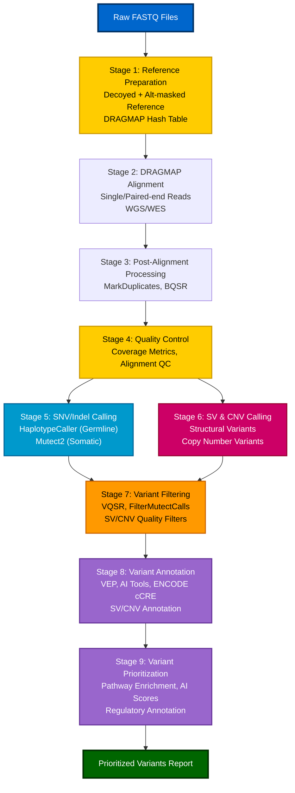

## Introduction

---

This tutorial provides a step-by-step guide for using <strong style="color: #0066cc;">DRAGMAP</strong> (DRAGEN open-source mapper) for read alignment and <strong style="color: #0066cc;">GATK</strong> (Genome Analysis Toolkit) for variant calling from whole genome sequencing (WGS) and whole exome sequencing (WES) data. It covers both <strong style="color: #0066cc;">somatic</strong> and <strong style="color: #0066cc;">germline</strong> variant calling workflows with command examples, filtering strategies, annotation using AI-based tools, and prioritization methods.

### What is DRAGMAP?

<strong style="color: #0066cc;">DRAGMAP</strong> is the open-source software implementation of Illumina's DRAGEN (Dynamic Read Analysis for GENomics) mapper/aligner. It provides fast and accurate alignment of sequencing reads to reference genomes, with support for:

- <strong style="color: #0066cc;">Hash table-based alignment</strong>: Efficient mapping using pre-built hash tables
- <strong style="color: #0066cc;">Decoy sequence support</strong>: Reduces false positives from misaligned reads
- <strong style="color: #0066cc;">ALT haplotype masking</strong>: Minimizes ambiguous mapping in complex genomic regions
- <strong style="color: #0066cc;">Pangenome references</strong>: Graph-augmented references for improved mapping in difficult regions (DRAGEN v4.3+)
- <strong style="color: #0066cc;">Hardware-agnostic</strong>: Runs on standard CPU/GPU hardware (unlike DRAGEN hardware which requires FPGA)

DRAGMAP is particularly well-suited for:
- Large-scale sequencing projects requiring fast alignment
- Somatic variant calling where mapping accuracy is critical
- Germline cohort studies (can use pangenome references for improved accuracy)
- Projects requiring DRAGEN-compatible alignment outputs

### What is GATK?

<strong style="color: #0066cc;">GATK</strong> (Genome Analysis Toolkit) is a comprehensive suite of tools for variant discovery and genotyping developed by the Broad Institute. Key features include:

- <strong style="color: #0066cc;">HaplotypeCaller</strong>: Industry-standard tool for germline variant calling
- <strong style="color: #0066cc;">Mutect2</strong>: Specialized tool for somatic variant calling
- <strong style="color: #0066cc;">DRAGEN-GATK features</strong>: Software implementation of DRAGEN algorithms for standard hardware since GATK 4.2
- <strong style="color: #0066cc;">Variant Quality Score Recalibration (VQSR)</strong>: Machine learning-based variant filtering
- <strong style="color: #0066cc;">Best Practices workflows</strong>: Well-established pipelines for variant analysis

### When to Use DRAGMAP vs BWA-MEM

<strong style="color: #0066cc;">Use DRAGMAP when</strong>:
- You need DRAGEN-compatible alignment outputs
- You're working with large-scale projects and need fast alignment
- You want to leverage decoy sequences and ALT masking for <strong style="color: #0066cc;">improved accuracy</strong>
- You're performing somatic variant calling where mapping specificity is critical

<strong style="color: #0066cc;">Use BWA-MEM when</strong>:
- You need a widely-adopted, well-documented aligner
- You're working with standard research workflows
- You prefer a simpler installation and setup process
- You're aligning to non-standard reference genomes

### When to Use GATK for Somatic vs Germline Variant Calling

<strong style="color: #0066cc;">For Germline Variant Calling</strong>:
- <strong style="color: #0066cc;">HaplotypeCaller</strong>: Use for single-sample or cohort analysis
- <strong style="color: #0066cc;">GVCF workflow</strong>: Recommended for cohort studies (more efficient than per-sample VCF)
- <strong style="color: #0066cc;">GenotypeGVCFs</strong>: Joint genotyping across multiple samples

<strong style="color: #0066cc;">For Somatic Variant Calling</strong>:
- <strong style="color: #0066cc;">Mutect2</strong>: Primary tool for tumor-normal pairs or tumor-only samples
- <strong style="color: #0066cc;">Panel of Normals (PoN)</strong>: Essential for tumor-only mode
- <strong style="color: #0066cc;">FilterMutectCalls</strong>: Somatic-specific filtering

### Prerequisites and Software Installation

Before starting, ensure you have the following installed:

<strong style="color: #0066cc;">Required Software</strong>:
- <strong style="color: #0066cc;">DRAGMAP</strong>: Available via Bioconda (`conda install dragmap`) or build from source
- <strong style="color: #0066cc;">GATK</strong>: Download from [GATK website](https://gatk.broadinstitute.org/) (version 4.2+ recommended)
- <strong style="color: #0066cc;">samtools</strong>: For BAM file manipulation (`conda install samtools`)
- <strong style="color: #0066cc;">bcftools</strong>: For VCF manipulation (`conda install bcftools`)
- <strong style="color: #0066cc;">VEP (Variant Effect Predictor)</strong>: For variant annotation (`conda install ensembl-vep`)

<strong style="color: #0066cc;">Reference Genome</strong>:
- <strong style="color: #0066cc;">GRCh38/hg38</strong>: Recommended standard reference genome
- <strong style="color: #0066cc;">Decoy sequences</strong>: Include hs38d1 or similar decoy sequences
- <strong style="color: #0066cc;">ALT masking</strong>: Use alt-masked reference for optimal results

<strong style="color: #0066cc;">System Requirements</strong>:
- <strong style="color: #0066cc;">Memory</strong>: Minimum 32GB RAM (64GB+ recommended for WGS)
- <strong style="color: #0066cc;">CPU</strong>: Multi-core processor (8+ cores recommended)
- <strong style="color: #0066cc;">Storage</strong>: Sufficient space for reference genome, hash tables, and intermediate files

### Reference Genome Considerations

<strong style="color: #0066cc;">Why Use Decoyed Reference?</strong>
Decoy sequences (e.g., hs38d1) help "soak up" reads from repetitive or unplaced regions that would otherwise mis-map to the primary assembly. This reduces false positive variant calls, especially important for:
- Somatic variant calling (low VAF variants)
- Structural variant detection
- Regions with high sequence similarity

<strong style="color: #0066cc;">Why Use ALT-Masked Reference?</strong>
ALT haplotype assemblies in GRCh38 represent alternate sequences that differ from the primary assembly. Masking regions of ALT contigs that are highly similar to the primary assembly:
- Reduces ambiguous mapping
- Improves mapping quality scores
- Prevents false variant calls from mapping artifacts
- Critical for accurate variant calling in complex genomic regions

<strong style="color: #0066cc;">Reference Consistency</strong>:
It is <strong style="color: #0066cc;">critical</strong> to use the same reference genome version (decoyed + alt-masked) throughout the entire pipeline:
- Alignment (DRAGMAP)
- Variant calling (GATK)
- Annotation (VEP)
- Filtering and prioritization

Mixing reference versions can lead to coordinate mismatches, dropped variants, or incorrect annotations.

## Workflow Overview

---

The following diagram illustrates the workflow from raw FASTQ files to prioritized variants:



### Key Workflow Components

1. <strong style="color: #0066cc;">Reference Preparation</strong>: Build decoyed and alt-masked reference, create DRAGMAP hash table
2. <strong style="color: #0066cc;">Alignment</strong>: Map reads using DRAGMAP with decoy and alt masking support
3. <strong style="color: #0066cc;">Post-Alignment Processing</strong>: Mark duplicates, perform base quality score recalibration
4. <strong style="color: #0066cc;">Quality Control</strong>: Assess alignment quality and coverage metrics
5. <strong style="color: #0066cc;">SNV/Indel Variant Calling</strong>: 
   - <strong style="color: #0066cc;">Germline</strong>: HaplotypeCaller with DRAGEN features
   - <strong style="color: #0066cc;">Somatic</strong>: Mutect2 with DRAGEN features
6. <strong style="color: #0066cc;">SV and CNV Calling</strong>: Structural variant and copy number variant detection using GATK tools
7. <strong style="color: #0066cc;">Variant Filtering</strong>: Quality-based filtering for SNVs/indels, SVs, and CNVs
   - <strong style="color: #0066cc;">Germline</strong>: VQSR for SNVs/indels
   - <strong style="color: #0066cc;">Somatic</strong>: FilterMutectCalls for SNVs/indels
   - <strong style="color: #0066cc;">SV/CNV</strong>: Quality and size-based filtering
8. <strong style="color: #0066cc;">Variant Annotation</strong>: 
   - <strong style="color: #0066cc;">Coding variants</strong>: VEP with AI tools (AlphaMissense, AlphaFold, FoldX) and SNPeffect 5.0
   - <strong style="color: #0066cc;">Non-coding variants</strong>: ENCODE cCRE annotation
   - <strong style="color: #0066cc;">SV annotation</strong>: AnnotSV, VEP with SV support
   - <strong style="color: #0066cc;">CNV annotation</strong>: Gene overlap and functional impact
9. <strong style="color: #0066cc;">Variant Prioritization</strong>: Pathway enrichment, AI-based scoring, regulatory impact assessment

### WGS vs WES Considerations

| Aspect | WGS | WES |
|--------|-----|-----|
| <strong style="color: #0066cc;">Target BED file</strong> | Not required | Required for QC and optional variant calling restriction |
| <strong style="color: #0066cc;">Coverage metrics</strong> | CollectWgsMetrics | CollectHsMetrics with BED |
| <strong style="color: #0066cc;">Mean coverage</strong> | 30-60x (germline), 60-100x (somatic) | 100-150x in targets |
| <strong style="color: #0066cc;">On-target %</strong> | N/A | ≥80% recommended |
| <strong style="color: #0066cc;">Variant calling scope</strong> | Genome-wide | Optionally restrict to target regions |
| <strong style="color: #0066cc;">Non-coding variants</strong> | Comprehensive detection | Limited to exonic and nearby regions |
| <strong style="color: #0066cc;">Reference preparation</strong> | Full genome with decoys | Same, but target BED needed for QC |

## Stage 1: Reference Genome Preparation

---

### Reference Genome Selection

<strong style="color: #0066cc;">Recommended</strong>: GRCh38/hg38 with decoy sequences and ALT masking

<strong style="color: #0066cc;">Reference options</strong>:
1. <strong style="color: #0066cc;">Linear reference with decoys and ALT masking</strong> (standard, recommended for most workflows)
2. <strong style="color: #0066cc;">Pangenome reference</strong> (recommended for large-scale germline cohort studies, see [Pangenome Reference Support](#pangenome-reference-support) section below)

<strong style="color: #0066cc;">Why GRCh38/hg38?</strong>
- Current standard reference genome
- Best annotation support
- Compatible with all major databases (gnomAD, ClinVar, COSMIC)
- Well-supported by DRAGMAP and GATK
- Prebuilt pangenome references available

### Downloading Reference Genome

<strong style="color: #0066cc;">Option 1: From GATK Resource Bundle (Recommended)</strong>

The GATK resource bundle provides pre-formatted reference genomes with decoys. Download from the official GATK resource bundle:

```bash
# Download GATK resource bundle using gsutil (Google Cloud SDK)
# First, install gsutil if not already installed
# Then download the reference files:

gsutil -m cp -r gs://genomics-public-data/resources/broad/hg38/v0/ .

# Or download specific files:
gsutil cp gs://genomics-public-data/resources/broad/hg38/v0/Homo_sapiens_assembly38.fasta .
gsutil cp gs://genomics-public-data/resources/broad/hg38/v0/Homo_sapiens_assembly38.fasta.fai .
gsutil cp gs://genomics-public-data/resources/broad/hg38/v0/Homo_sapiens_assembly38.dict .

# Alternative: Use wget with the public URL (if accessible)
# Check GATK documentation for current public URLs:
# https://gatk.broadinstitute.org/hc/en-us/articles/360035890811-Resource-bundle
```

<strong style="color: #0066cc;">Option 2: From NCBI (Build Your Own with Decoys)</strong>

```bash
# Download primary assembly from NCBI
# https://www.ncbi.nlm.nih.gov/assembly/GCF_000001405.39

# Download decoy sequences (hs38d1)
# Combine primary assembly with decoy sequences to create hs38d1 reference
```

<strong style="color: #0066cc;">Option 3: From GENCODE or Ensembl</strong>

```bash
# GENCODE: https://www.gencodegenes.org/human/
# Ensembl: https://www.ensembl.org/Homo_sapiens/Info/Index

# Download GRCh38 primary assembly and add decoy sequences manually
```

<strong style="color: #0066cc;">Note</strong>: Always verify the reference genome version and ensure it matches your annotation databases. Check the [GATK resource bundle documentation](https://gatk.broadinstitute.org/hc/en-us/articles/360035890811-Resource-bundle) for the most current download instructions.

### Obtaining ALT Mask BED File

ALT mask BED files specify regions in ALT contigs that should be masked (replaced with Ns) to reduce ambiguous mapping. DRAGMAP can auto-detect and apply default masks for standard references, or you can provide a custom mask file.

<strong style="color: #0066cc;">Sources for ALT mask BED files</strong>:
- <strong style="color: #0066cc;">DRAGMAP repository</strong>: Check the `fasta_mask` directory in the DRAGMAP GitHub repository
- <strong style="color: #0066cc;">Illumina documentation</strong>: DRAGEN reference preparation guides
- <strong style="color: #0066cc;">GATK resource bundle</strong>: May include alt mask files

<strong style="color: #0066cc;">Example locations</strong>:
```bash
# Check DRAGMAP repository for alt mask files
# https://github.com/Illumina/DRAGMAP/tree/master/fasta_mask

# Example: hg38 alt mask file
# fasta_mask/hg38_alt_mask.bed
```

### Building DRAGMAP Hash Table

The hash table is a pre-computed index that DRAGMAP uses for fast alignment. It should be built with the same reference genome (including decoys and alt masking) that you'll use for alignment.

<strong style="color: #0066cc;">Basic hash table building</strong>:

```bash
# Basic hash table building (DRAGMAP will auto-detect decoys if present)
dragen-os --build-hash-table true \
  --ht-reference reference.fasta \
  --output-directory /path/to/reference/ \
  --output-file-prefix dragmap.hg38
```

<strong style="color: #0066cc;">Hash table with explicit decoy sequences</strong>:

```bash
# If decoys are in separate file, specify explicitly
dragen-os --build-hash-table true \
  --ht-reference reference.fasta \
  --ht-decoys decoys.fasta \
  --output-directory /path/to/reference/ \
  --output-file-prefix dragmap.hg38_with_decoys
```

<strong style="color: #0066cc;">Hash table with ALT masking</strong>:

```bash
# Build hash table with ALT mask BED file
dragen-os --build-hash-table true \
  --ht-reference hg38.fa \
  --output-directory /path/to/reference/ \
  --output-file-prefix dragmap.hg38_alt_masked \
  --ht-mask-bed fasta_mask/hg38_alt_mask.bed
```

<strong style="color: #0066cc;">Hash table with both decoys and ALT masking</strong>:

```bash
# Combined: decoys + ALT masking (recommended)
dragen-os --build-hash-table true \
  --ht-reference hg38.fa \
  --ht-decoys hs38d1.fa \
  --output-directory /path/to/reference/ \
  --output-file-prefix dragmap.hg38_decoys_alt_masked \
  --ht-mask-bed fasta_mask/hg38_alt_mask.bed
```

<strong style="color: #0066cc;">Automatic detection</strong>: For standard references (hg38, hg19), DRAGMAP can automatically detect and apply default decoy sequences and ALT masks if they're not explicitly specified. However, explicitly providing them ensures consistency.

### Pangenome Reference Support

<strong style="color: #0066cc;">DRAGMAP supports pangenome references!</strong> DRAGMAP can use graph-augmented pangenome references that incorporate alternate variant paths from population cohorts, improving mapping accuracy especially in difficult-to-map regions.

#### What is a Pangenome Reference?

A <strong style="color: #0066cc;">pangenome reference</strong> in DRAGMAP context refers to:
- A <strong style="color: #0066cc;">linear reference scaffold</strong> (e.g., GRCh38) augmented with <strong style="color: #0066cc;">alternate variant paths</strong> from population VCFs
- Internally uses a graph structure for multigenome mapping
- Output remains in standard linear reference coordinates (BAM/VCF compatible with standard tools)
- DRAGEN v4.3+ includes a prebuilt pangenome based on <strong style="color: #0066cc;">128 human assemblies from 26 ancestries</strong>

#### Benefits of Pangenome References

<strong style="color: #0066cc;">Recommended for</strong>:
- <strong style="color: #0066cc;">Human germline analyses</strong>: Improved mapping in highly polymorphic regions
- <strong style="color: #0066cc;">Difficult-to-map regions</strong>: Better read placement in structurally complex regions
- <strong style="color: #0066cc;">Reducing reference bias</strong>: More accurate variant calling across diverse ancestries
- <strong style="color: #0066cc;">High coverage in ancestral diversity</strong>: Better representation of population variation

<strong style="color: #0066cc;">Less recommended for</strong>:
- <strong style="color: #0066cc;">Somatic variant calling</strong>: Linear references are typically preferred for somatic workflows
- <strong style="color: #0066cc;">Non-human organisms</strong>: Prebuilt pangenomes are primarily for human; custom pangenomes can be built

#### Using Prebuilt Pangenome References

DRAGEN/DRAGMAP provides prebuilt pangenome hash tables for major human assemblies:
- hg19
- hs37d5
- hg38
- T2T-CHM13v2.0

<strong style="color: #0066cc;">Download prebuilt pangenome references</strong>:
```bash
# Check Illumina/DRAGEN documentation for prebuilt pangenome hash tables
# These are large files and require significant storage space
# Prebuilt pangenomes are optimized for human germline analysis
```

#### Building Custom Pangenome References

You can build custom pangenome references using population VCFs:

```bash
# Build pangenome hash table with multi-sample VCF (msVCF)
dragen-os --build-hash-table true \
  --ht-reference reference.fasta \
  --ht-graph-msvcf-file population_variants.msvcf.gz \
  --ht-graph-extra-kmer-bed graph_regions.bed \
  --ht-mask-bed mask.bed \
  --output-directory /path/to/pangenome_reference/ \
  --output-file-prefix dragmap.pangenome.hg38
```

<strong style="color: #0066cc;">Requirements for custom pangenome</strong>:
- <strong style="color: #0066cc;">Multi-sample VCF (msVCF)</strong>: Population variants from cohort analysis
- <strong style="color: #0066cc;">Phasing information</strong>: Phased variants improve pangenome quality (long-read assemblies help)
- <strong style="color: #0066cc;">BED files</strong>: Optional region inclusion/exclusion or masking
- <strong style="color: #0066cc;">Computational resources</strong>: Building pangenomes with many samples (>256) requires significant memory and time

#### Using Pangenome References for Alignment

Once you have a pangenome hash table, use it like a standard reference:

```bash
# Alignment with pangenome reference
dragen-os -r /path/to/pangenome_reference/ \
  -1 sample_R1.fastq.gz \
  -2 sample_R2.fastq.gz \
  --output-directory /path/to/output/ \
  --output-file-prefix sample

# DRAGMAP automatically uses multigenome mapper when pangenome hash table is detected
# Output BAM files are in standard linear reference coordinates
```

#### Considerations and Limitations

<strong style="color: #0066cc;">When to use pangenome references</strong>:
- Large-scale germline cohort studies
- Studies with diverse ancestral backgrounds
- Projects focusing on difficult-to-map regions
- When reference bias is a concern

<strong style="color: #0066cc;">When to use linear references</strong>:
- Somatic variant calling workflows
- Standard germline analysis (linear references work well)
- Non-human organisms (unless custom pangenome built)
- When computational resources are limited

<strong style="color: #0066cc;">Important notes</strong>:
- Pangenome references are <strong style="color: #0066cc;">primarily validated for germline workflows</strong>
- Some DRAGEN components may not have fully validated accuracy with pangenomes for somatic workflows
- Check DRAGEN documentation for component-specific pangenome support
- Output coordinates remain in linear reference space, ensuring compatibility with standard tools

### Preparing Known Sites for BQSR

Base Quality Score Recalibration (BQSR) requires known variant sites to model systematic errors. Download these resources from the GATK resource bundle:

```bash
# Create directory for known sites
mkdir -p /path/to/known_sites
cd /path/to/known_sites

# Download using gsutil (Google Cloud SDK)
# Install gsutil if needed: https://cloud.google.com/storage/docs/gsutil_install

# Download dbSNP (common variants)
gsutil cp gs://genomics-public-data/resources/broad/hg38/v0/Homo_sapiens_assembly38.dbsnp138.vcf .
gsutil cp gs://genomics-public-data/resources/broad/hg38/v0/Homo_sapiens_assembly38.dbsnp138.vcf.idx .

# Download Mills and 1000G gold standard indels
gsutil cp gs://genomics-public-data/resources/broad/hg38/v0/Mills_and_1000G_gold_standard.indels.hg38.vcf.gz .
gsutil cp gs://genomics-public-data/resources/broad/hg38/v0/Mills_and_1000G_gold_standard.indels.hg38.vcf.gz.tbi .

# Download 1000G phase 1 high-confidence SNPs (optional, for VQSR)
gsutil cp gs://genomics-public-data/resources/broad/hg38/v0/1000G_phase1.snps.high_confidence.hg38.vcf.gz .
gsutil cp gs://genomics-public-data/resources/broad/hg38/v0/1000G_phase1.snps.high_confidence.hg38.vcf.gz.tbi .

# Alternative: Download entire resource bundle directory
gsutil -m cp -r gs://genomics-public-data/resources/broad/hg38/v0/ .

# For current URLs and additional resources, check:
# https://gatk.broadinstitute.org/hc/en-us/articles/360035890811-Resource-bundle
```

### WES Target BED File Preparation

For WES data, you'll need a BED file specifying the exome target regions:

```bash
# Download target BED file from capture kit manufacturer
# Example: Illumina Nextera Rapid Capture Exome
# Or use standard exome target files from:
# - Gencode
# - RefSeq
# - Capture kit manufacturer website

# Ensure BED file is in hg38 coordinates
# If in hg19, use liftOver to convert:
liftOver exome_targets.hg19.bed hg19ToHg38.over.chain.gz exome_targets.hg38.bed unmapped.bed
```

### Reference Consistency Checklist

Before proceeding, verify:
- [ ] Same reference genome version used for hash table building
- [ ] Decoy sequences included (if using)
- [ ] ALT masking applied (if using)
- [ ] Known sites match reference genome build (hg38)
- [ ] WES target BED file matches reference build (if applicable)
- [ ] All files indexed properly (.fai, .dict, .tbi files present)

## Stage 2: DRAGMAP Alignment

---

<strong style="color: #0066cc;">Note</strong>: Before alignment, perform quality control on raw sequencing data using tools like <strong style="color: #0066cc;">FastQC</strong> or <strong style="color: #0066cc;">MultiQC</strong> to assess read quality, adapter contamination, and sequencing metrics. This helps identify problematic samples and determine if adapter trimming or quality filtering is needed before alignment.

### Installation

<strong style="color: #0066cc;">Option 1: Bioconda (Recommended)</strong>

```bash
# Install via Bioconda
conda install -c bioconda dragmap

# Verify installation
dragen-os --help
```

<strong style="color: #0066cc;">Option 2: Build from Source</strong>

```bash
# Clone DRAGMAP repository
git clone https://github.com/Illumina/DRAGMAP.git
cd DRAGMAP

# Build (requires C++17 compiler, Boost library)
make

# Binary will be in ./build/release/
# Optional: Install to /usr/bin/
make install
```

### Alignment Commands

<strong style="color: #0066cc;">Paired-end reads (WGS or WES)</strong>:

```bash
# Basic paired-end alignment
dragen-os -r /path/to/reference/ \
  -1 sample_R1.fastq.gz \
  -2 sample_R2.fastq.gz \
  --output-directory /path/to/output/ \
  --output-file-prefix sample

# With read group information
dragen-os -r /path/to/reference/ \
  -1 sample_R1.fastq.gz \
  -2 sample_R2.fastq.gz \
  --RGID sample_lib1 \
  --RGSM sample_name \
  --RGPL ILLUMINA \
  --RGLB lib1 \
  --RGPU unit1 \
  --output-directory /path/to/output/ \
  --output-file-prefix sample  > sample.sam
```

<strong style="color: #0066cc;">Single-end reads</strong>:

```bash
# Single-end alignment
dragen-os -r /path/to/reference/ \
  -1 sample_R1.fastq.gz \
  --output-directory /path/to/output/ \
  --output-file-prefix sample
```

<strong style="color: #0066cc;">WGS vs WES considerations</strong>: Both use the same alignment command. Differences are in downstream QC (target BED file for WES) and optional variant calling restrictions. See the [WGS vs WES Considerations](#wgs-vs-wes-considerations) table in Workflow Overview.

### Post-Alignment Processing

After alignment, sort and index the BAM file:

```bash
# Sort BAM file
samtools sort -@ 8 sample.bam -o sample.sorted.bam

# Index BAM file
samtools index sample.sorted.bam

# Verify BAM file
samtools view -H sample.sorted.bam | head -20
```

### Why Use Decoyed + Alt-Masked Reference?

See the [Reference Genome Considerations](#reference-genome-considerations) section in the Introduction for detailed explanation. Key benefits:
- Reduces false positives from mis-mapped reads
- Improves mapping specificity in complex regions
- Critical for somatic variant calling and structural variant detection

### Comparison with BWA-MEM

See the [When to Use DRAGMAP vs BWA-MEM](#when-to-use-dragmap-vs-bwa-mem) section in the Introduction for detailed comparison. DRAGMAP offers built-in decoy and ALT masking support, while BWA-MEM requires manual setup.

## Stage 3: Post-Alignment Processing

---

### MarkDuplicates

Mark PCR and optical duplicates to avoid false positive variant calls:

```bash
# Mark duplicates using GATK
gatk MarkDuplicates \
  -I sample.sorted.bam \
  -O sample.markdup.bam \
  -M sample.markdup.metrics.txt \
  --CREATE_INDEX true

# Verify duplicate marking
samtools view -f 1024 sample.markdup.bam | head -5
```

### Base Quality Score Recalibration (BQSR)

BQSR corrects systematic biases in base quality scores. <strong style="color: #0066cc;">Note</strong>: When using DRAGEN mode in variant calling, BQSR may be bypassed as DRAGEN's error model already accounts for systematic biases (see [BQSR Considerations](#bqsr-considerations) section below for details).

<strong style="color: #0066cc;">First pass - Build recalibration table</strong>:

```bash
# For WGS (no target regions needed)
gatk BaseRecalibrator \
  -R reference.fa \
  -I sample.markdup.bam \
  --known-sites dbsnp.vcf.gz \
  --known-sites mills.vcf.gz \
  --known-sites 1000G_phase1.snps.high_confidence.hg38.vcf.gz \
  -O sample.recal.table

# For WES (optionally restrict to target regions for efficiency)
gatk BaseRecalibrator \
  -R reference.fa \
  -I sample.markdup.bam \
  -L exome_targets.bed \
  --known-sites dbsnp.vcf.gz \
  --known-sites mills.vcf.gz \
  -O sample.recal.table
```

<strong style="color: #0066cc;">Apply BQSR</strong>:

```bash
gatk ApplyBQSR \
  -R reference.fa \
  -I sample.markdup.bam \
  -bqsr sample.recal.table \
  -O sample.recal.bam \
  --CREATE_INDEX true
```

<strong style="color: #0066cc;">Second pass - Generate recalibration metrics</strong> (optional, for QC):

```bash
gatk BaseRecalibrator \
  -R reference.fa \
  -I sample.recal.bam \
  --known-sites dbsnp.vcf.gz \
  --known-sites mills.vcf.gz \
  -O sample.recal.table2

# Compare before/after (optional visualization)
gatk AnalyzeCovariates \
  -before sample.recal.table \
  -after sample.recal.table2 \
  -plots sample.recalibration_plots.pdf
```

<strong style="color: #0066cc;">BQSR and DRAGEN Mode</strong>: See [BQSR Considerations](#bqsr-considerations) section in [Understanding DRAGEN-GATK Features](#understanding-dragen-gatk-features) for details.

## Stage 4: Quality Control

---

### Alignment Metrics Collection

<strong style="color: #0066cc;">For WGS</strong>:

```bash
gatk CollectWgsMetrics \
  -R reference.fa \
  -I sample.recal.bam \
  -O sample.wgs_metrics.txt
```

<strong style="color: #0066cc;">For WES</strong>:

```bash
gatk CollectHsMetrics \
  -R reference.fa \
  -I sample.recal.bam \
  -O sample.wes_metrics.txt \
  -TI exome_targets.bed \
  -BI exome_targets.bed
```

### Coverage Analysis

<strong style="color: #0066cc;">Key metrics to check</strong>:

| Metric | WGS Target | WES Target |
|--------|------------|------------|
| <strong style="color: #0066cc;">Mean coverage</strong> | 30-60x (germline), 60-100x (somatic) | 100-150x in targets |
| <strong style="color: #0066cc;">On-target %</strong> | N/A | ≥80% |
| <strong style="color: #0066cc;">Uniformity</strong> | >0.9 | >0.8 |
| <strong style="color: #0066cc;">Duplication rate</strong> | <20% | <30% |

<strong style="color: #0066cc;">Interpretation</strong>:
- <strong style="color: #0066cc;">Low coverage</strong>: May miss variants or have low confidence calls
- <strong style="color: #0066cc;">High duplication</strong>: May indicate library issues or low input
- <strong style="color: #0066cc;">Poor uniformity</strong>: Uneven coverage may affect variant detection
- <strong style="color: #0066cc;">Low on-target (WES)</strong>: May indicate capture efficiency issues

### Quality Thresholds Before Variant Calling

<strong style="color: #0066cc;">Pass criteria</strong>:
- [ ] Mean coverage meets target (see table above)
- [ ] Duplication rate acceptable
- [ ] Mapping rate >95%
- [ ] Proper read group information present
- [ ] BAM file properly sorted and indexed
- [ ] For WES: On-target percentage ≥80%

<strong style="color: #0066cc;">Fail samples that don't meet QC thresholds</strong> before proceeding to variant calling.

## Understanding DRAGEN-GATK Features

---

### What is DRAGEN-GATK?

<strong style="color: #0066cc;">DRAGEN-GATK</strong> is a software implementation of DRAGEN algorithms that runs on standard hardware (CPU/GPU) without requiring DRAGEN FPGA hardware. It provides:

- <strong style="color: #0066cc;">Improved error models</strong>: Better handling of sequencing errors
- <strong style="color: #0066cc;">Foreign Read Detection (FRD)</strong>: Identifies reads from contamination
- <strong style="color: #0066cc;">Base Quality Dropout (BQD)</strong>: Models quality score degradation
- <strong style="color: #0066cc;">STR Error Correction (STRE)</strong>: Improved handling of short tandem repeats
- <strong style="color: #0066cc;">DRAGstr model</strong>: Specialized model for STR regions

### Two Operational Modes

<strong style="color: #0066cc;">1. Functional Equivalence Mode</strong>:
- Produces results equivalent to DRAGEN hardware output
- Use when you need DRAGEN-compatible results
- May disable some features for equivalence

<strong style="color: #0066cc;">2. Maximum Quality Mode</strong>:
- Prioritizes accuracy and variant call richness
- May produce more variants than DRAGEN hardware
- Use when accuracy is more important than equivalence

### Key Command-Line Flags

| Flag | Description | Typical Values |
|------|-------------|----------------|
| `--dragen-mode true` | Main flag to enable DRAGEN features | `true` |
| `--use-pdhmm true/false` | Enables Partially Determined HMM model | `true` for max quality, `false` for equivalence |
| `--disable-spanning-event-genotyping true/false` | Controls spanning event genotyping | `true` for equivalence, `false` for max quality |
| `--dragstr-params-path` | Path to DRAGstr model parameters file | Path to text file (generated by CalibrateDragstrModel) |
| `--dragstr-het-hom-ratio` | Controls heterozygous/homozygous prior ratio | `2` (default) |

### DRAGstr Parameters

DRAGstr parameters are <strong style="color: #0066cc;">not pre-downloaded files</strong> - they must be <strong style="color: #0066cc;">generated</strong> using GATK's `CalibrateDragstrModel` tool. These parameters contain tables (GOP, GCP, API) that model short tandem repeat (STR) regions for improved variant calling accuracy in DRAGEN mode.

<strong style="color: #0066cc;">Step 1: Generate STR table for your reference genome</strong>:

```bash
# Create STR table from reference genome
gatk ComposeSTRTableFile \
  -R reference.fa \
  -O str_table.tsv
```

<strong style="color: #0066cc;">Step 2: Calibrate DRAGstr model</strong>:

```bash
# Run CalibrateDragstrModel on your BAM file(s)
# This generates the DRAGstr parameters file
gatk CalibrateDragstrModel \
  -R reference.fa \
  -I sample.recal.bam \
  -str str_table.tsv \
  -O dragstr_params.txt

# The output file (dragstr_params.txt) contains:
# - GOP (Gap Open Penalty) table
# - GCP (Gap Continue Penalty) table  
# - API (Allelic Pruning Index) table
```

<strong style="color: #0066cc;">Step 3: Use the generated parameters file</strong>:

```bash
# Use the generated DRAGstr parameters in HaplotypeCaller
gatk HaplotypeCaller \
  -R reference.fa \
  -I sample.recal.bam \
  --dragen-mode true \
  --dragstr-params-path dragstr_params.txt \
  -O output.vcf.gz
```

<strong style="color: #0066cc;">Important notes</strong>:
- DRAGstr parameters are <strong style="color: #0066cc;">reference-specific</strong> - generate them for your specific reference genome
- The parameters file is a <strong style="color: #0066cc;">text file</strong> (not JSON) containing parameter tables
- You can reuse the same parameters file for multiple samples aligned to the same reference
- For best results, calibrate using high-quality BAM files from your project

### BQSR Considerations

When using DRAGEN mode, DRAGEN's error model already accounts for systematic biases, so BQSR may be bypassed. However, BQSR is still recommended for:
- Standard GATK workflows (non-DRAGEN mode)
- Ensuring compatibility with other tools
- QC purposes (to assess systematic biases)

## Stage 5: SNV/Indel Variant Calling with GATK

---

This stage covers calling single nucleotide variants (SNVs) and small insertions/deletions (indels) for both germline and somatic analyses.

### Germline Variant Calling

#### HaplotypeCaller - Single Sample Calling

<strong style="color: #0066cc;">Basic single sample calling</strong>:

```bash
# For WGS (no target regions needed)
gatk HaplotypeCaller \
  -R reference.fa \
  -I sample.recal.bam \
  -O sample.g.vcf.gz \
  -ERC GVCF

# For WES (optionally restrict to target regions for efficiency)
gatk HaplotypeCaller \
  -R reference.fa \
  -I sample.recal.bam \
  -L exome_targets.bed \
  -O sample.g.vcf.gz \
  -ERC GVCF
```

<strong style="color: #0066cc;">Output formats</strong>:
- <strong style="color: #0066cc;">GVCF</strong>: Genomic VCF format (recommended for cohort analysis)
- <strong style="color: #0066cc;">VCF</strong>: Standard VCF format (for single sample)

### GVCF Workflow (Recommended for Cohorts)

<strong style="color: #0066cc;">Step 1: Generate GVCF for each sample</strong>:

```bash
# Generate GVCF for each sample
for sample in sample1 sample2 sample3; do
  gatk HaplotypeCaller \
    -R reference.fa \
    -I ${sample}.recal.bam \
    -O ${sample}.g.vcf.gz \
    -ERC GVCF
done
```

<strong style="color: #0066cc;">Step 2: Joint genotyping</strong>:

```bash
# Create sample map file
echo -e "sample1\tsample1.g.vcf.gz" > samples.map
echo -e "sample2\tsample2.g.vcf.gz" >> samples.map
echo -e "sample3\tsample3.g.vcf.gz" >> samples.map

# Joint genotyping
gatk GenotypeGVCFs \
  -R reference.fa \
  -V samples.map \
  -O cohort.vcf.gz
```

### Enabling DRAGEN Features in HaplotypeCaller

<strong style="color: #0066cc;">Functional Equivalence Mode</strong>:

```bash
gatk --java-options "-Xmx32G" HaplotypeCaller \
  -R reference.fa \
  -I sample.recal.bam \
  -O sample-dragen-equiv.g.vcf.gz \
  -ERC GVCF \
  --dragen-mode true \
  --use-pdhmm false \
  --disable-spanning-event-genotyping true \
  --dragstr-params-path /path/to/dragstr_params.json \
  --dragstr-het-hom-ratio 2
```

<strong style="color: #0066cc;">Maximum Quality Mode</strong>:

```bash
gatk --java-options "-Xmx32G" HaplotypeCaller \
  -R reference.fa \
  -I sample.recal.bam \
  -O sample-dragen-maxquality.g.vcf.gz \
  -ERC GVCF \
  --dragen-mode true \
  --use-pdhmm true \
  --disable-spanning-event-genotyping false \
  --dragstr-params-path /path/to/dragstr_params.json \
  --dragstr-het-hom-ratio 2
```

<strong style="color: #0066cc;">Key differences</strong>:
- <strong style="color: #0066cc;">Functional Equivalence</strong>: `--use-pdhmm false`, `--disable-spanning-event-genotyping true`
- <strong style="color: #0066cc;">Maximum Quality</strong>: `--use-pdhmm true`, `--disable-spanning-event-genotyping false`

### Somatic Variant Calling

#### Mutect2 - Tumor-Normal Pair

<strong style="color: #0066cc;">Basic tumor-normal calling</strong>:

```bash
# For WGS (no target regions needed)
gatk Mutect2 \
  -R reference.fa \
  -I tumor.recal.bam \
  -I normal.recal.bam \
  -normal normal_sample \
  -O mutect2.vcf.gz \
  --tumor-sample tumor_sample

# For WES (optionally restrict to target regions for efficiency)
gatk Mutect2 \
  -R reference.fa \
  -I tumor.recal.bam \
  -I normal.recal.bam \
  -normal normal_sample \
  -L exome_targets.bed \
  -O mutect2.vcf.gz \
  --tumor-sample tumor_sample
```

### Mutect2 - Tumor-Only Mode

<strong style="color: #0066cc;">Step 1: Create Panel of Normals (PoN)</strong>:

```bash
# Generate PoN from multiple normal samples
gatk CreateSomaticPanelOfNormals \
  -R reference.fa \
  -vcfs normal1.vcf.gz normal2.vcf.gz normal3.vcf.gz \
  -O pon.vcf.gz
```

<strong style="color: #0066cc;">Step 2: Get pileup summaries</strong>:

```bash
# For tumor sample
gatk GetPileupSummaries \
  -R reference.fa \
  -I tumor.recal.bam \
  -V gnomad.vcf.gz \
  -L exome_targets.bed \
  -O tumor.pileups.table

# For normal samples (if available for contamination estimation)
gatk GetPileupSummaries \
  -R reference.fa \
  -I normal.recal.bam \
  -V gnomad.vcf.gz \
  -L exome_targets.bed \
  -O normal.pileups.table
```

<strong style="color: #0066cc;">Step 3: Calculate contamination</strong>:

```bash
# Tumor only
gatk CalculateContamination \
  -I tumor.pileups.table \
  -O tumor.contamination.table

# tumor-normal pairs
gatk CalculateContamination \
  -I tumor.pileups.table \
  -matched normal.pileups.table \
  -O tumor.contamination.table
```

<strong style="color: #0066cc;">Step 4: Run Mutect2 with PoN</strong>:

```bash
gatk Mutect2 \
  -R reference.fa \
  -I tumor.recal.bam \
  --germline-resource gnomad.vcf.gz \
  --panel-of-normals pon.vcf.gz \
  -O mutect2.vcf.gz \
  --tumor-sample tumor_sample
```

### FilterMutectCalls

<strong style="color: #0066cc;">Apply somatic filtering</strong>:

```bash
gatk FilterMutectCalls \
  -R reference.fa \
  -V mutect2.vcf.gz \
  -O mutect2.filtered.vcf.gz \
  --contamination-table tumor.contamination.table
```

### Enabling DRAGEN Features in Mutect2

<strong style="color: #0066cc;">With DRAGEN mode</strong>:

```bash
gatk Mutect2 \
  -R reference.fa \
  -I tumor.recal.bam \
  -I normal.recal.bam \
  -normal normal_sample \
  -O mutect2-dragen.vcf.gz \
  --tumor-sample tumor_sample \
  --dragen-mode true \
  --use-pdhmm true \
  --dragstr-params-path /path/to/dragstr_params.json
```

## Stage 6: Structural Variant (SV) and Copy Number Variant (CNV) Calling

---

This section covers calling structural variants (SVs) and copy number variants (CNVs) using GATK tools with DRAGMAP-aligned BAM files. SVs include deletions, duplications, inversions, and translocations, while CNVs refer to copy number gains and losses.

### Structural Variant (SV) Calling

GATK provides the <strong style="color: #0066cc;">StructuralVariantDiscoveryPipeline</strong> (GATK-SV) for comprehensive SV detection. This pipeline integrates multiple SV callers and evidence types.

#### GATK-SV Pipeline Overview

<strong style="color: #0066cc;">GATK-SV</strong> is a cloud-based ensemble SV discovery pipeline that combines multiple SV detection methods:
- <strong style="color: #0066cc;">Manta</strong>: Paired-end and split-read evidence
- <strong style="color: #0066cc;">Wham</strong>: Read-depth and split-read evidence
- <strong style="color: #0066cc;">Scramble</strong>: Assembly-based detection

<strong style="color: #0066cc;">Input requirements</strong>:
- DRAGMAP-aligned BAM files (sorted and indexed)
- Reference genome (same as used for alignment)
- Optional: Target intervals for WES/panel data

#### Running GATK-SV (Basic Workflow)

<strong style="color: #0066cc;">Note</strong>: GATK-SV is typically run using WDL workflows. Here we show the key components:

```bash
# GATK-SV is typically run via WDL workflows
# Download GATK-SV workflows from: https://github.com/broadinstitute/gatk-sv

# Basic SV calling workflow (simplified example)
# The full pipeline requires WDL execution, but key steps include:

# 1. Extract evidence (paired-end, split-read, depth)
# 2. Run ensemble callers (Manta, Wham, Scramble)
# 3. Merge and filter SV calls
# 4. Annotate with population frequencies

# For detailed GATK-SV usage, see:
# https://broadinstitute.github.io/gatk-sv/docs/intro/
```

#### Alternative: Using Individual SV Callers

If you prefer to use individual SV callers directly:

<strong style="color: #0066cc;">Manta</strong> (recommended for paired-end data):

```bash
# Install Manta
# conda install -c bioconda manta

# Configure Manta
configManta.py \
  --bam tumor.recal.bam \
  --referenceFasta reference.fa \
  --runDir manta_workdir

# Run Manta
python manta_workdir/runWorkflow.py

# Output: manta_workdir/results/variants/candidateSV.vcf.gz
```

<strong style="color: #0066cc;">Delly</strong> (for translocations and complex SVs):

```bash
# Install Delly
# conda install -c bioconda delly

# Germline SV calling
delly call \
  -g reference.fa \
  -o delly.bcf \
  sample.recal.bam

# Somatic SV calling (tumor-normal)
delly call \
  -g reference.fa \
  -o delly.bcf \
  -x exclude_regions.bed \
  tumor.recal.bam \
  normal.recal.bam
```

<strong style="color: #0066cc;">Lumpy</strong> (high sensitivity for complex rearrangements):

```bash
# Install Lumpy
# conda install -c bioconda lumpy-sv

# Extract discordant and split-reads
samtools view -b -F 1294 tumor.recal.bam | \
  samtools sort - > tumor.discordants.bam

samtools view -h tumor.recal.bam | \
  extractSplitReads_BwaMem -i stdin | \
  samtools view -Sb - > tumor.splitters.bam

# Run Lumpy
lumpyexpress \
  -B tumor.recal.bam \
  -S tumor.splitters.bam \
  -D tumor.discordants.bam \
  -o lumpy.vcf
```

### Copy Number Variant (CNV) Calling

GATK provides two main approaches for CNV calling:
1. <strong style="color: #0066cc;">gCNV</strong>: For germline CNV calling (cohort-based)
2. <strong style="color: #0066cc;">Somatic CNV pipeline</strong>: For tumor CNV calling (tumor-normal or tumor-only)

#### Germline CNV Calling with gCNV

<strong style="color: #0066cc;">gCNV</strong> is a cohort-based tool that uses a panel of normals (PoN) to detect germline CNVs. It's particularly useful for WES and targeted panel data.

<strong style="color: #0066cc;">For WES germline CNV</strong>   

<strong style="color: #0066cc;">Step 1: Create Panel of Normals (PoN)</strong>

```bash
# Collect read counts for each normal sample
# Repeat for all normal samples in your cohort

gatk CollectReadCounts \
  -I normal1.recal.bam \
  -L exome_targets.bed \
  -R reference.fa \
  -format HDF5 \
  -O normal1.counts.hdf5

# Repeat for normal2, normal3, etc.

# Denoise read counts (creates PoN)
gatk DenoiseReadCounts \
  -I normal1.counts.hdf5 \
  -I normal2.counts.hdf5 \
  -I normal3.counts.hdf5 \
  --standardized-copy-ratios pon.standardizedCR.tsv \
  --denoised-copy-ratios pon.denoisedCR.tsv \
  --count-panel-of-normals pon.counts.hdf5
```

<strong style="color: #0066cc;">Step 2: Call CNVs in Case Samples</strong>

```bash
# Collect read counts for case sample
gatk CollectReadCounts \
  -I case.recal.bam \
  -L exome_targets.bed \
  -R reference.fa \
  -format HDF5 \
  -O case.counts.hdf5

# Denoise using PoN
gatk DenoiseReadCounts \
  -I case.counts.hdf5 \
  --count-panel-of-normals pon.counts.hdf5 \
  --standardized-copy-ratios case.standardizedCR.tsv \
  --denoised-copy-ratios case.denoisedCR.tsv

# Model segments
gatk ModelSegments \
  --denoised-copy-ratios case.denoisedCR.tsv \
  --alleles-case case.hets.vcf.gz \
  --output case.modelBegin.seg \
  --output-prefix case

# Call copy ratio segments
gatk CallCopyRatioSegments \
  --input case.modelBegin.seg \
  --output case.called.seg
```

<strong style="color: #0066cc;">For WGS germline CNV</strong> (without target intervals):

```bash
# Collect read counts (no -L parameter for WGS)
gatk CollectReadCounts \
  -I sample.recal.bam \
  -R reference.fa \
  -format HDF5 \
  -O sample.counts.hdf5

# Continue with denoising and calling as above
```

#### Somatic CNV Calling

<strong style="color: #0066cc;">Tumor-Normal Pair</strong>:

```bash
# Step 1: Collect read counts for tumor and normal
gatk CollectReadCounts \
  -I tumor.recal.bam \
  -L exome_targets.bed \
  -R reference.fa \
  -format HDF5 \
  -O tumor.counts.hdf5

gatk CollectReadCounts \
  -I normal.recal.bam \
  -L exome_targets.bed \
  -R reference.fa \
  -format HDF5 \
  -O normal.counts.hdf5

# Step 2: Denoise (tumor normalized to normal)
gatk DenoiseReadCounts \
  -I tumor.counts.hdf5 \
  -I normal.counts.hdf5 \
  --standardized-copy-ratios tumor.standardizedCR.tsv \
  --denoised-copy-ratios tumor.denoisedCR.tsv

# Step 3: Model segments (with B-allele frequency from SNVs)
# First, extract heterozygous SNPs from normal
gatk SelectVariants \
  -R reference.fa \
  -V normal.vcf.gz \
  -select-type SNP \
  -O normal.hets.vcf.gz

# Model segments with BAF
gatk ModelSegments \
  --denoised-copy-ratios tumor.denoisedCR.tsv \
  --alleles normal.hets.vcf.gz \
  --output tumor.modelBegin.seg \
  --output-prefix tumor

# Step 4: Call copy ratio segments
gatk CallCopyRatioSegments \
  --input tumor.modelBegin.seg \
  --output tumor.called.seg

# Step 5: Plot segments (optional, for visualization)
gatk PlotModeledSegments \
  --denoised-copy-ratios tumor.denoisedCR.tsv \
  --allelic-counts tumor.hets.allelicCounts.tsv \
  --segments tumor.modelBegin.seg \
  --sequence-dictionary reference.dict \
  --output tumor_plots \
  --output-prefix tumor
```

<strong style="color: #0066cc;">Tumor-Only CNV Calling</strong>:

```bash
# For tumor-only, use a panel of normals (PoN) instead of matched normal
# Create PoN from multiple normal samples (see [Copy Number Variant (CNV) Calling](#copy-number-variant-cnv-calling) section above)

# Collect read counts for tumor
gatk CollectReadCounts \
  -I tumor.recal.bam \
  -L exome_targets.bed \
  -R reference.fa \
  -format HDF5 \
  -O tumor.counts.hdf5

# Denoise using PoN
gatk DenoiseReadCounts \
  -I tumor.counts.hdf5 \
  --count-panel-of-normals pon.counts.hdf5 \
  --standardized-copy-ratios tumor.standardizedCR.tsv \
  --denoised-copy-ratios tumor.denoisedCR.tsv

# Continue with modeling and calling as above
```

### Best Practices for SV and CNV Analysis

1. <strong style="color: #0066cc;">Reference consistency</strong>: Use the same reference genome for alignment and SV/CNV calling (see [Reference Genome Considerations](#reference-genome-considerations) in Introduction)
2. <strong style="color: #0066cc;">Target intervals</strong>: For WES/panel, ensure target BED files match across samples
3. <strong style="color: #0066cc;">Panel of Normals</strong>: Use PoN for WES/panel CNV calling (improves accuracy)
4. <strong style="color: #0066cc;">Multiple callers</strong>: For SVs, use ensemble approaches (GATK-SV) or multiple callers
5. <strong style="color: #0066cc;">Quality filtering</strong>: Apply appropriate filters based on sequencing depth and type
6. <strong style="color: #0066cc;">Validation</strong>: Validate high-priority SVs/CNVs with orthogonal methods (PCR, FISH, etc.)
7. <strong style="color: #0066cc;">Population frequencies</strong>: Check against gnomAD SV and DGV for common variants
8. <strong style="color: #0066cc;">Size considerations</strong>: 
   - <strong style="color: #0066cc;">WGS</strong>: Can detect SVs/CNVs of all sizes
   - <strong style="color: #0066cc;">WES</strong>: Limited to exonic regions, may miss intergenic SVs
   - <strong style="color: #0066cc;">Panel</strong>: Very limited, focus on target regions

### Integration with SNV/Indel Results

<strong style="color: #0066cc;">Combined variant analysis</strong>:

```bash
# Merge SNV/Indel, SV, and CNV results for comprehensive analysis
# Use custom scripts or tools like SURVIVOR for SV merging

# Example: Create combined variant report
# 1. SNV/Indel: mutect2.filtered.vcf.gz
# 2. SV: sv.filtered.vcf.gz  
# 3. CNV: tumor.called.seg

# Prioritize variants affecting same genes/regions
```

## Stage 7: Variant Filtering

---

### SNV and Small Indel Filtering

#### Germline Filtering - VQSR

<strong style="color: #0066cc;">Variant Quality Score Recalibration (VQSR)</strong> uses machine learning to identify true variants:

```bash
# Build recalibration model for SNPs
gatk VariantRecalibrator \
  -R reference.fa \
  -V cohort.vcf.gz \
  --resource:hapmap,known=false,training=true,truth=true,prior=15.0 hapmap.vcf.gz \
  --resource:omni,known=false,training=true,truth=false,prior=12.0 omni.vcf.gz \
  --resource:1000G,known=false,training=true,truth=false,prior=10.0 1000G_phase1.snps.high_confidence.hg38.vcf.gz \
  --resource:dbsnp,known=true,training=false,truth=false,prior=2.0 dbsnp.vcf.gz \
  -an QD -an MQ -an MQRankSum -an ReadPosRankSum -an FS -an SOR \
  -mode SNP \
  -O cohort.snps.recal \
  --tranches-file cohort.snps.tranches

# Apply VQSR to SNPs
gatk ApplyVQSR \
  -R reference.fa \
  -V cohort.vcf.gz \
  -O cohort.snps.vqsr.vcf.gz \
  --recal-file cohort.snps.recal \
  --tranches-file cohort.snps.tranches \
  --truth-sensitivity-filter-level 99.0 \
  -mode SNP

# Similar process for indels (using Mills and 1000G indels as resources)
```

#### Germline Filtering - Hard Filtering (Alternative)

If VQSR is not feasible (e.g., small sample size), use hard filters:

```bash
# Hard filter SNPs
gatk VariantFiltration \
  -R reference.fa \
  -V cohort.vcf.gz \
  -O cohort.filtered.vcf.gz \
  --filter-expression "QD < 2.0 || MQ < 40.0 || FS > 60.0 || SOR > 3.0 || MQRankSum < -12.5 || ReadPosRankSum < -8.0" \
  --filter-name "SNP_FILTER" \
  -mode SNP

# Hard filter indels
gatk VariantFiltration \
  -R reference.fa \
  -V cohort.filtered.vcf.gz \
  -O cohort.filtered.vcf.gz \
  --filter-expression "QD < 2.0 || FS > 200.0 || ReadPosRankSum < -20.0" \
  --filter-name "INDEL_FILTER" \
  -mode INDEL
```

#### Somatic Filtering

<strong style="color: #0066cc;">FilterMutectCalls output</strong> already applies somatic-specific filters. Additional hard filters may be applied:

```bash
# Additional hard filters for somatic variants
bcftools filter -i 'FILTER=="PASS" && INFO/DP>=10 && INFO/AF>=0.05' \
  mutect2.filtered.vcf.gz \
  -O mutect2.hardfiltered.vcf.gz
```

<strong style="color: #0066cc;">VAF thresholds</strong>:
- <strong style="color: #0066cc;">WGS tissue</strong>: 5-10% minimum (adjust for purity)
- <strong style="color: #0066cc;">WES tissue</strong>: 5-10% minimum
- <strong style="color: #0066cc;">ctDNA</strong>: 0.1-0.5% minimum (with high depth)

### SV and CNV Filtering

<strong style="color: #0066cc;">Note</strong>: VQSR (Variant Quality Score Recalibration) is designed for SNVs and indels, not for structural variants. SV filtering uses different quality metrics and filtering criteria as shown below.

#### SV Filtering

<strong style="color: #0066cc;">Quality filters for SV calls</strong>:

```bash
# Filter by quality score, read support, and size
bcftools filter \
  -i 'QUAL>20 && SVLEN>50 && SVLEN<1000000 && IMPRECISE==0' \
  -O z \
  -o sv.filtered.vcf.gz \
  sv.vcf.gz

# Additional filtering with bcftools
bcftools filter \
  -i 'INFO/SUPPORT_READS>5 && INFO/SUPPORT_FRACTION>0.1' \
  -O z \
  -o sv.high_confidence.vcf.gz \
  sv.filtered.vcf.gz
```

<strong style="color: #0066cc;">Common SV filtering criteria</strong>:
- <strong style="color: #0066cc;">Quality score</strong>: QUAL > 20-30
- <strong style="color: #0066cc;">Read support</strong>: Minimum supporting reads (e.g., >5)
- <strong style="color: #0066cc;">Size range</strong>: Filter very small (<50bp) or very large (>10Mb) SVs
- <strong style="color: #0066cc;">Precision</strong>: Prefer PRECISE over IMPRECISE calls
- <strong style="color: #0066cc;">Population frequency</strong>: Filter common SVs (gnomAD SV frequency < 1%)

#### CNV Filtering

<strong style="color: #0066cc;">Filter CNV segments</strong>:

```bash
# Filter segments by copy ratio and size
# Copy ratio thresholds:
# - Deletion: < 0.7 (log2 < -0.5)
# - Amplification: > 1.3 (log2 > 0.4)
# - Neutral: 0.7-1.3

# Using awk or custom script
awk 'BEGIN{FS=OFS="\t"} {
  if ($6 < -0.5 && $3-$2 > 10000) print  # Deletions > 10kb
  if ($6 > 0.4 && $3-$2 > 10000) print    # Amplifications > 10kb
}' tumor.called.seg > tumor.filtered.seg
```

<strong style="color: #0066cc;">Common CNV filtering criteria</strong>:
- <strong style="color: #0066cc;">Copy ratio thresholds</strong>: 
  - Deletion: log2 copy ratio < -0.5
  - Amplification: log2 copy ratio > 0.4
- <strong style="color: #0066cc;">Segment size</strong>: Minimum segment size (e.g., >10kb for WGS, >5kb for WES)
- <strong style="color: #0066cc;">Quality scores</strong>: Filter by segment quality metrics
- <strong style="color: #0066cc;">Overlap with known CNVs</strong>: Check against DGV, gnomAD SV

## Stage 8: Variant Annotation

---
### VEP

**Ensembl Variant Effect Predictor (VEP)** ([documentation](https://useast.ensembl.org/info/docs/tools/vep/script/index.html)) is a comprehensive command-line tool developed by EMBL-EBI that predicts and annotates the functional impact of genomic variants (SNPs, indels, structural variants) relative to reference annotations. VEP uses Ensembl and RefSeq transcript annotations, population frequency databases, regulatory element data, and custom annotation sources to assess variant consequences.

**Key capabilities**:
- **Consequence prediction**: Assigns Sequence Ontology (SO) terms (e.g., `nonsynonymous_variant`, `synonymous_variant`, `splice_region_variant`) for all overlapping transcripts
- **Allele frequency annotation**: Integrates data from 1000 Genomes, gnomAD, and other population databases
- **Clinical significance**: Annotates variants with ClinVar clinical significance classifications
- **Regulatory region overlap**: Reports variants intersecting regulatory regions, transcription factor binding sites, and promoter regions
- **HGVS nomenclature**: Generates HGVS-compliant coding (`HGVSc`) and protein (`HGVSp`) change descriptions
- **Flexible output formats**: Supports VCF (with `CSQ` tag), tab-delimited, JSON, and summary formats
- **Plugin architecture**: Extensible through plugins for additional annotations (e.g., CADD, dbNSFP, AlphaMissense, AlphaFold)
- **Transcript selection**: Options like `--canonical`, `--pick`, `--most_severe`, and `--per_gene` for prioritizing transcripts in multi-isoform genes

VEP can operate using local cache files (recommended for performance) or connect to remote Ensembl databases. The tool supports over 100 species and multiple genome assemblies, making it suitable for both human and non-human variant annotation workflows.

#### VEP Installation and Setup

```bash
# Install VEP via conda
conda install -c bioconda ensembl-vep

# Or install manually
# Download and install from: https://github.com/Ensembl/ensembl-vep

# Install VEP cache
vep_install -a cf -s homo_sapiens -y GRCh38 -c /path/to/vep_cache
```

#### Basic VEP Annotation

```bash
# Basic VEP annotation (includes traditional pathogenicity scores)
vep -i variants.vcf.gz \
  -o variants.vep.vcf \
  --cache --dir_cache /path/to/vep_cache \
  --assembly GRCh38 \
  --format vcf \
  --vcf \
  --everything

# VEP's --everything flag includes:
# - SIFT scores (deleterious if <0.05)
# - PolyPhen-2 scores (damaging if >0.447)
# - Other functional predictions

# With additional annotation sources
vep -i variants.vcf.gz \
  -o variants.vep.vcf \
  --cache --dir_cache /path/to/vep_cache \
  --assembly GRCh38 \
  --format vcf \
  --vcf \
  --custom /path/to/cosmic.vcf.gz,COSMIC,vcf,exact,0 \
  --custom /path/to/gnomad.vcf.gz,gnomAD,vcf,exact,0 \
  --plugin CADD,/path/to/CADD.tsv.gz
```

<strong style="color: #0066cc;">Traditional pathogenicity scores available via VEP</strong>:
- <strong style="color: #0066cc;">SIFT</strong>: <0.05 (deleterious), included with `--everything`
- <strong style="color: #0066cc;">PolyPhen-2</strong>: >0.447 (possibly damaging), >0.908 (probably damaging), included with `--everything`
- <strong style="color: #0066cc;">CADD</strong>: >15-20 (deleterious), requires `--plugin CADD`
- <strong style="color: #0066cc;">PhyloP</strong>: >2.0 (conserved, likely functional), available via dbNSFP plugin

#### VEP with AI Tools

##### AlphaMissense

<strong style="color: #0066cc;">What it is</strong>: AlphaFold-derived model predicting pathogenicity of all possible single amino acid substitutions in human proteins.

<strong style="color: #0066cc;">Using with VEP</strong>:

```bash
# VEP with AlphaMissense plugin
vep -i coding_variants.vcf.gz \
  -o coding_variants.alphamissense.vcf \
  --cache --dir_cache /path/to/vep_cache \
  --assembly GRCh38 \
  --format vcf \
  --vcf \
  --plugin AlphaMissense,/path/to/AlphaMissense_hg38.tsv.gz

# Score interpretation:
# - Pathogenic: score > 0.5
# - Ambiguous: 0.35 < score <= 0.5
# - Benign: score <= 0.35
```

##### AlphaFold Structure Integration

<strong style="color: #0066cc;">Mapping variants to AlphaFold structures</strong>:

```bash
# VEP with AlphaFold structure annotation
vep -i coding_variants.vcf.gz \
  -o coding_variants.alphafold.vcf \
  --cache --dir_cache /path/to/vep_cache \
  --assembly GRCh38 \
  --format vcf \
  --vcf \
  --plugin AlphaFold

# pLDDT confidence scores:
# - Very high: pLDDT >= 90
# - Confident: pLDDT >= 70 (use for predictions)
# - Low: pLDDT < 70 (less reliable)
```

<strong style="color: #0066cc;">Accessing AlphaFold models</strong>:
- AlphaFold DB: https://alphafold.ebi.ac.uk/
- Download structures for specific proteins
- Use pLDDT scores to filter reliable regions (≥70)

#### EVE (Evolutionary Model of Variant Effect)

<strong style="color: #0066cc;">What it is</strong>: EVE is an evolutionary model-based AI predictor that uses unsupervised machine learning on multiple sequence alignments to predict variant pathogenicity. It can be used independently or integrated with VEP workflows.

<strong style="color: #0066cc;">Using EVE scores</strong>:

```bash
# EVE provides precomputed scores for human missense variants
# Download from: https://evemodel.org/

# Annotate with EVE scores
bcftools annotate -a eve_scores.vcf.gz \
  -c INFO/EVE \
  variants.vcf.gz \
  -O variants.eve.vcf.gz

# Score interpretation:
# - Pathogenic: EVE_score > 0.5
# - Benign: EVE_score < 0.5
```

#### Other AI Tools

<strong style="color: #0066cc;">Additional AI-based predictors available via VEP plugins</strong>:
- <strong style="color: #0066cc;">REVEL</strong>: Ensemble predictor combining multiple scores (available via dbNSFP)
- <strong style="color: #0066cc;">PrimateAI</strong>: Deep learning model trained on primate sequences
- <strong style="color: #0066cc;">DANN</strong>: Deep neural network for pathogenicity prediction
- <strong style="color: #0066cc;">MutPred2</strong>: Machine learning predictor of molecular and phenotypic impact

<strong style="color: #0066cc;">Integration methods</strong>:
- VEP plugins (dbNSFP provides many scores including REVEL, SIFT, PolyPhen-2, PhyloP)
- Custom annotation with `bcftools annotate`
- Database lookups (dbNSFP, dbscSNV)

<strong style="color: #0066cc;">Note</strong>: Traditional scores (SIFT, PolyPhen-2, CADD, PhyloP) are widely used and well-validated. They complement AI-based scores and should be considered together for comprehensive variant assessment.

### SNPeffect 5.0

SNPeffect is a comprehensive variant effect prediction pipeline ([GitHub](https://github.com/vibbits/snpeffect)) that integrates multiple computational tools to assess the functional impact of coding variants. The pipeline processes VCF files through SnpEff annotation, then performs protein structure-based analysis using FoldX for stability predictions, along with sequence-based predictions from SIFT, PROVEAN, AGADIR, and TMHMM. It generates detailed reports including FoldX ΔΔG values, domain annotations (via Gene3D for CATH domain classification), transmembrane predictions, and functional impact scores.

**Integrated tools**:
- **Structure analysis**: FoldX (protein stability ΔΔG), AlphaFold (structure retrieval and pLDDT scoring), Gene3D (CATH domain annotation)
- **Sequence-based predictors**: SIFT (pathogenicity), PROVEAN (protein variant effect), AGADIR (helix propensity), TMHMM (transmembrane domain prediction)

#### SNPeffect 5.0 Pipeline

<strong style="color: #0066cc;">Integrated AlphaFold + FoldX workflow</strong>:

```bash
# SNPeffect 5.0 usage
snpeffect5 --variants coding_variants.vcf.gz \
  --output snpeffect_results.tsv \
  --structure_db /path/to/alphafold_db/ \
  --threads 8 \
  --min_plddt 70

# Output includes:
# - ΔΔG (stability change)
# - Domain annotation
# - pLDDT confidence
# - Functional impact predictions
```

### Comparison: VEP vs. SNPeffect 5.0

Both VEP and SNPeffect 5.0 are powerful variant annotation tools, but they serve different purposes and have distinct strengths. Understanding their differences helps in choosing the right tool for your analysis needs.

| Feature | **VEP (Ensembl Variant Effect Predictor)** | **SNPeffect 5.0** |
|---------|-------------------------------------------|-------------------|
| **Primary Focus** | Comprehensive variant annotation across all variant types | Deep structural and functional analysis of coding variants |
| **Variant Types Supported** | SNVs, indels, structural variants, CNVs | Primarily coding variants (missense, nonsense, etc.) |
| **Annotation Approach** | Transcript-based consequences, population frequencies, regulatory regions | Protein structure-based predictions with biophysical modeling |
| **AI-Based Predictors** | **AlphaMissense** (plugin), **AlphaFold** (plugin), **EVE** (external), **REVEL** (dbNSFP plugin), **PrimateAI/DANN/MutPred2** (dbNSFP) | **AlphaFold** (integrated), **FoldX** (core component for ΔΔG stability predictions) |
| **Traditional Predictors** | **SIFT**, **PolyPhen-2** (built-in), **CADD**, **PhyloP**, **PhastCons** (via plugins) | **SIFT**, **PROVEAN**, **AGADIR**, **TMHMM** |
| **Structure Analysis** | Limited: AlphaFold plugin provides pLDDT scores; no direct stability calculations | Core feature: Integrated FoldX for ΔΔG predictions, automated AlphaFold structure retrieval, Gene3D domain annotation |
| **Integration Method** | Plugin architecture (extensible), custom annotations via `--custom`, combinable with external tools | Integrated pipeline (automated), requires pre-built AlphaFold structure database |
| **Species Support** | 100+ species (mammals, plants, fungi, etc.) | Primarily human (focused on human protein structures) |
| **Population Data** | Extensive (1000 Genomes, gnomAD, ExAC, etc.) | Limited (relies on external annotation sources) |
| **Regulatory Annotation** | Built-in support for regulatory regions, TFBS, promoters | Not a primary focus |
| **Clinical Data** | ClinVar integration, HGMD (via plugins) | Not included |
| **Output Formats** | VCF (CSQ tag), tab-delimited, JSON, summary | Tab-delimited reports (FoldX reports, sequence analysis) |
| **Computational Requirements** | Moderate (16-32GB RAM with cache) | High (requires protein structures, FoldX calculations) |
| **Ease of Use** | Well-documented, widely adopted, plugin ecosystem | Specialized pipeline requiring structure databases |

**Key Distinction**: VEP excels at **annotation aggregation** - bringing together multiple AI and traditional predictors through plugins for comprehensive annotation in a single pass. SNPeffect 5.0 focuses on **deep structural analysis** - integrating AlphaFold structures with FoldX to provide unique biophysical insights (protein stability ΔΔG) that VEP cannot calculate directly.

**When to Use VEP**:
- **Initial annotation**: First-pass annotation of all variants (coding and non-coding)
- **Population genetics**: Analyzing allele frequencies across populations
- **Regulatory variants**: Identifying variants in regulatory regions, promoters, enhancers
- **Clinical interpretation**: Integrating ClinVar and other clinical databases
- **Multi-species analysis**: Working with non-human genomes
- **Standard workflows**: When following established annotation pipelines

**When to Use SNPeffect 5.0**:
- **Protein structure analysis**: When you need detailed biophysical predictions (ΔΔG values)
- **Stability predictions**: Understanding how variants affect protein folding and stability
- **Research focus**: Deep analysis of specific genes or protein families
- **Structure-function studies**: Investigating relationships between structure and function
- **Complementary analysis**: After initial VEP annotation, for prioritized coding variants

**Recommended Workflow**: Use both tools in a complementary manner:
1. **VEP** for initial comprehensive annotation and filtering
2. **SNPeffect 5.0** for detailed structural analysis of prioritized coding variants
3. Combine results for comprehensive variant interpretation

**Integration Example**:
```bash
# Step 1: VEP for comprehensive annotation
vep -i variants.vcf.gz \
  -o variants.vep.vcf \
  --cache --dir_cache /path/to/vep_cache \
  --assembly GRCh38 \
  --everything \
  --plugin AlphaMissense,/path/to/AlphaMissense_hg38.tsv.gz

# Step 2: Extract coding variants of interest
bcftools view -i 'INFO/CSQ~"missense_variant"' variants.vep.vcf.gz \
  > coding_variants.vcf

# Step 3: SNPeffect for structural analysis
snpeffect5 --variants coding_variants.vcf \
  --output snpeffect_results.tsv \
  --structure_db /path/to/alphafold_db/ \
  --min_plddt 70

# Step 4: Merge results for comprehensive interpretation
# (Custom script to combine VEP and SNPeffect outputs)
```

### ENCODE cCRE Annotation for Non-coding Variants

#### What are cCREs?

<strong style="color: #0066cc;">cCREs</strong> (candidate cis-Regulatory Elements) are genomic intervals identified by ENCODE as candidate regulatory elements based on:
- Transcription factor ChIP-seq
- Chromatin accessibility (DNase/ATAC)
- Histone modifications (H3K4me3, H3K27ac)
- CTCF binding

<strong style="color: #0066cc;">cCRE classification</strong>:
- <strong style="color: #0066cc;">Promoter-like</strong>: Near transcription start sites
- <strong style="color: #0066cc;">Enhancer-like</strong>: Distal regulatory elements
- <strong style="color: #0066cc;">CTCF-only</strong>: Insulator elements
- <strong style="color: #0066cc;">Other</strong>: Additional regulatory classes

#### Downloading cCRE Data

```bash
# Download from ENCODE cCRE Registry
# Version 4 contains ~2.37M human cCREs for hg38

# Option 1: SCREEN portal
# https://screen.wenglab.org/downloads
# Download BED files for specific cell types or all cCREs

# Option 2: ENCODE FTP
# Download from ENCODE project FTP site

# Example file: ENCODE_cCREs.hg38.v4.bed
```

#### Overlapping Variants with cCREs

<strong style="color: #0066cc;">Method 1: bedtools intersect</strong>:

```bash
# Extract variant positions to BED format
bcftools query -f '%CHROM\t%POS\t%POS\n' non_coding_variants.vcf.gz > variants.bed

# Intersect with cCREs
bedtools intersect -a variants.bed \
  -b ENCODE_cCREs.hg38.v4.bed \
  -wa -wb > variants_in_ccres.txt

# Add cCRE information back to VCF
# (requires custom script to merge results)
```

<strong style="color: #0066cc;">Method 2: VEP custom annotation</strong>:

```bash
# VEP with cCRE custom annotation
vep -i non_coding_variants.vcf.gz \
  -o non_coding_variants.ccre.vcf \
  --cache --dir_cache /path/to/vep_cache \
  --assembly GRCh38 \
  --format vcf \
  --vcf \
  --custom /path/to/ENCODE_cCREs.hg38.v4.bed.gz,ENCODE_cCRE,bed,overlap,0
```

<strong style="color: #0066cc;">Method 3: R/Bioconductor</strong>:

```r
library(GenomicRanges)
library(VariantAnnotation)

# Read variants
variants <- readVcf("non_coding_variants.vcf.gz", "hg38")

# Read cCREs
ccres <- rtracklayer::import("ENCODE_cCREs.hg38.v4.bed")

# Find overlaps
overlaps <- findOverlaps(variants, ccres)

# Annotate variants with cCRE type
annotated <- cbind(
  as.data.frame(variants[queryHits(overlaps)]),
  cCRE_class = elementMetadata(ccres[subjectHits(overlaps)])$class
)
```

#### Tissue-Specific cCRE Activity

<strong style="color: #0066cc;">Prioritizing variants in tissue-relevant cCREs</strong>:
- Use cell-type specific cCRE annotations when available
- Prioritize variants in cCREs active in disease-relevant tissues
- Consider tissue-specific chromatin states

#### Integration with Other Regulatory Annotations

<strong style="color: #0066cc;">Combine cCRE annotation with</strong>:
- <strong style="color: #0066cc;">TF binding motifs</strong>: JASPAR, TRANSFAC databases
- <strong style="color: #0066cc;">Chromatin states</strong>: ChromHMM, Segway segmentation
- <strong style="color: #0066cc;">Histone modifications</strong>: H3K4me3 (promoters), H3K27ac (enhancers)
- <strong style="color: #0066cc;">Motif disruption</strong>: motifbreakR, FIMO tools

### SV and CNV Annotation

#### SV Annotation

<strong style="color: #0066cc;">AnnotSV</strong> (specialized SV annotation tool):

```bash
# Install AnnotSV
# conda install -c bioconda annotsv

# Annotate SVs
AnnotSV \
  -SVinputFile sv.vcf.gz \
  -genomeBuild GRCh38 \
  -outputDir annotsv_output \
  -outputFile sv.annotated.vcf
```

<strong style="color: #0066cc;">VEP annotation for SVs</strong>:

```bash
# VEP can annotate SVs (limited compared to AnnotSV)
vep -i sv.vcf.gz \
  -o sv.vep.vcf \
  --cache --dir_cache /path/to/vep_cache \
  --assembly GRCh38 \
  --format vcf \
  --vcf \
  --check_existing \
  --check_svs
```

#### CNV Annotation

<strong style="color: #0066cc;">Annotate CNV segments with gene information</strong>:

```bash
# Use bedtools to overlap CNV segments with gene annotations
bedtools intersect \
  -a tumor.called.seg \
  -b genes.gtf \
  -wa -wb > cnv.genes.txt

# Or use R/Bioconductor GenomicRanges
```

## Stage 9: Variant Prioritization

---

Variant prioritization involves ranking variants by their potential biological and clinical significance. Different prioritization strategies are used depending on variant type (coding vs. non-coding) and analysis context (germline vs. somatic). For more details about prioritization strategies, multi-tool consensus approaches, and comprehensive guidelines, see the [Guidelines for Sequencing-Based Somatic Variant Analysis](). 

### Coding Variant Prioritization

Coding variants (SNVs and indels in protein-coding regions) can be prioritized using multiple complementary approaches.

#### Pathogenicity Score Assessment

<strong style="color: #0066cc;">AI-based scores</strong> (recommended for recent analyses):
- <strong style="color: #0066cc;">AlphaMissense</strong>: >0.5 (pathogenic)
- <strong style="color: #0066cc;">EVE</strong>: >0.5 (pathogenic)
- <strong style="color: #0066cc;">REVEL</strong>: >0.5 (pathogenic)

<strong style="color: #0066cc;">Traditional scores</strong> (widely used, well-validated):
- <strong style="color: #0066cc;">CADD</strong>: >15-20 (deleterious)
- <strong style="color: #0066cc;">SIFT</strong>: <0.05 (deleterious)
- <strong style="color: #0066cc;">PolyPhen-2</strong>: >0.447 (possibly damaging), >0.908 (probably damaging)
- <strong style="color: #0066cc;">PhyloP</strong>: >2.0 (conserved, likely functional)

> #### Comparison: AI-Based vs. Traditional Scoring for Protein Impact

> <strong style="color: #0066cc;">AI-Based Scores (AlphaMissense, EVE, REVEL)</strong>:

> <strong style="color: #0066cc;">Advantages</strong>:
> - <strong style="color: #0066cc;">Higher accuracy</strong>: Trained on large-scale experimental and clinical data, often outperform traditional methods
> - <strong style="color: #0066cc;">Protein structure-aware</strong>: AlphaMissense leverages AlphaFold protein structures, capturing structural context
> - <strong style="color: #0066cc;">Evolutionary modeling</strong>: EVE uses evolutionary information across species to predict functional impact
> - <strong style="color: #0066cc;">Ensemble approaches</strong>: REVEL combines multiple predictors for robust predictions
> - <strong style="color: #0066cc;">Comprehensive coverage</strong>: Pre-computed scores available for all possible missense variants in human proteins
> - <strong style="color: #0066cc;">Better for rare variants</strong>: Less dependent on training data frequency, better generalization

> <strong style="color: #0066cc;">Limitations</strong>:
> - <strong style="color: #0066cc;">Computational requirements</strong>: Some models require significant computational resources
> - <strong style="color: #0066cc;">Interpretability</strong>: Deep learning models can be "black boxes" with less transparent decision-making
> - <strong style="color: #0066cc;">Database dependencies</strong>: May require large pre-computed databases (e.g., AlphaMissense database)
> - <strong style="color: #0066cc;">Newer tools</strong>: Less historical validation compared to traditional methods

> <strong style="color: #0066cc;">Traditional Scores (SIFT, PolyPhen-2, CADD, PhyloP)</strong>:

> <strong style="color: #0066cc;">Advantages</strong>:
> - <strong style="color: #0066cc;">Well-validated</strong>: Extensive validation in clinical and research settings over many years
> - <strong style="color: #0066cc;">Interpretable</strong>: Based on clear biological principles (sequence conservation, physicochemical properties)
> - <strong style="color: #0066cc;">Widely available</strong>: Integrated into standard annotation pipelines (VEP, ANNOVAR)
> - <strong style="color: #0066cc;">Fast computation</strong>: Efficient algorithms, suitable for large-scale analyses
> - <strong style="color: #0066cc;">Established thresholds</strong>: Well-characterized score cutoffs with known performance metrics
> - <strong style="color: #0066cc;">Complementary information</strong>: Different methods capture different aspects (conservation, structure, function)

> <strong style="color: #0066cc;">Limitations</strong>:
> - <strong style="color: #0066cc;">Lower accuracy</strong>: Generally less accurate than state-of-the-art AI methods
> - <strong style="color: #0066cc;">Sequence-based</strong>: SIFT and PolyPhen-2 primarily use sequence features, less structural context
> - <strong style="color: #0066cc;">Conservation bias</strong>: PhyloP and SIFT heavily rely on evolutionary conservation, may miss species-specific effects
> - <strong style="color: #0066cc;">Limited for rare variants</strong>: Performance may degrade for variants not well-represented in training data

> <strong style="color: #0066cc;">When to Use Each Approach</strong>:

> <strong style="color: #0066cc;">Use AI-based scores when</strong>:
> - Prioritizing variants for experimental validation or clinical interpretation
> - Analyzing large-scale datasets where accuracy is critical
> - Working with rare or novel variants not well-represented in traditional training sets
> - Need protein structure context for variant impact assessment
> - Have access to pre-computed AI score databases

> <strong style="color: #0066cc;">Use traditional scores when</strong>:
> - Need interpretable predictions based on clear biological principles
> - Working with established annotation pipelines (VEP, ANNOVAR)
> - Require fast annotation for large-scale screening
> - Need complementary information from multiple independent methods
> - Comparing results with historical datasets or published studies

> <strong style="color: #0066cc;">Best Practice: Combined Approach</strong>:
> - <strong style="color: #0066cc;">Use both AI and traditional scores</strong> for comprehensive assessment
> - <strong style="color: #0066cc;">Prioritize variants with agreement</strong> across multiple predictor types
> - <strong style="color: #0066cc;">Consider context</strong>: AI scores for high-priority variants, traditional scores for initial screening
> - <strong style="color: #0066cc;">Validate predictions</strong> with experimental or clinical evidence when possible

> <strong style="color: #0066cc;">Prioritization strategy</strong>:
> - <strong style="color: #0066cc;">Highest priority</strong>: Agreement across multiple predictors (e.g., AlphaMissense >0.5 + CADD >20 + SIFT <0.05)
> - <strong style="color: #0066cc;">High priority</strong>: Multiple predictors (AI or traditional) agree on pathogenicity
> - <strong style="color: #0066cc;">Moderate priority</strong>: Single strong predictor (either AI or traditional)

#### Structural Impact Assessment

<strong style="color: #0066cc;">Prioritize variants with</strong>:
- <strong style="color: #0066cc;">Destabilizing ΔΔG</strong>: FoldX ΔΔG > 0.5 kcal/mol
- <strong style="color: #0066cc;">High-confidence structure</strong>: AlphaFold pLDDT ≥ 70
- <strong style="color: #0066cc;">Domain disruption</strong>: Variants in functional domains or interaction surfaces

#### Codon Usage Change Analysis for Synonymous Variants

<strong style="color: #0066cc;">Why codon usage matters</strong>: Synonymous variants can cause disease (including cancer) through expression changes when codon usage is dramatically altered. Codon usage bias affects:
- <strong style="color: #0066cc;">mRNA stability</strong>: Rare codons can reduce mRNA stability, leading to decreased expression
- <strong style="color: #0066cc;">Translation efficiency</strong>: Codon usage affects translation speed and efficiency
- <strong style="color: #0066cc;">Protein folding</strong>: Altered translation kinetics can affect co-translational protein folding
- <strong style="color: #0066cc;">Gene expression levels</strong>: Dramatic codon usage changes can significantly alter gene expression

<strong style="color: #0066cc;">Calculating Codon Usage Frequency (CUF) Change</strong>:

1. <strong style="color: #0066cc;">Obtain codon usage frequencies</strong>: Download species-specific codon usage tables from:
   - Codon Usage Database (CUTG): http://www.kazusa.or.jp/codon/
   - Kazusa Codon Usage Database
   - Human codon usage tables from genomic databases

2. <strong style="color: #0066cc;">Identify the codon change</strong>: For a synonymous variant, determine:
   - Original codon (e.g., TTC encoding Phe)
   - New codon (e.g., TTT encoding Phe)
   - Both encode the same amino acid (synonymous)

3. <strong style="color: #0066cc;">Look up frequencies</strong>: Find the relative frequency of each codon:
   - Normalized to 0-1 scale (where 1.0 = most common codon for that amino acid)
   - Example: TTC (Phe) might have CUF = 0.8, TTT (Phe) might have CUF = 0.2

4. <strong style="color: #0066cc;">Calculate change</strong>: 
   ```
   CUF_change = |CUF_original - CUF_new|
   ```
   - Example: |0.8 - 0.2| = 0.6 (large change, high priority)

<strong style="color: #0066cc;">Prioritization criteria for synonymous variants</strong>:
- <strong style="color: #0066cc;">Large CUF change (>0.4)</strong>: High priority, especially in cancer genes
- <strong style="color: #0066cc;">Moderate CUF change (0.2-0.4)</strong>: Moderate priority, consider gene context
- <strong style="color: #0066cc;">Small CUF change (<0.2)</strong>: Lower priority
- <strong style="color: #0066cc;">Cancer gene context</strong>: Higher priority for synonymous variants in oncogenes or tumor suppressors

<strong style="color: #0066cc;">Tools for codon usage analysis</strong>:
- <strong style="color: #0066cc;">CodonW</strong>: Codon usage analysis software
- <strong style="color: #0066cc;">CAI (Codon Adaptation Index)</strong>: Measures codon usage bias
- <strong style="color: #0066cc;">tAI (tRNA Adaptation Index)</strong>: Considers tRNA abundance
- <strong style="color: #0066cc;">Custom scripts</strong>: Calculate codon frequency changes from variant annotations

<strong style="color: #0066cc;">Example calculation</strong> (Python):

```python
# Load codon usage table (from CUTG or Kazusa database)
codon_freq = {
    'TTC': 0.8,  # Phe - common codon
    'TTT': 0.2,  # Phe - rare codon
    'GAA': 0.9,  # Glu - common codon
    'GAG': 0.1,  # Glu - rare codon
    # ... more codons
}

def calculate_cuf_change(ref_codon, alt_codon, codon_freq_table):
    """Calculate codon usage frequency change for synonymous variant"""
    ref_freq = codon_freq_table.get(ref_codon, 0.0)
    alt_freq = codon_freq_table.get(alt_codon, 0.0)
    cuf_change = abs(ref_freq - alt_freq)
    return cuf_change

# Example: Synonymous variant TTC > TTT (both encode Phe)
cuf_change = calculate_cuf_change('TTC', 'TTT', codon_freq)
# Result: |0.8 - 0.2| = 0.6 (large change, high priority)
```

<strong style="color: #0066cc;">Integration with expression data</strong>: If RNA-seq data is available, prioritize synonymous variants with:
- Large codon usage changes (>0.4)
- Associated expression changes in the sample
- Located in cancer-relevant genes

#### Pathway and Gene Set Enrichment Analysis

<strong style="color: #0066cc;">Why perform enrichment analysis?</strong> Pathway enrichment analysis connects variant-level signals to biological function, revealing disease mechanisms, affected pathways, and gene sets with coordinated variant burden.

<strong style="color: #0066cc;">Preparation steps</strong> (before enrichment analysis):

1. <strong style="color: #0066cc;">Filter variants by impact</strong> to focus on functionally relevant variants:
   - <strong style="color: #0066cc;">High impact</strong>: Frameshift, stop-gain/loss, splice-site disrupting
   - <strong style="color: #0066cc;">Moderate impact</strong>: Missense (predicted deleterious), in-frame indels

2. <strong style="color: #0066cc;">Aggregate variants to gene level</strong> for enrichment analysis:

```bash
# Step 1: Extract coding variants with moderate or high impact
# Using VEP-annotated VCF
bcftools filter -i 'CSQ[*] ~ "HIGH" || CSQ[*] ~ "MODERATE"' \
  variants.vep.vcf.gz \
  -O coding_variants.vcf.gz

# Alternative: Filter by CADD score (e.g., CADD > 15)
bcftools filter -i 'INFO/CADD > 15' \
  variants.vcf.gz \
  -O coding_variants.cadd_filtered.vcf.gz

# Step 2: Count variants per gene and create gene list
bcftools query -f '%CHROM\t%POS\t%REF\t%ALT\t%INFO/CSQ\n' \
  coding_variants.vcf.gz | \
  awk -F'|' '{print $4}' | sort | uniq -c | sort -rn > gene_burden.txt

# Create gene list for enrichment tools
cut -d' ' -f2 gene_burden.txt | grep -v "^$" > genes_with_variants.txt
```

<strong style="color: #0066cc;">Pathway enrichment tools</strong>:

<strong style="color: #0066cc;">GSEA (Gene Set Enrichment Analysis)</strong>:

```bash
# Prepare ranked gene list (e.g., by variant burden)
# Format: GENE_NAME  RANK_SCORE

# Run GSEA (Java application)
java -Xmx4g -cp gsea.jar \
  xtools.gsea.Gsea \
  -res ranked_genes.rnk \
  -cls phenotype.cls \
  -gmx pathway.gmt \
  -chip gene_chip.chip \
  -out output_dir
```

<strong style="color: #0066cc;">Enrichr (Web-based)</strong>:

```bash
# Prepare gene list
# Upload to: https://maayanlab.cloud/Enrichr/

# Or use R package
library(enrichR)
dbs <- listEnrichrDbs()
enriched <- enrichr(genes_with_variants, dbs)
```

<strong style="color: #0066cc;">clusterProfiler (R)</strong>:

```r
library(clusterProfiler)
library(org.Hs.eg.db)

# Convert gene symbols to ENTREZ IDs
gene_ids <- bitr(genes_with_variants, 
                  fromType="SYMBOL", 
                  toType="ENTREZID", 
                  OrgDb=org.Hs.eg.db)

# GO enrichment
go_enrich <- enrichGO(gene = gene_ids$ENTREZID,
                      OrgDb = org.Hs.eg.db,
                      ont = "BP",
                      pAdjustMethod = "BH",
                      pvalueCutoff = 0.05,
                      qvalueCutoff = 0.2,
                      readable = TRUE)

# KEGG enrichment
kegg_enrich <- enrichKEGG(gene = gene_ids$ENTREZID,
                         organism = "hsa",
                         pvalueCutoff = 0.05)

# Reactome enrichment
library(ReactomePA)
reactome_enrich <- enrichPathway(gene = gene_ids$ENTREZID,
                                 organism = "human",
                                 pvalueCutoff = 0.05)
```

<strong style="color: #0066cc;">Gene set databases</strong>:
- <strong style="color: #0066cc;">KEGG</strong>: Metabolic and signaling pathways
- <strong style="color: #0066cc;">Reactome</strong>: Comprehensive human pathways
- <strong style="color: #0066cc;">MSigDB</strong>: Hallmark gene sets, oncogenic signatures, immunologic signatures
- <strong style="color: #0066cc;">Enrichr</strong>: Web-based enrichment analysis platform with multiple gene set libraries - https://maayanlab.cloud/Enrichr/. Databases can be downloaded.
- <strong style="color: #0066cc;">GO</strong>: Biological process, molecular function, cellular component
- <strong style="color: #0066cc;">WikiPathways</strong>: Community-curated pathways

<strong style="color: #0066cc;">Best practices for enrichment analysis</strong>:
1. <strong style="color: #0066cc;">Multiple testing correction</strong>: Use FDR (Benjamini-Hochberg) or Bonferroni
2. <strong style="color: #0066cc;">Proper background</strong>: Use callable/high-confidence genes as background
3. <strong style="color: #0066cc;">Gene size bias</strong>: Consider gene length and mutability
4. <strong style="color: #0066cc;">Integration</strong>: Combine with functional predictions (AI scores, structural impact)
5. <strong style="color: #0066cc;">Sample size</strong>: Ensure sufficient power for rare variant enrichment

#### Integration Strategy for Coding Variants

<strong style="color: #0066cc;">Pathogenicity score integration</strong>: Combine multiple predictors for robust prioritization:

<strong style="color: #0066cc;">AI-based scores</strong> (recommended for recent analyses):
- <strong style="color: #0066cc;">AlphaMissense</strong>: >0.5 (pathogenic)
- <strong style="color: #0066cc;">EVE</strong>: >0.5 (pathogenic)
- <strong style="color: #0066cc;">REVEL</strong>: >0.5 (pathogenic)

<strong style="color: #0066cc;">Traditional scores</strong> (widely used, well-validated):
- <strong style="color: #0066cc;">CADD</strong>: >15-20 (deleterious)
- <strong style="color: #0066cc;">SIFT</strong>: <0.05 (deleterious)
- <strong style="color: #0066cc;">PolyPhen-2</strong>: >0.908 (probably damaging) or >0.447 (possibly damaging)
- <strong style="color: #0066cc;">PhyloP</strong>: >2.0 (conserved, likely functional)

<strong style="color: #0066cc;">Highest priority variants</strong>:
- <strong style="color: #0066cc;">Multiple high pathogenicity scores</strong>: Agreement across multiple predictors (e.g., AlphaMissense >0.5 + CADD >20 + SIFT <0.05)
- <strong style="color: #0066cc;">Destabilizing structural impact</strong>: FoldX ΔΔG > 0.5 kcal/mol
- <strong style="color: #0066cc;">Located in functional domain</strong>: Variants in known functional domains or interaction surfaces
- <strong style="color: #0066cc;">In enriched pathway</strong>: Variants in genes from significantly enriched pathways
- <strong style="color: #0066cc;">Synonymous variants</strong>: Large codon usage change (>0.4) in cancer genes with expression evidence

### Germline Variant Prioritization

<strong style="color: #0066cc;">Prioritization criteria</strong>:
- <strong style="color: #0066cc;">Population frequency</strong>: gnomAD AF < 0.01% (rare variants)
- <strong style="color: #0066cc;">Pathogenicity predictions</strong>: 
  - AI-based: High AlphaMissense, EVE, REVEL scores (>0.5)
  - Traditional: High CADD (>15-20), SIFT (<0.05), PolyPhen-2 (>0.447), PhyloP (>2.0)
  - Agreement across multiple predictors strengthens confidence
- <strong style="color: #0066cc;">Clinical significance</strong>: Pathogenic/Likely Pathogenic in ClinVar
- <strong style="color: #0066cc;">Inheritance patterns</strong>: Match expected inheritance mode
- <strong style="color: #0066cc;">Functional impact</strong>: High or moderate impact variants (frameshift, stop-gain, missense)
- <strong style="color: #0066cc;">Gene-level burden</strong>: Variants in genes with known disease associations

### Non-coding Variant Prioritization

<strong style="color: #0066cc;">ENCODE cCRE overlap</strong>:
- <strong style="color: #0066cc;">Highest priority</strong>: Promoter-like and enhancer-like cCREs
- <strong style="color: #0066cc;">Tissue-specific</strong>: Variants in tissue-relevant cCREs
- <strong style="color: #0066cc;">High confidence</strong>: cCREs with strong experimental support

<strong style="color: #0066cc;">Regulatory impact assessment</strong>:
- <strong style="color: #0066cc;">TF binding disruption</strong>: motifbreakR, FIMO predictions
- <strong style="color: #0066cc;">Active chromatin</strong>: H3K4me3 (promoters), H3K27ac (enhancers)
- <strong style="color: #0066cc;">eQTL evidence</strong>: GTEx, eQTLGen associations
- <strong style="color: #0066cc;">Chromatin state</strong>: ChromHMM, Segway segmentation

### Somatic Variant Prioritization

<strong style="color: #0066cc;">Cancer-specific criteria</strong>:
- <strong style="color: #0066cc;">COSMIC</strong>: Known cancer-associated variants
- <strong style="color: #0066cc;">OncoKB</strong>: Therapeutic implications
- <strong style="color: #0066cc;">Pathway enrichment</strong>: Variants in enriched cancer pathways (TP53, PI3K/AKT, MAPK, DNA repair)
- <strong style="color: #0066cc;">Recurrence</strong>: Variants recurrent across samples
- <strong style="color: #0066cc;">Tier classification</strong>: Tier 1 (highest clinical significance) to Tier 4
- <strong style="color: #0066cc;">Synonymous variants with codon usage changes</strong>: 
  - Prioritize synonymous variants in cancer genes with large codon usage frequency changes (>0.4)
  - Consider expression changes associated with codon usage alterations
  - Higher priority for variants in oncogenes or tumor suppressors

## Complete Workflow Examples

---

### Example 1: WGS Germline Variant Calling (Single Sample)

```bash
#!/bin/bash
# Complete workflow for WGS germline variant calling

# Setup
REFERENCE="/path/to/hg38.fa"
REF_DIR="/path/to/dragmap_reference"
SAMPLE="sample1"
FASTQ_R1="sample1_R1.fastq.gz"
FASTQ_R2="sample1_R2.fastq.gz"

# Stage 1: Alignment
dragen-os -r ${REF_DIR} \
  -1 ${FASTQ_R1} \
  -2 ${FASTQ_R2} \
  --RGID ${SAMPLE}_lib1 \
  --RGSM ${SAMPLE} \
  --RGPL ILLUMINA \
  --output-directory ./alignment/ \
  --output-file-prefix ${SAMPLE}

# Stage 2: Sort and index
samtools sort -@ 8 ./alignment/${SAMPLE}.bam -o ${SAMPLE}.sorted.bam
samtools index ${SAMPLE}.sorted.bam

# Stage 3: Mark duplicates
gatk MarkDuplicates \
  -I ${SAMPLE}.sorted.bam \
  -O ${SAMPLE}.markdup.bam \
  -M ${SAMPLE}.markdup.metrics.txt \
  --CREATE_INDEX true

# Stage 4: BQSR
gatk BaseRecalibrator \
  -R ${REFERENCE} \
  -I ${SAMPLE}.markdup.bam \
  --known-sites dbsnp.vcf.gz \
  --known-sites mills.vcf.gz \
  -O ${SAMPLE}.recal.table

gatk ApplyBQSR \
  -R ${REFERENCE} \
  -I ${SAMPLE}.markdup.bam \
  -bqsr ${SAMPLE}.recal.table \
  -O ${SAMPLE}.recal.bam \
  --CREATE_INDEX true

# Stage 5: SNV/Indel variant calling with DRAGEN mode
gatk HaplotypeCaller \
  -R ${REFERENCE} \
  -I ${SAMPLE}.recal.bam \
  -O ${SAMPLE}.g.vcf.gz \
  -ERC GVCF \
  --dragen-mode true \
  --use-pdhmm true \
  --dragstr-params-path /path/to/dragstr_params.json

# Genotype (if needed as VCF)
gatk GenotypeGVCFs \
  -R ${REFERENCE} \
  -V ${SAMPLE}.g.vcf.gz \
  -O ${SAMPLE}.vcf.gz

# Stage 6: SV and CNV calling (optional)
# See [Stage 6: Structural Variant (SV) and Copy Number Variant (CNV) Calling](#stage-6-structural-variant-sv-and-copy-number-variant-cnv-calling) section for SV/CNV calling commands

# Stage 7: Variant filtering
gatk VariantFiltration \
  -R ${REFERENCE} \
  -V ${SAMPLE}.vcf.gz \
  -O ${SAMPLE}.filtered.vcf.gz \
  --filter-expression "QD < 2.0 || MQ < 40.0 || FS > 60.0" \
  --filter-name "SNP_FILTER" \
  -mode SNP

# Stage 8: Variant annotation
vep -i ${SAMPLE}.filtered.vcf.gz \
  -o ${SAMPLE}.annotated.vcf \
  --cache --dir_cache /path/to/vep_cache \
  --assembly GRCh38 \
  --format vcf \
  --vcf \
  --plugin AlphaMissense,/path/to/AlphaMissense_hg38.tsv.gz \
  --everything
```

### Example 2: WES Germline Variant Calling (Cohort)

```bash
#!/bin/bash
# Cohort analysis with GVCF workflow

REFERENCE="/path/to/hg38.fa"
TARGETS="exome_targets.bed"
SAMPLES=("sample1" "sample2" "sample3")

# Generate GVCF for each sample
for SAMPLE in "${SAMPLES[@]}"; do
  gatk HaplotypeCaller \
    -R ${REFERENCE} \
    -I ${SAMPLE}.recal.bam \
    -L ${TARGETS} \
    -O ${SAMPLE}.g.vcf.gz \
    -ERC GVCF \
    --dragen-mode true
done

# Create sample map
echo -e "sample1\tsample1.g.vcf.gz" > samples.map
echo -e "sample2\tsample2.g.vcf.gz" >> samples.map
echo -e "sample3\tsample3.g.vcf.gz" >> samples.map

# Joint genotyping
gatk GenotypeGVCFs \
  -R ${REFERENCE} \
  -V samples.map \
  -O cohort.vcf.gz

# VQSR (if sufficient samples)
# ... VQSR commands ...

# Annotation
vep -i cohort.vcf.gz \
  -o cohort.annotated.vcf \
  --cache --dir_cache /path/to/vep_cache \
  --assembly GRCh38 \
  --format vcf \
  --vcf \
  --everything
```

### Example 3: WGS Somatic Variant Calling (Tumor-Normal Pair)

```bash
#!/bin/bash
# Tumor-normal pair somatic calling

REFERENCE="/path/to/hg38.fa"
TUMOR="tumor.recal.bam"
NORMAL="normal.recal.bam"

# Mutect2 calling
gatk Mutect2 \
  -R ${REFERENCE} \
  -I ${TUMOR} \
  -I ${NORMAL} \
  -normal normal_sample \
  -O mutect2.vcf.gz \
  --tumor-sample tumor_sample \
  --dragen-mode true \
  --use-pdhmm true

# Filter
gatk FilterMutectCalls \
  -R ${REFERENCE} \
  -V mutect2.vcf.gz \
  -O mutect2.filtered.vcf.gz

# Additional hard filters
bcftools filter -i 'FILTER=="PASS" && INFO/DP>=10 && INFO/AF>=0.05' \
  mutect2.filtered.vcf.gz \
  -O mutect2.hardfiltered.vcf.gz

# Annotation
vep -i mutect2.hardfiltered.vcf.gz \
  -o mutect2.annotated.vcf \
  --cache --dir_cache /path/to/vep_cache \
  --assembly GRCh38 \
  --format vcf \
  --vcf \
  --custom /path/to/cosmic.vcf.gz,COSMIC,vcf,exact,0 \
  --plugin AlphaMissense,/path/to/AlphaMissense_hg38.tsv.gz
```

### Example 4: WES Somatic Variant Calling (Tumor-Only with PoN)

```bash
#!/bin/bash
# Tumor-only calling with Panel of Normals

REFERENCE="/path/to/hg38.fa"
TARGETS="exome_targets.bed"
TUMOR="tumor.recal.bam"
PON="pon.vcf.gz"
GNOMAD="gnomad.vcf.gz"

# Get pileup summaries
gatk GetPileupSummaries \
  -R ${REFERENCE} \
  -I ${TUMOR} \
  -V ${GNOMAD} \
  -L ${TARGETS} \
  -O tumor.pileups.table

# Calculate contamination
gatk CalculateContamination \
  -I tumor.pileups.table \
  -O tumor.contamination.table

# Mutect2 with PoN
gatk Mutect2 \
  -R ${REFERENCE} \
  -I ${TUMOR} \
  --germline-resource ${GNOMAD} \
  --panel-of-normals ${PON} \
  -L ${TARGETS} \
  -O mutect2.vcf.gz \
  --tumor-sample tumor_sample \
  --dragen-mode true

# Filter with contamination table
gatk FilterMutectCalls \
  -R ${REFERENCE} \
  -V mutect2.vcf.gz \
  -O mutect2.filtered.vcf.gz \
  --contamination-table tumor.contamination.table
```

### Example 5: Coding Variant Annotation with AI Tools

```bash
#!/bin/bash
# Complete AI-based annotation workflow

VCF="coding_variants.vcf.gz"

# Step 1: VEP with AlphaMissense
vep -i ${VCF} \
  -o variants.alphamissense.vcf \
  --cache --dir_cache /path/to/vep_cache \
  --assembly GRCh38 \
  --format vcf \
  --vcf \
  --plugin AlphaMissense,/path/to/AlphaMissense_hg38.tsv.gz

# Step 2: SNPeffect for structural impact
snpeffect5 --variants variants.alphamissense.vcf \
  --output snpeffect_results.tsv \
  --structure_db /path/to/alphafold_db/ \
  --min_plddt 70 \
  --threads 8

# Step 3: Combine results
# (Custom script to merge VEP and SNPeffect outputs)

# Step 4: Prioritize
# Filter for high-confidence pathogenic variants:
# - AlphaMissense > 0.5
# - FoldX ΔΔG > 0.5 (destabilizing)
# - pLDDT >= 70 (high confidence structure)
```

### Example 6: Pathway Enrichment Analysis

```r
# R script for pathway enrichment

library(clusterProfiler)
library(org.Hs.eg.db)
library(ReactomePA)

# Read genes with variants (moderate/high impact)
genes_with_variants <- read.table("genes_with_variants.txt", 
                                   header=FALSE, 
                                   stringsAsFactors=FALSE)$V1

# Convert to ENTREZ IDs
gene_ids <- bitr(genes_with_variants, 
                  fromType="SYMBOL", 
                  toType="ENTREZID", 
                  OrgDb=org.Hs.eg.db)

# GO enrichment
go_enrich <- enrichGO(gene = gene_ids$ENTREZID,
                      OrgDb = org.Hs.eg.db,
                      ont = "BP",
                      pAdjustMethod = "BH",
                      pvalueCutoff = 0.05,
                      qvalueCutoff = 0.2,
                      readable = TRUE)

# KEGG enrichment
kegg_enrich <- enrichKEGG(gene = gene_ids$ENTREZID,
                          organism = "hsa",
                          pvalueCutoff = 0.05)

# Reactome enrichment
reactome_enrich <- enrichPathway(gene = gene_ids$ENTREZID,
                                 organism = "human",
                                 pvalueCutoff = 0.05)

# Save results
write.csv(as.data.frame(go_enrich), "go_enrichment.csv")
write.csv(as.data.frame(kegg_enrich), "kegg_enrichment.csv")
write.csv(as.data.frame(reactome_enrich), "reactome_enrichment.csv")
```

### Example 7: Non-coding Variant Annotation with ENCODE cCRE

```bash
#!/bin/bash
# ENCODE cCRE annotation workflow

VCF="non_coding_variants.vcf.gz"
CCRE_BED="ENCODE_cCREs.hg38.v4.bed.gz"

# Method 1: VEP custom annotation
vep -i ${VCF} \
  -o variants.ccre.vcf \
  --cache --dir_cache /path/to/vep_cache \
  --assembly GRCh38 \
  --format vcf \
  --vcf \
  --custom ${CCRE_BED},ENCODE_cCRE,bed,overlap,0

# Method 2: bedtools intersect (for detailed analysis)
bcftools query -f '%CHROM\t%POS\t%POS\n' ${VCF} > variants.bed

bedtools intersect -a variants.bed \
  -b ${CCRE_BED} \
  -wa -wb > variants_in_ccres.txt

# Filter for promoter-like and enhancer-like cCREs
grep -E "(promoter|enhancer)" variants_in_ccres.txt > variants_regulatory.txt
```

## Troubleshooting and Best Practices

---

### Reference Genome Consistency

<strong style="color: #0066cc;">Critical</strong>: Use the same reference genome version (decoyed + alt-masked) throughout the entire pipeline. See [Reference Genome Considerations](#reference-genome-considerations) in the Introduction for details.

<strong style="color: #0066cc;">Common issues</strong>:
- Coordinate mismatches between alignment and variant calling
- Dropped variants due to reference version differences
- Incorrect annotations from coordinate mismatches

<strong style="color: #0066cc;">Decoy and ALT masking</strong>: Always use for WGS (critical), recommended for WES (improves accuracy). See [Reference Genome Considerations](#reference-genome-considerations) section in the Introduction for detailed rationale.

### Common Errors and Solutions

<strong style="color: #0066cc;">Error: "Hash table not found"</strong>
- Solution: Verify hash table path and that it was built with the correct reference

<strong style="color: #0066cc;">Error: "Reference mismatch"</strong>
- Solution: Ensure all tools use the same reference genome version

<strong style="color: #0066cc;">Error: "Low mapping rate"</strong>
- Solution: Check read quality, adapter contamination, reference genome version

<strong style="color: #0066cc;">Error: "VQSR fails with insufficient samples"</strong>
- Solution: Use hard filtering instead of VQSR for small cohorts (<30 samples)

### Performance Optimization

<strong style="color: #0066cc;">DRAGMAP alignment</strong>:
- Use multiple threads: `-t` parameter
- Ensure sufficient memory (64GB+ for WGS)

<strong style="color: #0066cc;">GATK variant calling</strong>:
- Use `--java-options "-Xmx32G"` for memory allocation
- Parallelize by chromosome when possible
- Use GVCF workflow for cohorts (more efficient)

<strong style="color: #0066cc;">VEP annotation</strong>:
- Use `--offline` mode with local cache
- Parallelize with `--fork` option
- Use compressed input/output for disk space

### Resource Requirements

| Stage | Memory | CPU | Disk |
|-------|--------|-----|------|
| <strong style="color: #0066cc;">DRAGMAP alignment</strong> | 32-64GB | 8+ cores | 100GB+ |
| <strong style="color: #0066cc;">BQSR</strong> | 16-32GB | 4+ cores | 50GB+ |
| <strong style="color: #0066cc;">HaplotypeCaller</strong> | 32-64GB | 8+ cores | 50GB+ |
| <strong style="color: #0066cc;">Mutect2</strong> | 32-64GB | 8+ cores | 50GB+ |
| <strong style="color: #0066cc;">VEP annotation</strong> | 16-32GB | 4+ cores | 100GB+ (with cache) |

### Quality Control Checkpoints

<strong style="color: #0066cc;">After alignment</strong>:
- [ ] Mapping rate >95%
- [ ] Mean coverage meets target
- [ ] Duplication rate acceptable
- [ ] Proper read group information

<strong style="color: #0066cc;">After variant calling</strong>:
- [ ] Variant count reasonable (not too high/low)
- [ ] Ti/Tv ratio ~2.0-2.1 (for germline)
- [ ] PASS filter rate acceptable
- [ ] No obvious technical artifacts

<strong style="color: #0066cc;">After annotation</strong>:
- [ ] Annotation success rate >95%
- [ ] Expected annotation fields present
- [ ] No coordinate mismatches

## References and Resources

---

### Official Documentation

- <strong style="color: #0066cc;">DRAGMAP</strong>: https://github.com/Illumina/DRAGMAP
- <strong style="color: #0066cc;">GATK</strong>: https://gatk.broadinstitute.org/
- <strong style="color: #0066cc;">VEP</strong>: https://ensembl.org/info/docs/tools/vep/
- <strong style="color: #0066cc;">AlphaFold</strong>: https://alphafold.ebi.ac.uk/
- <strong style="color: #0066cc;">ENCODE</strong>: https://www.encodeproject.org/

### AI Variant Effect Prediction Resources

- <strong style="color: #0066cc;">AlphaMissense</strong>: Database and VEP plugin - https://www.nature.com/articles/s41586-023-06345-5
- <strong style="color: #0066cc;">AlphaFold DB</strong>: https://alphafold.ebi.ac.uk/
- <strong style="color: #0066cc;">FoldX</strong>: Protein stability prediction -https://foldxsuite.crg.eu/ (Note: May require HTTPS)
- <strong style="color: #0066cc;">SNPeffect 5.0</strong>: Integrated pipeline - https://github.com/vibbits/snpeffect
- <strong style="color: #0066cc;">EVE</strong>: Evolutionary model - https://evemodel.org/
- <strong style="color: #0066cc;">REVEL</strong>: Ensemble predictor - Available via dbNSFP
- <strong style="color: #0066cc;">PrimateAI</strong>: Deep learning model - Available via dbNSFP

### Pathway Enrichment Resources

- <strong style="color: #0066cc;">GSEA</strong>: https://www.gsea-msigdb.org/gsea/index.jsp
- <strong style="color: #0066cc;">Enrichr</strong>: https://maayanlab.cloud/Enrichr/
- <strong style="color: #0066cc;">DAVID</strong>: https://davidbioinformatics.nih.gov/
- <strong style="color: #0066cc;">clusterProfiler</strong>: Bioconductor R package
- <strong style="color: #0066cc;">MSigDB</strong>: https://www.gsea-msigdb.org/gsea/msigdb/
- <strong style="color: #0066cc;">KEGG</strong>: https://www.genome.jp/kegg/
- <strong style="color: #0066cc;">Reactome</strong>: https://reactome.org/
- <strong style="color: #0066cc;">VarSAn</strong>: Variant set enrichment analysis tool

### ENCODE cCRE Resources

- <strong style="color: #0066cc;">ENCODE cCRE Registry</strong>: https://www.encodeproject.org/data/annotations/
- <strong style="color: #0066cc;">SCREEN portal</strong>: https://screen.wenglab.org/
- <strong style="color: #0066cc;">ENCODE FTP</strong>: For downloading cCRE BED files
- <strong style="color: #0066cc;">cCRE documentation</strong>: Classification and usage guidelines

### Key Papers

1. <strong style="color: #0066cc;">DRAGEN/DRAGMAP</strong>: Behera, S., Catreux, S., Rossi, M. et al. Comprehensive genome analysis and variant detection at scale using DRAGEN. *Nat Biotechnol* <strong style="color: #0066cc;">43</strong>, 1177–1191 (2025). https://doi.org/10.1038/s41587-024-02382-1
2. <strong style="color: #0066cc;">GATK Best Practices</strong>: Van der Auwera & O'Connor (2020) *Genomics in the Cloud*
3. <strong style="color: #0066cc;">AlphaMissense</strong>: Cheng et al. (2023) *Nature* - AlphaMissense predicts pathogenicity
4. <strong style="color: #0066cc;">ENCODE cCRE</strong>: Moore et al. (2020) *Nature* - Expanded ENCODE annotations
5. <strong style="color: #0066cc;">Pathway Enrichment</strong>: Subramanian et al. (2005) *PNAS* - GSEA method

### Additional Tools and Databases

- <strong style="color: #0066cc;">gnomAD</strong>: Population frequency database - https://gnomad.broadinstitute.org/
- <strong style="color: #0066cc;">ClinVar</strong>: Clinical significance database - https://www.ncbi.nlm.nih.gov/clinvar/
- <strong style="color: #0066cc;">COSMIC</strong>: Cancer mutation database - https://cancer.sanger.ac.uk/cosmic
- <strong style="color: #0066cc;">OncoKB</strong>: Cancer therapeutic database - https://www.oncokb.org/
- <strong style="color: #0066cc;">dbNSFP</strong>: Functional prediction database - https://www.dbnsfp.org/
- <strong style="color: #0066cc;">Codon Usage Databases</strong>:
  - <strong style="color: #0066cc;">CUTG (Codon Usage Database)</strong>: http://www.kazusa.or.jp/codon/
  - <strong style="color: #0066cc;">Kazusa Codon Usage Database</strong>: Species-specific codon usage tables
- <strong style="color: #0066cc;">Codon Usage Analysis Tools</strong>:
  - <strong style="color: #0066cc;">CodonW</strong>: Codon usage analysis software
  - <strong style="color: #0066cc;">CAI (Codon Adaptation Index)</strong>: Measures codon usage bias
  - <strong style="color: #0066cc;">tAI (tRNA Adaptation Index)</strong>: Considers tRNA abundance in codon optimality

---

## Conclusion

---

Key takeaways from this tutorial:

1. <strong style="color: #0066cc;">Reference preparation is critical</strong>: Use decoyed and alt-masked references consistently
2. <strong style="color: #0066cc;">DRAGEN features enhance accuracy</strong>: Enable DRAGEN mode for improved variant calling
3. <strong style="color: #0066cc;">AI tools provide powerful annotation</strong>: AlphaMissense, AlphaFold, and FoldX offer structural insights
4. <strong style="color: #0066cc;">Pathway enrichment reveals biology</strong>: Connect variants to biological function through enrichment analysis
5. <strong style="color: #0066cc;">Non-coding variants matter</strong>: ENCODE cCRE annotation helps prioritize regulatory variants

For more advanced prioritization strategies and multi-tool consensus approaches, see the [comprehensive variant analysis guidelines]().

---


